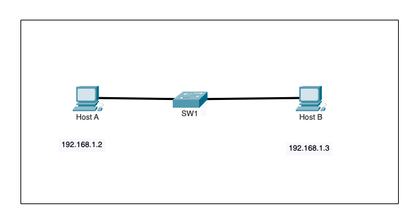
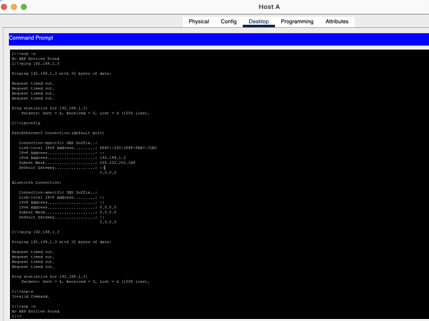
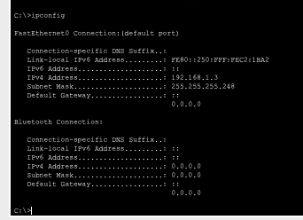
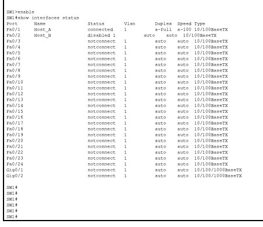
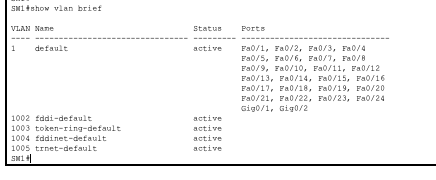
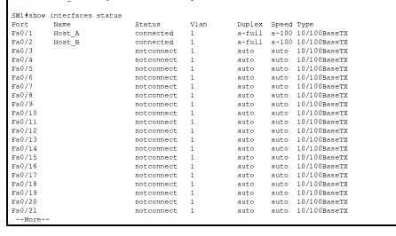
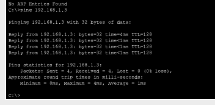

# Phase 1.1 - Basic LAN Connectivity Troubleshooting

## Objective

Troubleshoot a basic Layer 2 connectivity issue between two hosts connected to the same switch.

The goal was to identify **why Host A could not communicate with Host B**, isolate the fault using a structured troubleshooting process, apply the correct fix, and verify that connectivity was restored.

---

## Initial Topology



| Device | IPv4 Address | Subnet Mask | Switch Port | VLAN |
|---|---|---|---|---|
| Host A | `192.168.1.2` | `255.255.255.248` (`/29`) | `Fa0/1` | 1 |
| Host B | `192.168.1.3` | `255.255.255.248` (`/29`) | `Fa0/2` | 1 |

Both hosts belong to the same subnet:

```text
Network:   192.168.1.0/29
Usable:    192.168.1.1 - 192.168.1.6
Broadcast: 192.168.1.7
```

Because both hosts are in the same subnet, they should be able to communicate directly through the switch. A router or default gateway is **not required** for this local communication.

---

## 1. Initial Connectivity Test

From Host A, I first tested connectivity to Host B:

```text
C:\>ping 192.168.1.3
```

The ping failed with 100% packet loss.



### Why this test?

A ping gives a quick indication of whether end-to-end IP connectivity is working.

The failed ping confirmed that there was a real connectivity problem, but it did not yet tell us whether the issue was caused by:

- incorrect IP addressing,
- a subnet mismatch,
- a VLAN problem,
- a disabled switch port,
- or another Layer 1 / Layer 2 issue.

The ARP table was also empty:

```text
C:\>arp -a
No ARP Entries Found
```

This was an important clue because Host A was unable to resolve Host B's MAC address.

---

## 2. Verify Host IP Configuration

### Host A

```text
IPv4 Address: 192.168.1.2
Subnet Mask:  255.255.255.248
```

### Host B

```text
IPv4 Address: 192.168.1.3
Subnet Mask:  255.255.255.248
```



### Why did we check this?

Before troubleshooting the switch, we needed to confirm that both hosts were configured correctly.

`192.168.1.2/29` and `192.168.1.3/29` are both inside the same `192.168.1.0/29` network.

Therefore, the IPv4 addressing was correct and could be ruled out as the root cause.

---

## 3. Check Switch Interface Status

On SW1:

```text
SW1>enable
SW1#show interfaces status
```

The relevant output was:

```text
Port    Name      Status       Vlan
Fa0/1   Host_A    connected    1
Fa0/2   Host_B    disabled     1
```



### What did this tell us?

This was the key finding.

- `Fa0/1`, connected to Host A, was operational.
- `Fa0/2`, connected to Host B, was **disabled**.

A disabled switch port cannot forward Ethernet frames. This explains why Host A could not receive an ARP reply from Host B and why the ping failed.

At this point, `Fa0/2` became the primary suspected root cause.

---

## 4. Verify VLAN Membership

Before changing the configuration, I also verified that the two switch ports were in the same VLAN:

```text
SW1#show vlan brief
```



The output confirmed that both `Fa0/1` and `Fa0/2` belonged to **VLAN 1**.

### Why did we check VLANs?

Even if two hosts use IP addresses from the same subnet, they cannot communicate directly if their switch ports are placed in different VLANs.

Because both ports were in VLAN 1, a VLAN mismatch was ruled out.

This confirmed that the problem was specifically the disabled `Fa0/2` interface.

---

## Root Cause

The root cause was:

> **FastEthernet0/2 on SW1 was administratively disabled.**

The addressing and VLAN configuration were correct, but the switch port connected to Host B was shut down.

```text
Host A                  SW1                         Host B
192.168.1.2      Fa0/1 connected      Fa0/2 disabled     192.168.1.3
     |----------------------|       X       |----------------------|
```

Because `Fa0/2` was disabled:

1. Host A sent an ARP request for `192.168.1.3`.
2. The switch could not forward traffic through the disabled port.
3. Host B never received the request.
4. Host A could not learn Host B's MAC address.
5. ICMP ping failed.

---

## 5. Fix the Problem

I enabled the switch port connected to Host B:

```text
SW1#configure terminal
SW1(config)#interface fastEthernet 0/2
SW1(config-if)#no shutdown
SW1(config-if)#end
```

### Why `no shutdown`?

Cisco switch interfaces can be administratively disabled with the `shutdown` command.

`no shutdown` removes that administrative shutdown and allows the interface to become operational when a physical link is present.

---

## 6. Verify the Switch Port

After applying the fix:

```text
SW1#show interfaces status
```

The port status changed to:

```text
Fa0/1   Host_A   connected   1
Fa0/2   Host_B   connected   1
```



This confirmed that both host-facing interfaces were now operational.

---

## 7. Final Connectivity Test

From Host A:

```text
C:\>ping 192.168.1.3
```

The result was successful:

```text
Reply from 192.168.1.3: bytes=32 time=4ms TTL=128
Reply from 192.168.1.3: bytes=32 time<1ms TTL=128
Reply from 192.168.1.3: bytes=32 time<1ms TTL=128
Reply from 192.168.1.3: bytes=32 time<1ms TTL=128

Packets: Sent = 4, Received = 4, Lost = 0 (0% loss)
```



The successful ping confirmed that connectivity between Host A and Host B had been restored.

---

## Troubleshooting Logic

```text
Ping fails
   |
   v
Check host IP configuration
   |
   v
Both hosts are in 192.168.1.0/29
   |
   v
Check switch interface status
   |
   v
Fa0/2 = disabled
   |
   v
Verify VLAN membership
   |
   v
Both ports are in VLAN 1
   |
   v
Enable Fa0/2 with "no shutdown"
   |
   v
Fa0/2 = connected
   |
   v
Ping succeeds
```

---

## Commands Used

### Host commands

```text
ipconfig
ping 192.168.1.3
arp -a
```

### Cisco IOS commands

```text
enable
show interfaces status
show vlan brief
configure terminal
interface fastEthernet 0/2
no shutdown
end
show interfaces status
```

---

## What I Learned

This lab demonstrated why troubleshooting should be performed methodically instead of immediately changing configurations.

The important lessons were:

- A correct IP address does not guarantee connectivity.
- Hosts in the same subnet communicate directly and do not need a router for local traffic.
- An empty ARP table after a failed connectivity attempt can indicate a Layer 2 problem.
- `show interfaces status` quickly reveals whether a switch interface is connected, disconnected, or administratively disabled.
- `show vlan brief` helps rule out VLAN membership problems.
- On Cisco IOS, `no shutdown` is used to enable an administratively disabled interface.
- Always verify the fix with the same test that originally failed.

---

## Result

**Problem:** Host A could not ping Host B.  
**Root cause:** SW1 `FastEthernet0/2` was administratively disabled.  
**Fix:** `no shutdown` on `FastEthernet0/2`.  
**Verification:** 4/4 successful ICMP replies, 0% packet loss.
