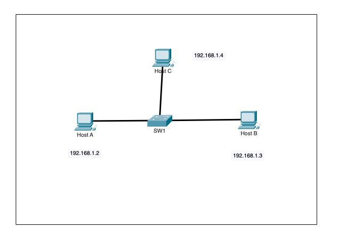
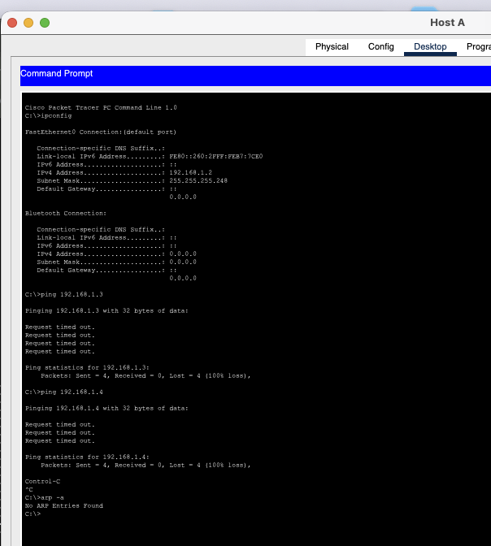
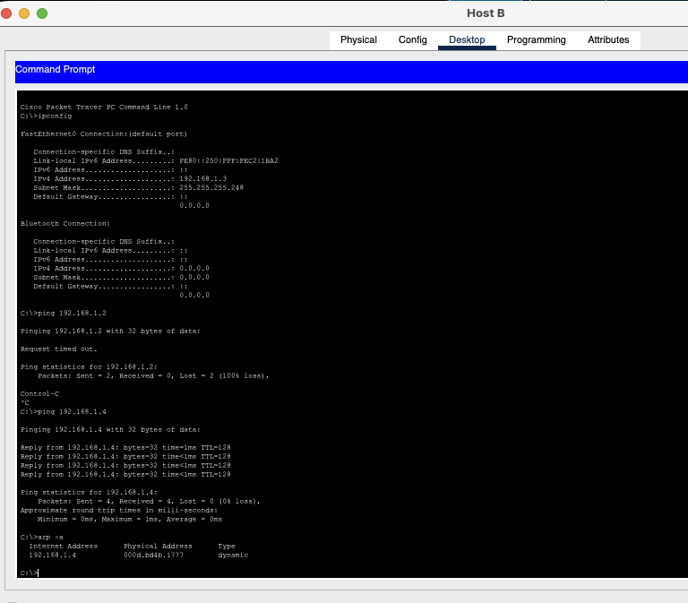
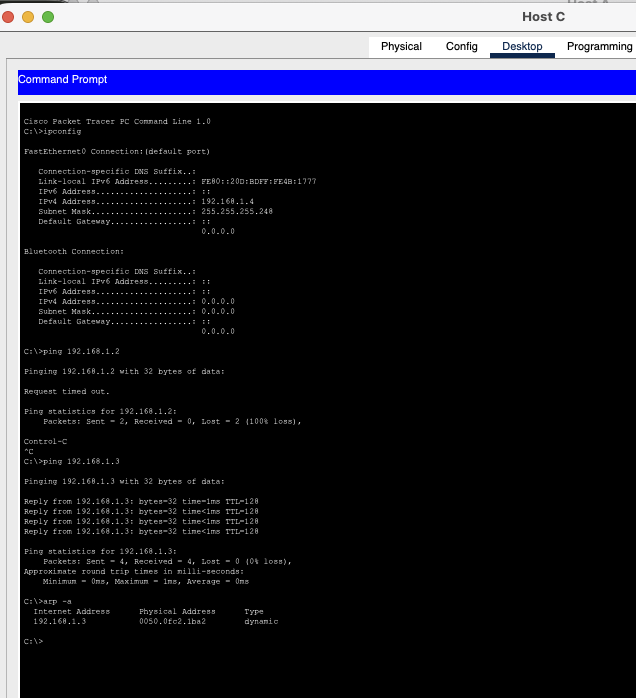
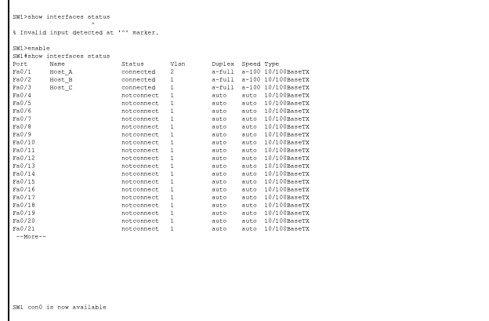
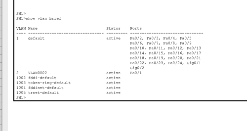
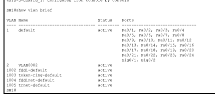
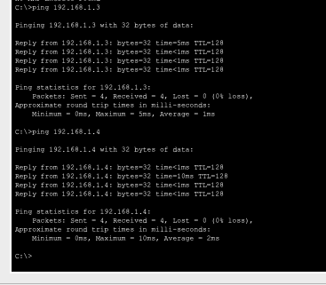

# Phase 1.2 - VLAN Mismatch Causing Host Isolation

## Objective

Troubleshoot a three-host LAN in which one host is isolated even though all hosts are configured with IPv4 addresses from the same subnet.

The goal was to determine why **Host A could not communicate with Host B or Host C**, identify the Layer 2 fault, correct the switch configuration, and verify that full connectivity was restored.

---

## Initial Topology



| Device | IPv4 Address | Subnet Mask | Switch Port |
|---|---|---|---|
| Host A | `192.168.1.2` | `255.255.255.248` (`/29`) | `Fa0/1` |
| Host B | `192.168.1.3` | `255.255.255.248` (`/29`) | `Fa0/2` |
| Host C | `192.168.1.4` | `255.255.255.248` (`/29`) | `Fa0/3` |

All three hosts belong to:

```text
Network:   192.168.1.0/29
Usable:    192.168.1.1 - 192.168.1.6
Broadcast: 192.168.1.7
```

Because all three hosts use addresses from the same subnet, they should be able to communicate directly through the Layer 2 switch without using a router or default gateway.

---

## 1. Test Connectivity From Host A

From Host A:

```text
C:\>ipconfig
C:\>ping 192.168.1.3
C:\>ping 192.168.1.4
C:\>arp -a
```

Both pings failed with 100% packet loss.



### Why this mattered

Host A had the expected IP address and subnet mask:

```text
192.168.1.2 /29
```

However, Host A could not reach either of the other two hosts.

This suggested that the problem was not limited to one destination. Host A itself, its switch port, or its Layer 2 configuration became the main area to investigate.

---

## 2. Compare Connectivity From Host B

From Host B:

```text
C:\>ipconfig
C:\>ping 192.168.1.2
C:\>ping 192.168.1.4
C:\>arp -a
```

Host B could not reach Host A, but it could successfully reach Host C.



The key result was:

```text
Host B -> Host A   FAILED
Host B -> Host C   SUCCESS
```

### Why this was useful

This proved that:

- Host B was operational.
- Host C was reachable.
- The switch was forwarding traffic between at least some ports.
- The fault was specifically related to Host A's path or configuration.

---

## 3. Compare Connectivity From Host C

From Host C:

```text
C:\>ipconfig
C:\>ping 192.168.1.2
C:\>ping 192.168.1.3
C:\>arp -a
```

Host C could not reach Host A, but it could successfully reach Host B.



The complete connectivity pattern was therefore:

| From | Host A | Host B | Host C |
|---|---:|---:|---:|
| Host A | - | Failed | Failed |
| Host B | Failed | - | Success |
| Host C | Failed | Success | - |

This strongly indicated that **Host A was isolated at Layer 2**.

---

## 4. Inspect Switch Interface Status

On SW1:

```text
SW1>enable
SW1#show interfaces status
```

The important output was:

```text
Port    Name      Status       Vlan
Fa0/1   Host_A    connected    2
Fa0/2   Host_B    connected    1
Fa0/3   Host_C    connected    1
```



### What did this reveal?

All three physical links were connected, so this was **not** a disabled-port problem.

However, Host A's switch port was assigned to **VLAN 2**, while Host B and Host C were assigned to **VLAN 1**.

This immediately suggested a VLAN mismatch.

---

## 5. Confirm the VLAN Configuration

To confirm the finding:

```text
SW1#show vlan brief
```



The output confirmed:

```text
VLAN 1 -> Fa0/2, Fa0/3
VLAN 2 -> Fa0/1
```

### Why can this break communication even when the IP subnet is correct?

VLANs create separate Layer 2 broadcast domains.

Host A believed that `192.168.1.3` and `192.168.1.4` were local because they were inside its `/29` subnet. Therefore, Host A attempted to use ARP to discover their MAC addresses.

An ARP request is a Layer 2 broadcast.

Because Host A was in VLAN 2:

```text
Host A ARP broadcast -> VLAN 2 only
```

Host B and Host C were in VLAN 1, so they never received Host A's ARP broadcasts.

The hosts were configured as if they were on the same Layer 3 subnet, but the switch placed them in different Layer 2 broadcast domains.

---

## Root Cause

The root cause was a **wrong access VLAN assignment on SW1 FastEthernet0/1**.

```text
Fa0/1 -> Host A -> VLAN 2   <-- incorrect
Fa0/2 -> Host B -> VLAN 1
Fa0/3 -> Host C -> VLAN 1
```

This caused Host A to be isolated from Host B and Host C.

---

## 6. Fix the VLAN Assignment

The port connected to Host A was moved from VLAN 2 to VLAN 1:

```text
SW1#enable
SW1#configure terminal
SW1(config)#interface fastEthernet 0/1
SW1(config-if)#switchport mode access
SW1(config-if)#switchport access vlan 1
SW1(config-if)#end
```

### Why these commands?

`switchport mode access` ensures that the interface operates as a Layer 2 access port.

`switchport access vlan 1` places the endpoint in VLAN 1, matching Host B and Host C.

---

## 7. Verify VLAN Membership After the Fix

The VLAN configuration was checked again:

```text
SW1#show vlan brief
```



Now:

```text
VLAN 1 -> Fa0/1, Fa0/2, Fa0/3
```

All three hosts were in the same Layer 2 broadcast domain.

---

## 8. Final Connectivity Verification

From Host A:

```text
C:\>ping 192.168.1.3
C:\>ping 192.168.1.4
```

Both tests succeeded:

```text
Host A -> Host B: 4 sent, 4 received, 0% loss
Host A -> Host C: 4 sent, 4 received, 0% loss
```



This confirmed that the VLAN correction restored communication.

---

## Troubleshooting Logic

```text
Host A cannot reach B or C
        |
        v
Check Host A IP configuration
        |
        v
IP address and /29 mask are correct
        |
        v
Test from Host B
        |
        +----> B can reach C
        |
        v
Test from Host C
        |
        +----> C can reach B
        |
        v
Host A is the common failure point
        |
        v
show interfaces status
        |
        v
Fa0/1 = VLAN 2
Fa0/2 = VLAN 1
Fa0/3 = VLAN 1
        |
        v
show vlan brief
        |
        v
VLAN mismatch confirmed
        |
        v
switchport access vlan 1
        |
        v
Verify VLAN membership
        |
        v
Ping Host B and Host C
        |
        v
Connectivity restored
```

---

## Commands Used

### Packet Tracer PC Commands

```text
ipconfig
ping 192.168.1.2
ping 192.168.1.3
ping 192.168.1.4
arp -a
```

### Cisco IOS Troubleshooting Commands

```text
enable
show interfaces status
show vlan brief
show mac address-table
```

### Cisco IOS Configuration Commands

```text
configure terminal
interface fastEthernet 0/1
switchport mode access
switchport access vlan 1
end
```

### Verification Commands

```text
show vlan brief
show interfaces status
ping 192.168.1.3
ping 192.168.1.4
```

---

## What I Learned

This lab demonstrated an important troubleshooting principle: **correct Layer 3 addressing does not guarantee Layer 2 connectivity**.

Key lessons:

- Hosts can have addresses in the same IP subnet but still be separated by VLANs.
- VLANs define Layer 2 broadcast domains.
- ARP broadcasts do not cross VLAN boundaries without Layer 3 routing.
- Testing connectivity from several endpoints helps identify the common point of failure.
- `show interfaces status` provides a fast view of both interface state and access VLAN assignment.
- `show vlan brief` is essential for confirming VLAN membership.
- A wrong access VLAN can completely isolate a host even when its cable, interface, IP address, and subnet mask are all correct.
- Always verify the fix using the same connectivity tests that originally failed.

---

## Result

**Problem:** Host A could not communicate with Host B or Host C.  
**Root cause:** `Fa0/1` on SW1 was assigned to VLAN 2 while `Fa0/2` and `Fa0/3` were in VLAN 1.  
**Fix:** Reassign `Fa0/1` to VLAN 1.  
**Verification:** Host A successfully pinged both Host B and Host C with 0% packet loss.
