# Phase 1.3 - Access/Trunk Mismatch Between Switches

## Objective

Troubleshoot a two-switch LAN where hosts connected to the same switch can communicate, but a host located behind a second switch cannot be reached.

The goal was to identify why traffic could not cross the inter-switch link, understand the Spanning Tree Protocol (STP) protection behavior, correct the trunk configuration, and verify end-to-end connectivity.

---

## Initial Topology

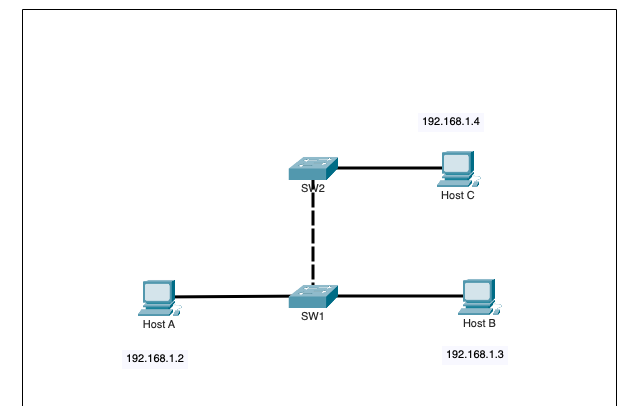

```text
                Host C
             192.168.1.4
                  |
                 SW2
                  |
            Inter-switch link
                  |
                 SW1
              /       \
             /         \
        Host A         Host B
     192.168.1.2    192.168.1.3
```

Host A, Host B, and Host C used IPv4 addresses in the same `/29` subnet.

---

## 1. Initial Symptoms

The first tests showed that Host A and Host B could communicate with each other, but neither could reach Host C.

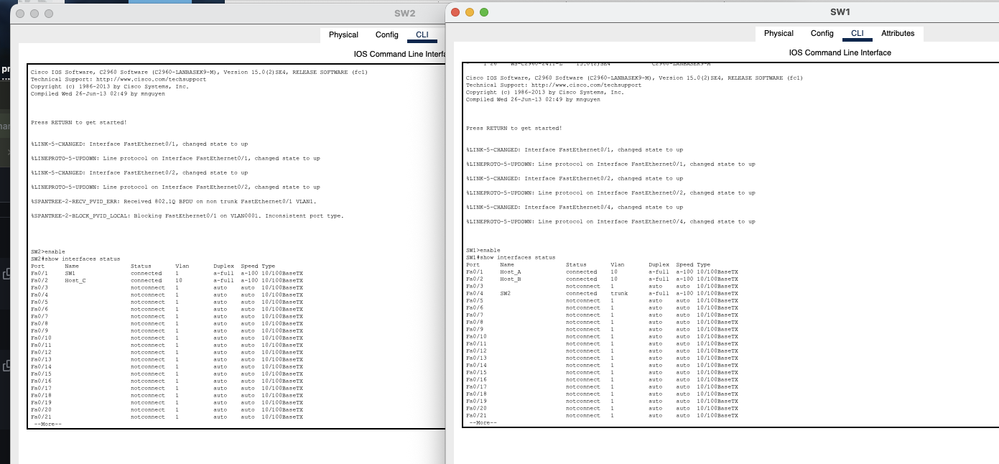

From Host A:

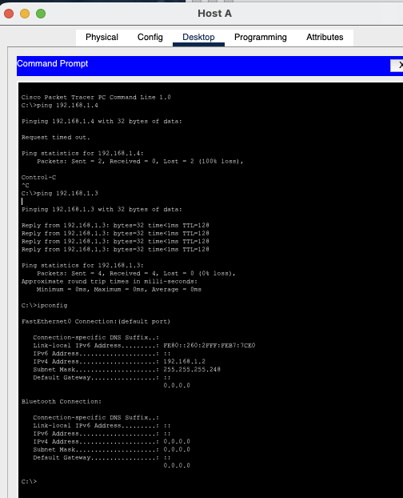

From Host B:

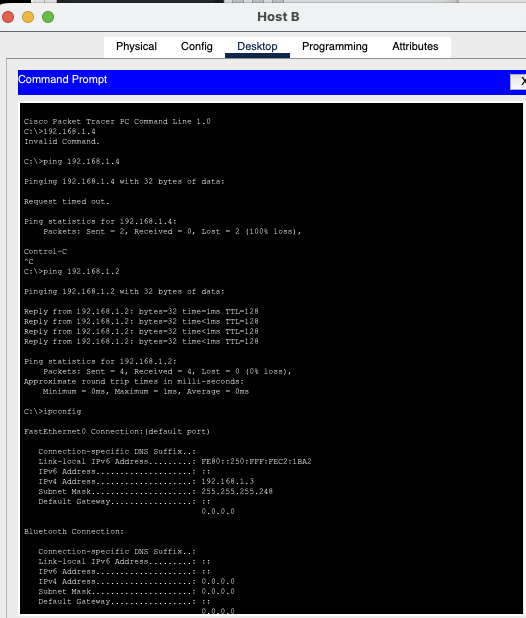

From Host C:

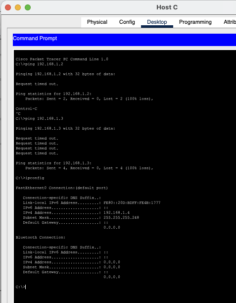

The connectivity pattern was:

```text
Host A <-> Host B   SUCCESS
Host A <-> Host C   FAILED
Host B <-> Host C   FAILED
```

### Why this pattern mattered

Host A and Host B were both connected to SW1, so their communication did not need to cross the inter-switch link.

Host C was connected to SW2. Therefore, any traffic to or from Host C had to cross the link between SW1 and SW2.

This made the inter-switch link the most likely failure point.

---

## 2. Inspect the SW1 Side of the Inter-Switch Link

On SW1:

```text
enable
show interfaces trunk
show interfaces fa0/4 switchport
show spanning-tree
```

The trunk output showed:

```text
Fa0/4
Mode: on
Encapsulation: 802.1Q
Status: trunking
Native VLAN: 1
Allowed VLANs: 1,10
```

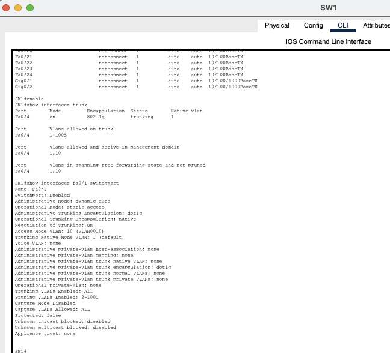

STP on SW1 showed the link in forwarding state:

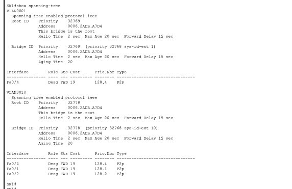

### What did this prove?

SW1 FastEthernet0/4 was correctly operating as an 802.1Q trunk.

This meant the SW1 side of the inter-switch link was not the problem.

---

## 3. Inspect the SW2 Side

On SW2:

```text
enable
show interfaces trunk
show interfaces fa0/1 switchport
show spanning-tree
```

The important output was:

```text
Administrative Mode: static access
Operational Mode: static access
Access Mode VLAN: 1
```

The STP output also showed an inconsistency on Fa0/1:

```text
Fa0/1   Root   BKN   ...   *TYPE_Inc
```

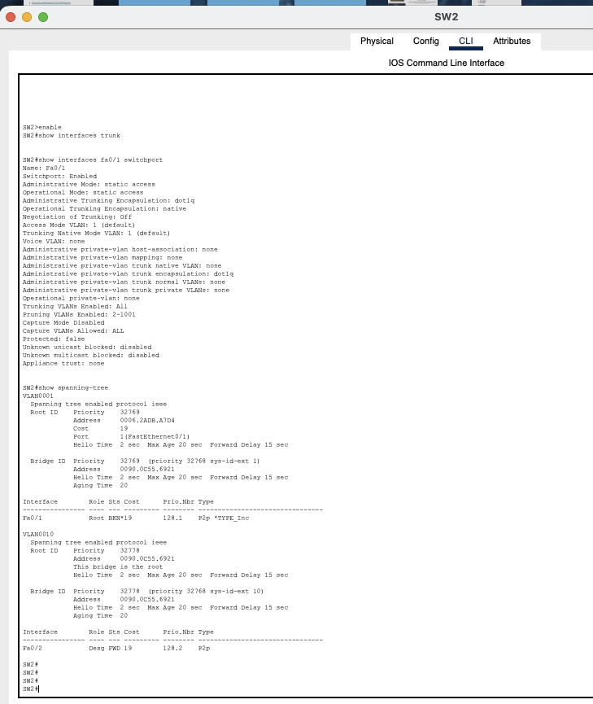

### Why this was the root cause

SW1 Fa0/4 was a trunk, but SW2 Fa0/1 was an access port.

```text
SW1 Fa0/4              SW2 Fa0/1
802.1Q TRUNK   <---->  STATIC ACCESS
```

The two ends of the same physical link were configured differently.

STP detected the inconsistency and protected the Layer 2 topology by blocking the link.

Earlier console messages also indicated:

```text
%SPANTREE-2-RECV_PVID_ERR
%SPANTREE-2-BLOCK_PVID_LOCAL
Inconsistent port type
```

This explained why Host C was isolated from hosts connected to SW1.

---

## Root Cause

The root cause was an **access/trunk mismatch on the inter-switch link**:

```text
SW1 Fa0/4 = 802.1Q trunk
SW2 Fa0/1 = access port
```

Because of this mismatch, STP placed the SW2 port into an inconsistent/blocking state.

---

## 4. Fix the SW2 Inter-Switch Port

The SW2 port was configured to match SW1:

```text
enable
configure terminal
interface fastEthernet 0/1
switchport mode trunk
switchport trunk allowed vlan 1,10
end
```

The native VLAN was already VLAN 1, so no additional change was required.

---

## 5. Verify the Trunk After the Fix

On SW2:

```text
show interfaces trunk
```

The output now showed:

```text
Fa0/1
Mode: on
Encapsulation: 802.1Q
Status: trunking
Native VLAN: 1
Allowed VLANs: 1,10
```

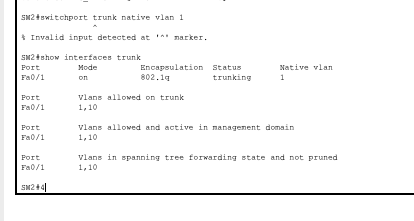

This confirmed that both ends of the inter-switch link were now trunks.

---

## 6. Verify STP Recovery

On SW2:

```text
show spanning-tree
```

After the fix, the previous `BKN` and `TYPE_Inc` conditions were gone.

Fa0/1 was now forwarding:

```text
VLAN 1
Fa0/1   Root   FWD

VLAN 10
Fa0/1   Root   FWD
```

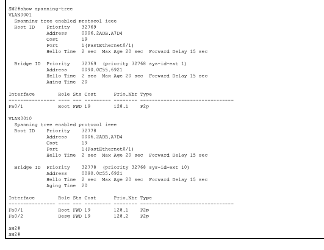

### Why this was important

The trunk configuration itself was not enough to prove the issue was fully resolved.

STP had previously blocked the inconsistent link, so we also verified that STP returned the interface to the forwarding state.

---

## 7. Final End-to-End Verification

From Host A:

```text
ping 192.168.1.4
```

The ping succeeded with 0% packet loss.

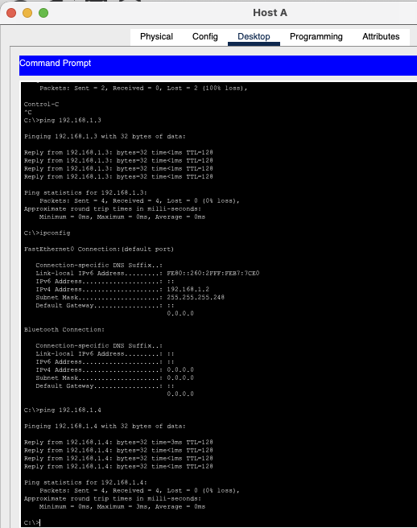

Additional final connectivity proof:

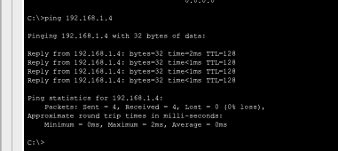

The successful ICMP replies confirmed that traffic could once again cross the SW1-SW2 trunk and reach Host C.

---

## Troubleshooting Logic

```text
Host A <-> Host B works
        |
        v
Host A/B cannot reach Host C
        |
        v
Host C is behind SW2
        |
        v
Investigate inter-switch link
        |
        v
SW1 Fa0/4 = trunk
        |
        v
SW2 Fa0/1 = access
        |
        v
STP shows BKN / TYPE_Inc
        |
        v
Access/trunk mismatch confirmed
        |
        v
Configure SW2 Fa0/1 as trunk
        |
        v
Verify 802.1Q trunk
        |
        v
Verify STP = FWD
        |
        v
Ping Host C
        |
        v
Connectivity restored
```

---

## Commands Used

### Packet Tracer PC Commands

```text
ipconfig
ping 192.168.1.2
ping 192.168.1.3
ping 192.168.1.4
```

### Cisco IOS Troubleshooting Commands

```text
enable
show interfaces status
show interfaces trunk
show interfaces fa0/4 switchport
show interfaces fa0/1 switchport
show spanning-tree
```

### Cisco IOS Configuration Commands

```text
configure terminal
interface fastEthernet 0/1
switchport mode trunk
switchport trunk allowed vlan 1,10
end
```

### Verification Commands

```text
show interfaces trunk
show spanning-tree
ping 192.168.1.4
```

---

## What I Learned

This lab demonstrated how a Layer 2 configuration mismatch between two switches can isolate an otherwise correctly configured host.

Key lessons:

- Both ends of an inter-switch link must use compatible trunking settings.
- `show interfaces trunk` quickly confirms which ports are actively trunking.
- `show interfaces <interface> switchport` shows both administrative and operational Layer 2 modes.
- An access/trunk mismatch can trigger STP protection mechanisms.
- `BKN` and `TYPE_Inc` in STP output indicate an inconsistency that must be investigated.
- STP may block a link to protect the network from an invalid Layer 2 topology.
- After correcting a trunk problem, verify both trunk state and STP forwarding state.
- A connectivity pattern where local hosts communicate but a remote-switch host cannot be reached is a strong clue to investigate the inter-switch path.

---

## Result

**Problem:** Host A and Host B could communicate locally, but Host C behind SW2 was unreachable.  
**Root cause:** SW1 Fa0/4 was an 802.1Q trunk while SW2 Fa0/1 was configured as a static access port.  
**STP behavior:** SW2 detected a port-type/PVID inconsistency and blocked the inter-switch link.  
**Fix:** Configure SW2 Fa0/1 as an 802.1Q trunk and allow VLANs 1 and 10.  
**Verification:** Trunking became operational, STP returned to forwarding, and Host C became reachable.
