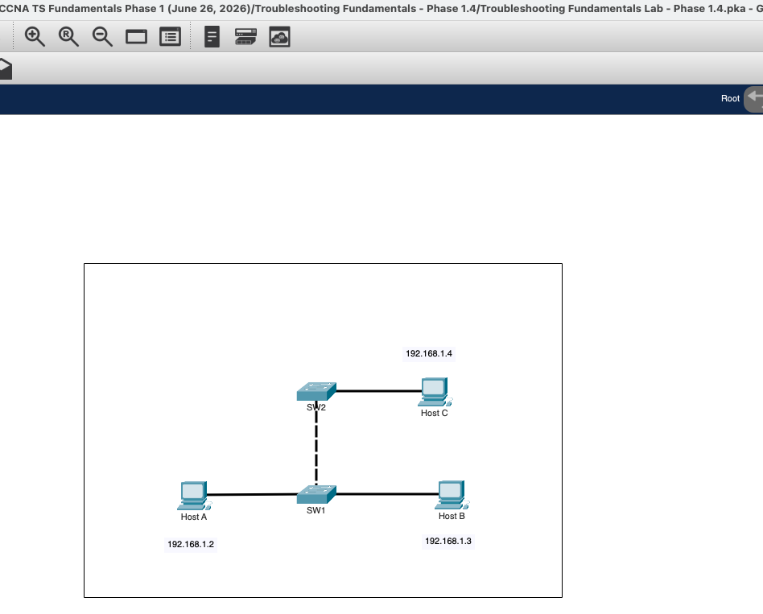
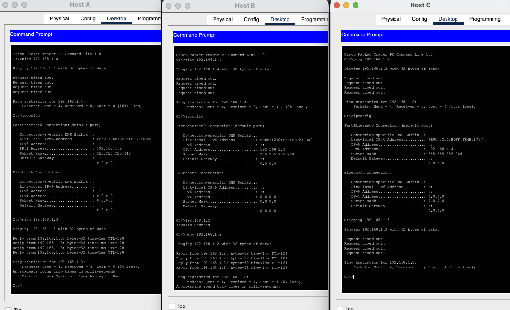
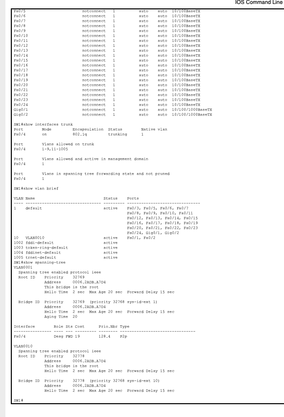
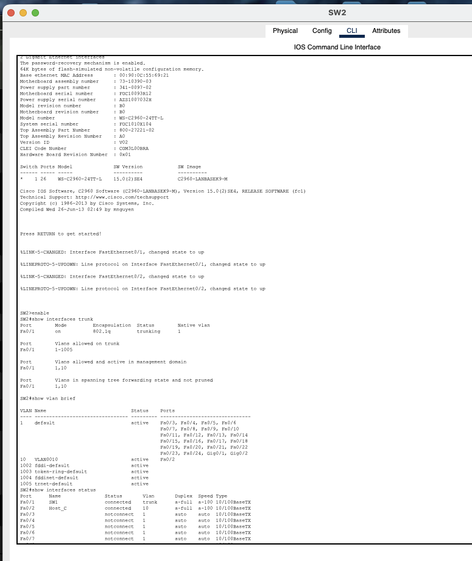
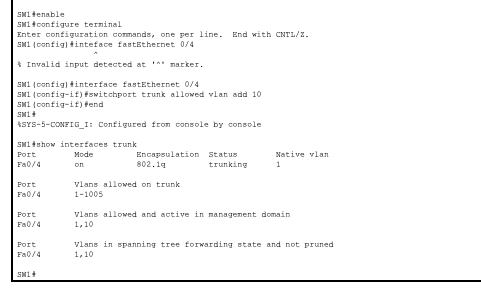
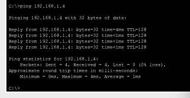
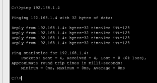

# Phase 1.4 - VLAN 10 Missing from the Trunk Allowed List

## Objective

Troubleshoot a two-switch LAN where two hosts connected to SW1 can communicate with each other, but neither can reach Host C behind SW2.

The goal was to identify why VLAN 10 traffic could not cross the inter-switch trunk, correct the trunk configuration, and verify end-to-end connectivity.

---

## Initial Topology



```text
                Host C
             192.168.1.4
                  |
                 SW2
                  |
             802.1Q trunk
                  |
                 SW1
              /       \
             /         \
        Host A         Host B
     192.168.1.2    192.168.1.3
```

All three hosts use addresses from the same `/29` IP subnet, while the host-facing switch ports belong to VLAN 10.

---

## 1. Initial Connectivity Tests

The first tests showed:

```text
Host A <-> Host B   SUCCESS
Host A <-> Host C   FAILED
Host B <-> Host C   FAILED
```



### Why this pattern mattered

Host A and Host B are both connected to SW1, so their VLAN 10 traffic can remain local to SW1.

Host C is connected to SW2, so any communication with Host C must cross the inter-switch trunk.

That made the trunk path the most likely failure point.

---

## 2. Inspect SW1

On SW1:

```text
enable
show interfaces trunk
show vlan brief
show spanning-tree
```

The important trunk output was:

```text
Port    Mode   Encapsulation   Status     Native vlan
Fa0/4   on     802.1q          trunking   1
```

However, the allowed VLAN list showed:

```text
Vlans allowed on trunk
Fa0/4   1-9,11-1005
```



### Key finding

VLAN 10 was missing from the allowed VLAN list on SW1 Fa0/4.

The list jumped directly from VLAN 9 to VLAN 11:

```text
1-9,11-1005
    ^
 VLAN 10 excluded
```

SW1 had VLAN 10 configured locally, but it was not permitted to cross the trunk.

---

## 3. Verify SW2

On SW2:

```text
enable
show interfaces trunk
show vlan brief
show interfaces status
```

SW2 showed:

```text
Fa0/1   connected   trunk
Fa0/2   Host_C      connected   10
```

The trunk allowed VLAN 10 and showed VLAN 10 as active and forwarding.



### Why this mattered

This proved that the SW2 side was correctly configured:

- The inter-switch interface was trunking.
- VLAN 10 existed on SW2.
- Host C was connected to VLAN 10.
- VLAN 10 was allowed and forwarding across the SW2 trunk.

The problem was therefore isolated to the SW1 allowed VLAN list.

---

## Root Cause

The root cause was:

> **VLAN 10 was excluded from the trunk allowed VLAN list on SW1 FastEthernet0/4.**

Before the fix:

```text
SW1 Fa0/4 allowed VLANs:
1-9,11-1005
```

Therefore VLAN 10 frames could not leave SW1 and reach SW2.

This explains why Host A and Host B could communicate locally but neither could reach Host C.

---

## 4. Fix the Trunk Allowed VLAN List

On SW1:

```text
enable
configure terminal
interface fastEthernet 0/4
switchport trunk allowed vlan add 10
end
```

### Why use `add 10`?

Using:

```text
switchport trunk allowed vlan add 10
```

adds VLAN 10 to the existing list without replacing the other allowed VLANs.

This is safer than accidentally overwriting the complete allowed VLAN list.

---

## 5. Verify the Trunk After the Fix

On SW1:

```text
show interfaces trunk
```

The trunk now showed:

```text
Vlans allowed on trunk
Fa0/4   1-1005

Vlans allowed and active in management domain
Fa0/4   1,10

Vlans in spanning tree forwarding state and not pruned
Fa0/4   1,10
```



This confirmed that VLAN 10 was:

```text
Created      YES
Active       YES
Allowed      YES
Forwarding   YES
```

---

## 6. Final End-to-End Verification

From Host A:

```text
ping 192.168.1.4
```

Result:

```text
4 packets sent
4 packets received
0% packet loss
```



From Host B:

```text
ping 192.168.1.4
```

Result:

```text
4 packets sent
4 packets received
0% packet loss
```



Full connectivity was restored.

---

## Troubleshooting Logic

```text
Host A <-> Host B works
        |
        v
Host A/B cannot reach Host C
        |
        v
Host C is behind SW2
        |
        v
Investigate inter-switch trunk
        |
        v
SW1 trunk is operational
        |
        v
SW1 allowed VLAN list excludes VLAN 10
        |
        v
Check SW2
        |
        v
SW2 trunk allows VLAN 10
Host C is in VLAN 10
        |
        v
Root cause isolated to SW1 Fa0/4
        |
        v
switchport trunk allowed vlan add 10
        |
        v
Verify VLAN 10 is allowed and forwarding
        |
        v
Ping Host C
        |
        v
Connectivity restored
```

---

## Commands Used

### Packet Tracer PC Commands

```text
ipconfig
ping 192.168.1.2
ping 192.168.1.3
ping 192.168.1.4
```

### Cisco IOS Troubleshooting Commands

```text
enable
show interfaces status
show interfaces trunk
show vlan brief
show spanning-tree
```

### Cisco IOS Configuration Commands

```text
configure terminal
interface fastEthernet 0/4
switchport trunk allowed vlan add 10
end
```

### Verification Commands

```text
show interfaces trunk
ping 192.168.1.4
```

---

## What I Learned

This lab demonstrated that a trunk can be operational while still failing to carry a specific VLAN.

Key lessons:

- `trunking` does not mean every VLAN is allowed.
- Always inspect the **allowed VLAN list** when troubleshooting inter-switch connectivity.
- Hosts in the same VLAN can communicate locally on one switch even if that VLAN is blocked from crossing the trunk.
- Compare both ends of the trunk before changing configuration.
- `switchport trunk allowed vlan add <id>` safely adds a VLAN without replacing the current allowed list.
- `show interfaces trunk` is one of the most important commands for diagnosing VLAN propagation problems.
- Final verification should confirm both the trunk state and end-to-end host connectivity.

---

## Result

**Problem:** Host A and Host B could communicate with each other but could not reach Host C behind SW2.  
**Root cause:** VLAN 10 was excluded from the allowed VLAN list on SW1 Fa0/4.  
**Fix:** `switchport trunk allowed vlan add 10` on SW1 Fa0/4.  
**Verification:** VLAN 10 became allowed and forwarding across the trunk, and both Host A and Host B successfully reached Host C with 0% packet loss.
