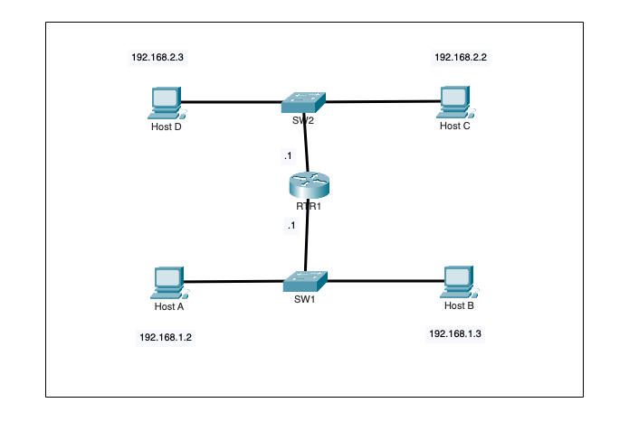
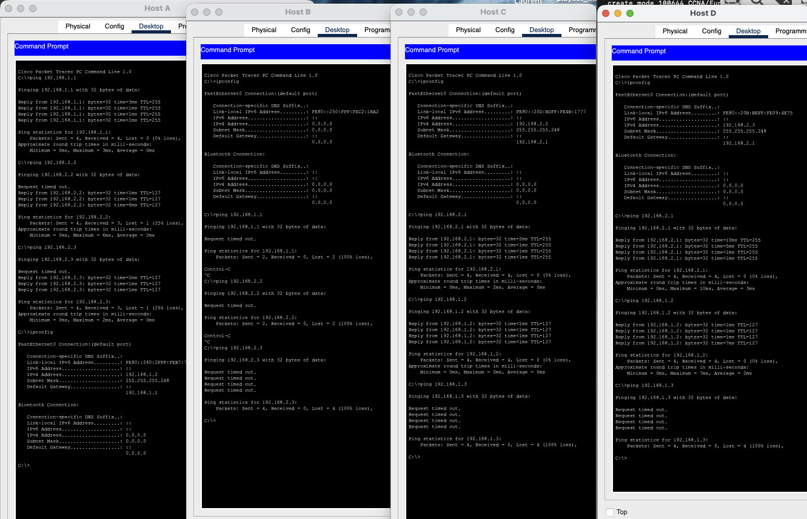
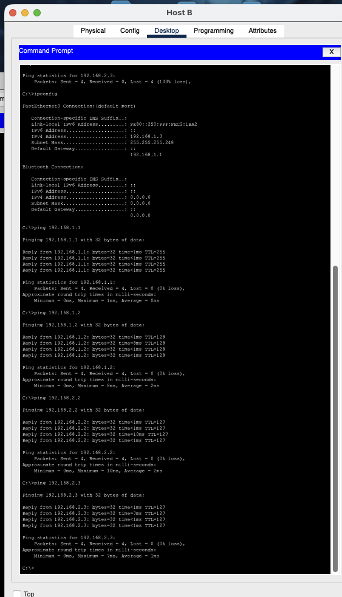

# Phase 1.5 - Missing IPv4 Configuration Causing Host Isolation

## Objective

Troubleshoot a routed network where three hosts can communicate across two subnets, but one host is completely isolated.

The goal was to determine whether the failure came from routing, switching, or the endpoint itself, correct the faulty configuration, and verify full local and remote connectivity.

---

## Initial Topology



```text
               192.168.2.0/29

Host D                            Host C
192.168.2.3                    192.168.2.2
    \                              /
                  SW2
                   |
              192.168.2.1
                  RTR1
              192.168.1.1
                   |
                  SW1
               /      \
              /        \
         Host A        Host B
      192.168.1.2    expected:
                     192.168.1.3

               192.168.1.0/29
```

RTR1 connects the two LANs:

```text
192.168.1.0/29
192.168.2.0/29
```

Expected default gateways:

```text
LAN 1 -> 192.168.1.1
LAN 2 -> 192.168.2.1
```

---

## 1. Initial Connectivity Tests

The first tests showed that Host A could reach:

```text
192.168.1.1  -> local router interface
192.168.2.2  -> Host C
192.168.2.3  -> Host D
```

Host C and Host D could also reach Host A.

However, Host B could not reach any destination.



### Why this pattern mattered

Because Host A could successfully communicate across the router with Host C and Host D, the following components were already proven to be working:

- SW1
- SW2
- both router interfaces
- routing between `192.168.1.0/29` and `192.168.2.0/29`
- Host A, Host C, and Host D IP configurations

This made Host B itself the common point of failure.

---

## 2. Inspect Host B

On Host B:

```text
ipconfig
```

The output showed:

```text
IPv4 Address:    0.0.0.0
Subnet Mask:     0.0.0.0
Default Gateway: 0.0.0.0
```

### What did this prove?

Host B had no usable IPv4 configuration.

Without an IPv4 address, subnet mask, and default gateway, Host B could not determine:

- what network it belonged to,
- which destinations were local,
- where to send traffic destined for another subnet.

The failure was therefore an endpoint configuration issue, not a router or switch failure.

---

## Root Cause

The root cause was:

> **Host B had no valid IPv4 configuration.**

Expected configuration:

```text
IPv4 Address:    192.168.1.3
Subnet Mask:     255.255.255.248
Default Gateway: 192.168.1.1
```

Initial configuration:

```text
IPv4 Address:    0.0.0.0
Subnet Mask:     0.0.0.0
Default Gateway: 0.0.0.0
```

---

## 3. Fix Host B

In Packet Tracer:

```text
Host B
Desktop
IP Configuration
Static
```

The following values were configured:

```text
IPv4 Address:    192.168.1.3
Subnet Mask:     255.255.255.248
Default Gateway: 192.168.1.1
```

---

## 4. Verify Local and Routed Connectivity

After the correction:

```text
ipconfig
```

showed:

```text
IPv4 Address:    192.168.1.3
Subnet Mask:     255.255.255.248
Default Gateway: 192.168.1.1
```

The following tests were then performed:

```text
ping 192.168.1.1
ping 192.168.1.2
ping 192.168.2.2
ping 192.168.2.3
```



All four tests succeeded with 0% packet loss.

This confirmed:

```text
Host B -> Default Gateway   SUCCESS
Host B -> Host A            SUCCESS
Host B -> Host C            SUCCESS
Host B -> Host D            SUCCESS
```

---

## Why the Test Order Matters

The verification sequence moved progressively outward:

```text
Host B
  |
  v
192.168.1.1
Can I reach my default gateway?
  |
  v
192.168.1.2
Can I reach another host on my local LAN?
  |
  v
192.168.2.2
Can traffic be routed to the remote LAN?
  |
  v
192.168.2.3
Can I reach another remote endpoint?
```

This helps isolate problems efficiently instead of testing random destinations.

---

## Troubleshooting Logic

```text
Host B cannot communicate
        |
        v
Other hosts can communicate across RTR1
        |
        v
Routing infrastructure is working
        |
        v
Check Host B with ipconfig
        |
        v
IPv4 = 0.0.0.0
Mask = 0.0.0.0
Gateway = 0.0.0.0
        |
        v
Missing endpoint IPv4 configuration
        |
        v
Configure 192.168.1.3/29
Gateway 192.168.1.1
        |
        v
Ping local gateway
        |
        v
Ping local host
        |
        v
Ping remote hosts
        |
        v
Full connectivity restored
```

---

## Commands Used

### Packet Tracer PC Commands

```text
ipconfig
ping 192.168.1.1
ping 192.168.1.2
ping 192.168.1.3
ping 192.168.2.1
ping 192.168.2.2
ping 192.168.2.3
```

---

## What I Learned

This lab demonstrated how connectivity tests from multiple hosts can quickly separate an endpoint problem from an infrastructure problem.

Key lessons:

- If other hosts can route successfully, do not immediately blame the router.
- `ipconfig` should be one of the first checks when one endpoint alone is isolated.
- A host needs a valid IP address and subnet mask even for local communication.
- A default gateway is required to reach destinations outside the local subnet.
- Test connectivity progressively: gateway, local host, then remote network.
- A successful routed ping from another host can prove that the Layer 3 path is already operational.
- Troubleshooting is faster when the common point of failure is identified before changing configuration.

---

## Result

**Problem:** Host B could not communicate with any local or remote device.  
**Root cause:** Host B had no valid IPv4 address, subnet mask, or default gateway.  
**Fix:** Configure Host B as `192.168.1.3/29` with default gateway `192.168.1.1`.  
**Verification:** Host B successfully reached its gateway, Host A, Host C, and Host D with 0% packet loss.
