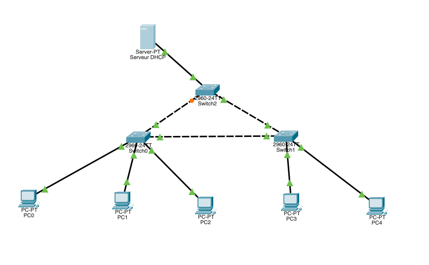
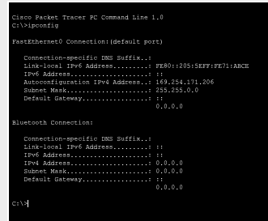
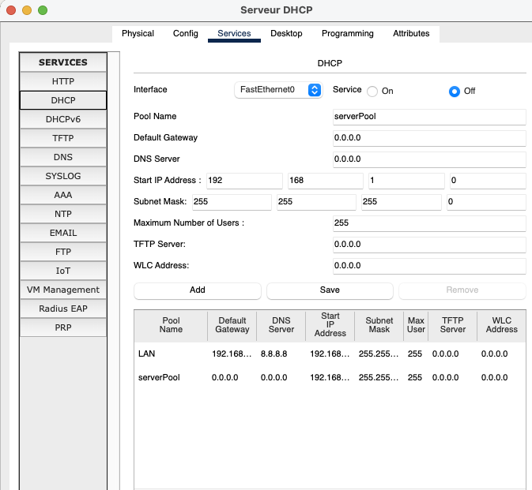
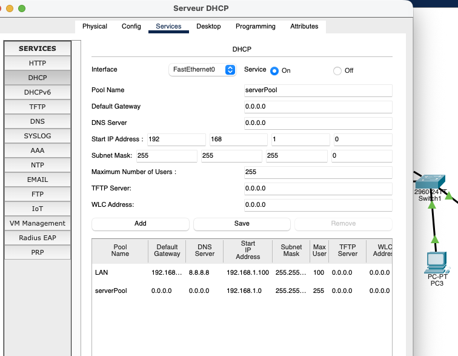
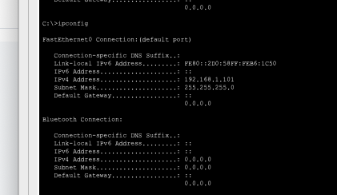
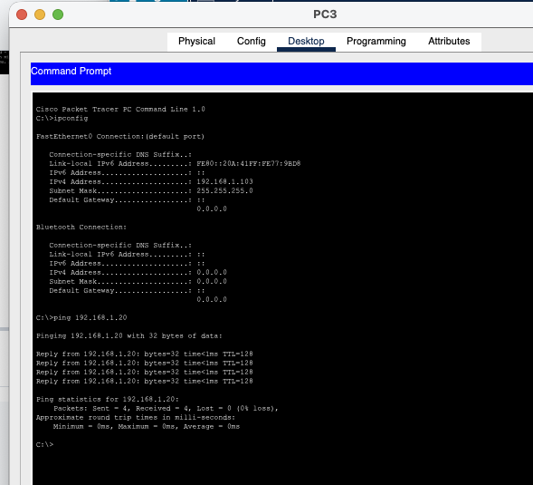

# Lab 01 - DHCP Troubleshooting

## Overview

This Cisco Packet Tracer lab focuses on troubleshooting DHCP in a simple Layer 2 LAN containing one DHCP server, three Cisco 2960 switches and five client PCs. There is no router; all hosts communicate inside VLAN 1 on `192.168.1.0/24`.



The DHCP server uses the static address `192.168.1.20/24`.

## Initial Symptom

PC0 was configured for DHCP but received an APIPA address instead of a valid lease:

```text
169.254.171.206
255.255.0.0
```



An address in `169.254.0.0/16` indicates that the host attempted DHCP but did not receive a valid lease.

## Fault 1 - DHCP Service Disabled

The server was inspected under `Server -> Services -> DHCP`. The DHCP service was set to **Off**.



### Fix

Set:

```text
DHCP Service: On
```

## Layer 2 Verification

To separate a DHCP problem from a switching problem, PC0 was temporarily configured with:

```text
IP Address:  192.168.1.10
Subnet Mask: 255.255.255.0
```

Then the server was tested:

```bash
ping 192.168.1.20
```

The ping succeeded with `4/4 replies` and `0% packet loss`. This proved that the NICs, switches, links and VLAN 1 connectivity were operational. No switch configuration changes were required.

## Fault 2 - Invalid / Overlapping DHCP Pools

Two pools were present: `LAN` and `serverPool`.

The default pool started at:

```text
192.168.1.0
```

This is the network address of `192.168.1.0/24` and cannot be assigned to a host. The pools also overlapped, producing inconsistent lease allocation.



### Clean DHCP Scope

The server was standardized to use a clean, non-overlapping dynamic range:

```text
Start IP Address:       192.168.1.100
Subnet Mask:            255.255.255.0
Maximum Number Users:   100
Default Gateway:        0.0.0.0
DNS Server:             0.0.0.0
```

Because this lab contains no router, clients do not need a default gateway for local communication with the DHCP server.

## DHCP Lease Renewal

Each client was forced to request a fresh lease by switching from `Static` back to `DHCP`.

Clients then received valid addresses in the configured scope, for example:

```text
PC0 -> 192.168.1.100
PC1 -> 192.168.1.101
PC2 -> 192.168.1.102
PC3 -> 192.168.1.103
```



## Final Validation

Clients successfully pinged the DHCP server:

```bash
ping 192.168.1.20
```

with `4/4 replies` and `0% packet loss`.



## Root Causes

1. The DHCP service was disabled.
2. The server contained invalid and overlapping DHCP pools, including a scope beginning at the network address `192.168.1.0`.

## Troubleshooting Methodology

```text
Client receives APIPA
        ↓
Verify DHCP client mode
        ↓
Inspect DHCP service
        ↓
Enable DHCP
        ↓
Test Layer 2 connectivity with static IP
        ↓
Verify DHCP pools
        ↓
Remove invalid / overlapping allocation
        ↓
Configure clean DHCP scope
        ↓
Renew client leases
        ↓
Validate client-to-server connectivity
```

## Commands Used

```bash
ipconfig
ping 192.168.1.20
```

Switch verification:

```bash
enable
show vlan brief
show interfaces trunk
```

## Skills Practiced

- DHCP troubleshooting
- APIPA identification
- DHCP scope configuration
- IPv4 addressing and subnetting
- Layer 2 connectivity validation
- Fault isolation
- Packet Tracer server configuration
- DHCP lease renewal
- ICMP connectivity testing

## Key Takeaway

An APIPA address such as `169.254.x.x` is a strong sign that a DHCP client could not obtain a lease. A temporary static IP and successful ping to the server can quickly prove that the Layer 2 network is healthy, allowing the investigation to focus on DHCP itself.
