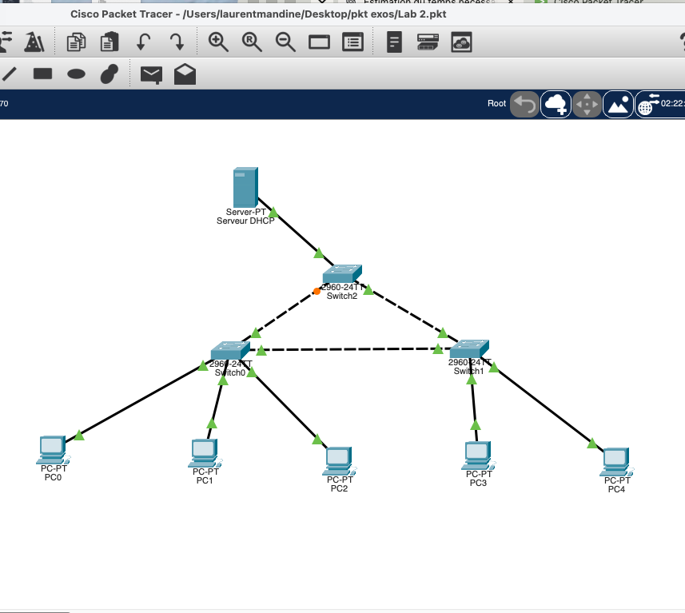
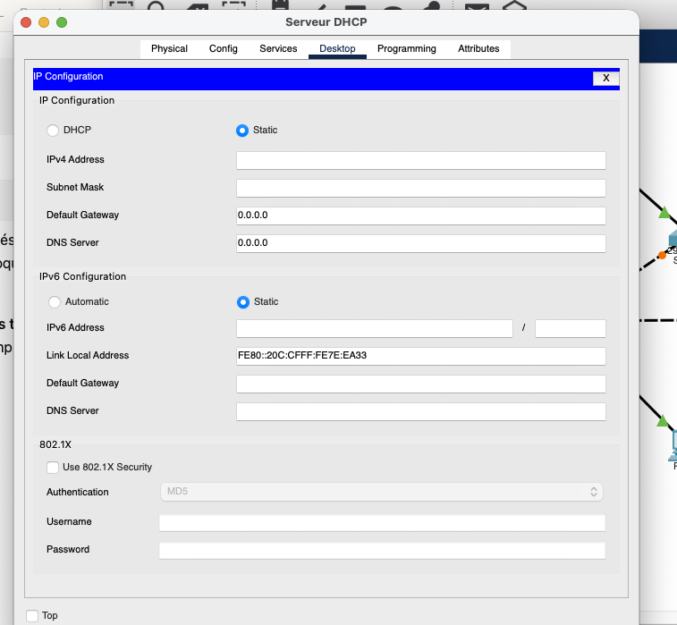
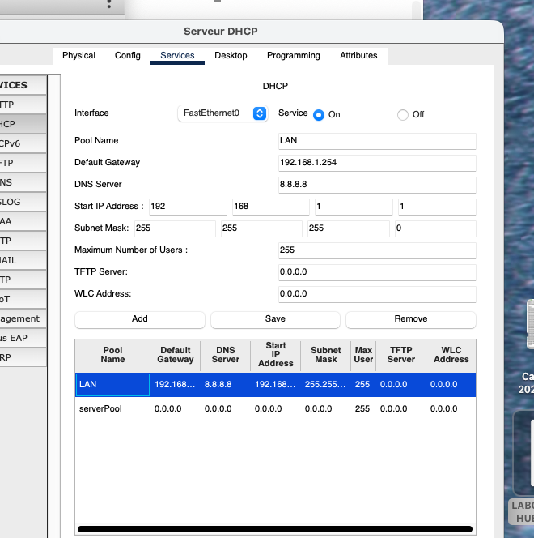
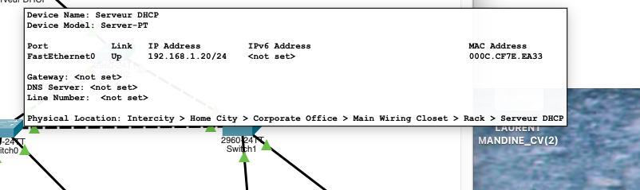
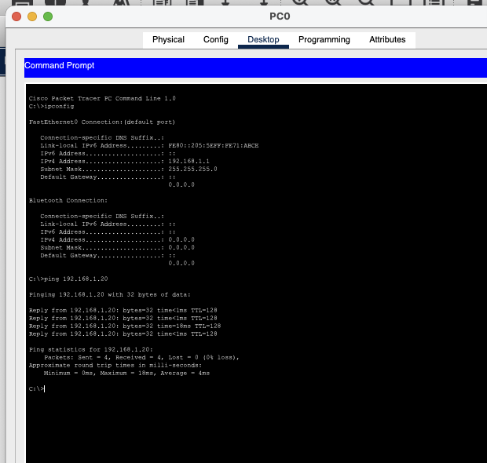
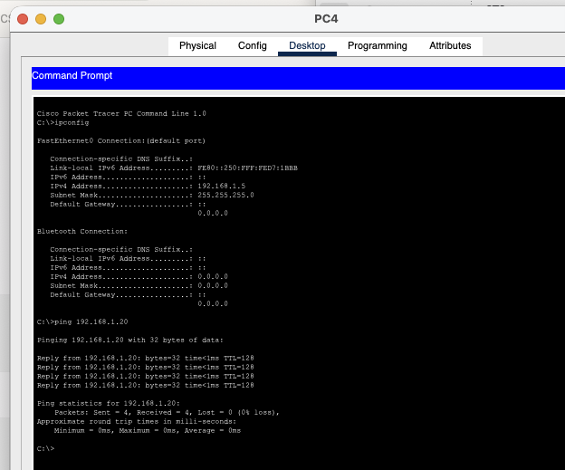

# Lab 02 - DHCP Server Address Troubleshooting

## Overview

This Cisco Packet Tracer lab focuses on troubleshooting DHCP in a simple Layer 2 LAN.

The topology contains:

- 1 DHCP server
- 3 Cisco 2960 switches
- 5 client PCs
- No router
- A single VLAN 1 broadcast domain



The DHCP service was enabled and a valid LAN pool already existed, but the DHCP server itself had no IPv4 address configured.

---

## Initial Observation

The DHCP server interface was physically up, but no IPv4 address was assigned.

```text
FastEthernet0: Up
IPv4 Address:  <not set>
```



This was the key fault: the DHCP service and scope existed, but the server interface was not correctly addressed on the LAN.

---

## DHCP Pool Verification

The DHCP service was already enabled:

```text
DHCP Service: On
```

The `LAN` pool already contained the expected addressing information:

```text
Pool Name:       LAN
Start IP:        192.168.1.1
Subnet Mask:     255.255.255.0
Default Gateway: 192.168.1.254
DNS Server:      8.8.8.8
```



Because the pool already existed, the investigation focused on the server interface rather than changing the switching topology.

---

## Root Cause

The DHCP server did not have a static IPv4 address on FastEthernet0.

```text
IPv4 Address: <not set>
```

The server therefore needed to be placed correctly in the same `192.168.1.0/24` LAN as the clients.

---

## Resolution

The server was configured with a static IPv4 address:

```text
IPv4 Address: 192.168.1.20
Subnet Mask:  255.255.255.0
```

No router is present in this lab, so a default gateway was not required for local client-to-server communication.



The server then reported:

```text
FastEthernet0   Up   192.168.1.20/24
```

---

## Client DHCP Validation

PC0 was configured for DHCP and successfully received:

```text
IPv4 Address: 192.168.1.1
Subnet Mask:  255.255.255.0
```

PC0 then successfully reached the DHCP server:

```bash
ping 192.168.1.20
```

Result:

```text
4/4 replies
0% packet loss
```



---

## Final Addressing

All five clients successfully received DHCP addresses:

| Client | DHCP Address |
|---|---|
| PC0 | `192.168.1.1` |
| PC1 | `192.168.1.2` |
| PC2 | `192.168.1.3` |
| PC3 | `192.168.1.4` |
| PC4 | `192.168.1.5` |

All clients successfully pinged the DHCP server at `192.168.1.20` with **0% packet loss**.



---

## Troubleshooting Methodology

```text
Inspect topology
      ↓
Check server interface state
      ↓
Verify DHCP service
      ↓
Verify DHCP pool
      ↓
Identify missing server IPv4 address
      ↓
Configure static server IP
      ↓
Renew client DHCP leases
      ↓
Verify client addressing
      ↓
Ping DHCP server
```

---

## Commands Used

### Client Verification

```bash
ipconfig
ping 192.168.1.20
```

### Switch Verification

```bash
enable
show vlan brief
show interfaces trunk
```

No switch configuration changes were required because all active ports already operated in VLAN 1.

---

## Skills Practiced

- DHCP troubleshooting
- Static server addressing
- DHCP scope verification
- IPv4 addressing
- Layer 2 troubleshooting
- VLAN 1 verification
- DHCP lease validation
- ICMP connectivity testing
- Fault isolation
- Cisco Packet Tracer server configuration

---

## Key Takeaway

A DHCP service can be enabled and have a valid scope while still failing because the server interface itself is not correctly addressed.

A useful troubleshooting sequence is:

```text
Service status
      +
Pool configuration
      +
Server interface configuration
      +
Client validation
```

Checking each layer prevented unnecessary changes to the switching infrastructure.
