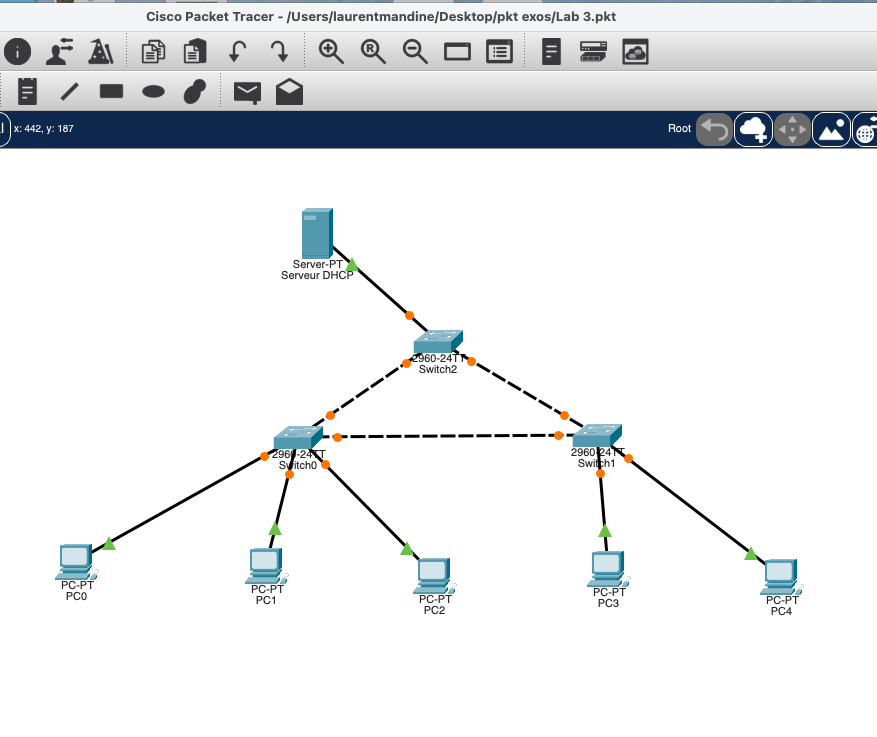
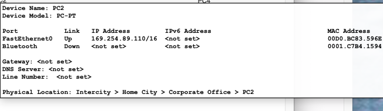
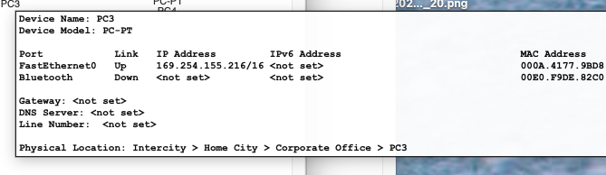
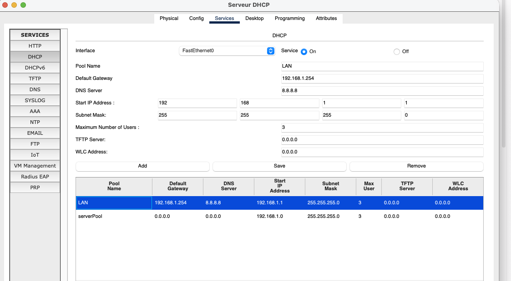
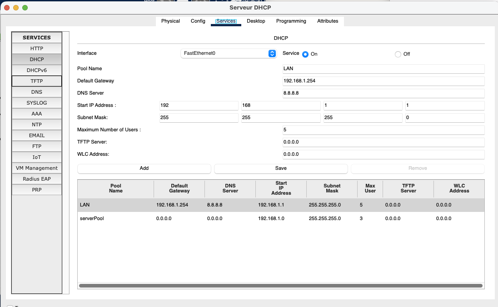
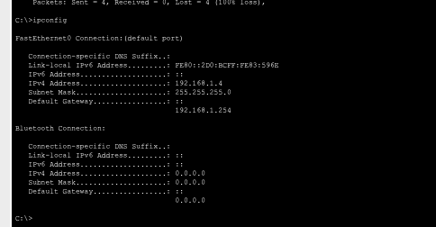
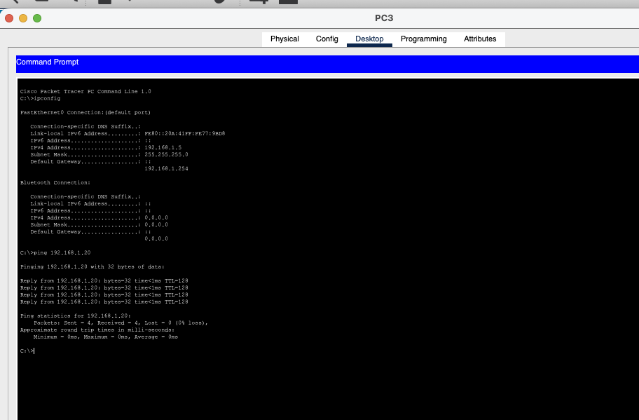

# Lab 03 - DHCP Pool Exhaustion Troubleshooting

## Overview

This Cisco Packet Tracer lab focuses on troubleshooting DHCP address allocation in a simple Layer 2 LAN with one DHCP server, three Cisco 2960 switches, and five client PCs.



The DHCP server is configured as `192.168.1.20/24`.

## Initial Symptom

Three clients obtained valid DHCP leases, while PC2 and PC3 fell back to APIPA addresses.

```text
PC0 -> 192.168.1.1
PC4 -> 192.168.1.2
PC1 -> 192.168.1.3
PC2 -> 169.254.89.110/16
PC3 -> 169.254.155.216/16
```





An address in `169.254.0.0/16` indicates that the client attempted DHCP but did not obtain a valid lease.

## Investigation

The key clue was that exactly three clients had valid leases while two clients failed. The DHCP configuration confirmed the cause:

```text
Start IP Address:        192.168.1.1
Subnet Mask:             255.255.255.0
Maximum Number of Users: 3
```



The topology contained five DHCP clients, but the pool was sized for only three.

## Root Cause

The primary root cause was DHCP pool exhaustion:

```text
Maximum Number of Users: 3
```

A secondary configuration issue was present because Packet Tracer retained its built-in `serverPool` on the same subnet. The default pool could not be removed, so its values were aligned with the intended DHCP configuration to avoid inconsistent behavior during lease renewal.

## Resolution

The `LAN` DHCP pool was changed to:

```text
Start IP Address:        192.168.1.1
Subnet Mask:             255.255.255.0
Maximum Number of Users: 5
```



The built-in `serverPool` was also aligned with the same subnet and usable client capacity, the DHCP service was restarted, and the failed clients were forced to renew their leases.

## PC2 Validation

PC2 successfully obtained:

```text
IPv4 Address:    192.168.1.4
Subnet Mask:     255.255.255.0
Default Gateway: 192.168.1.254
```



PC2 successfully pinged the DHCP server at `192.168.1.20` with 0% packet loss.

## PC3 Validation

PC3 successfully obtained:

```text
IPv4 Address:    192.168.1.5
Subnet Mask:     255.255.255.0
Default Gateway: 192.168.1.254
```

PC3 also successfully pinged `192.168.1.20` with 0% packet loss.



## Final Addressing

| Client | Final IPv4 Address |
|---|---|
| PC0 | `192.168.1.1` |
| PC4 | `192.168.1.2` |
| PC1 | `192.168.1.3` |
| PC2 | `192.168.1.4` |
| PC3 | `192.168.1.5` |

All five clients successfully received DHCP leases.

## Troubleshooting Methodology

```text
Observe APIPA clients
        ↓
Compare working and failing clients
        ↓
Notice exactly three valid leases
        ↓
Inspect DHCP pool capacity
        ↓
Identify Max Users = 3
        ↓
Increase capacity to 5
        ↓
Align built-in default pool
        ↓
Restart DHCP service
        ↓
Renew failed clients
        ↓
Verify addressing and connectivity
```

## Commands Used

```text
ipconfig
ping 192.168.1.20
```

Switch verification:

```text
enable
show vlan brief
show interfaces trunk
```

No switch configuration changes were required.

## Skills Practiced

- DHCP troubleshooting
- DHCP pool exhaustion analysis
- APIPA identification
- DHCP scope sizing
- IPv4 addressing
- DHCP lease renewal
- Layer 2 fault isolation
- Client/server connectivity testing
- Cisco Packet Tracer DHCP configuration
- Evidence-based troubleshooting

## Key Takeaway

When several DHCP clients work and the next clients consistently receive APIPA addresses, check DHCP pool capacity before changing the switching infrastructure.

The strongest clue in this lab was the exact match between three successful leases and `Maximum Number of Users = 3`.
