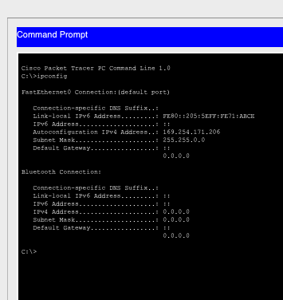
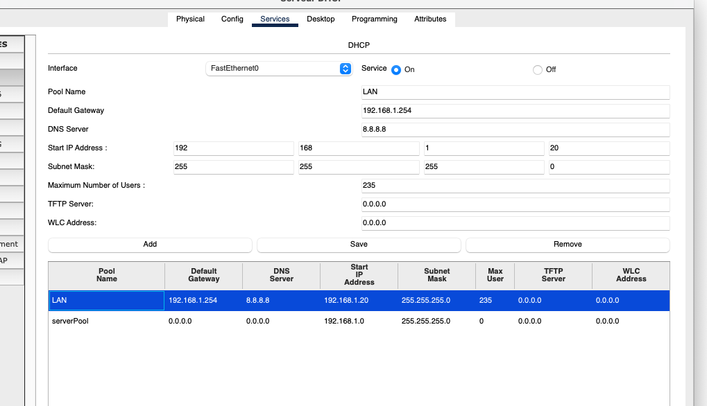
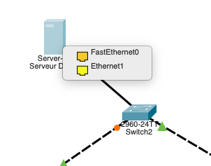
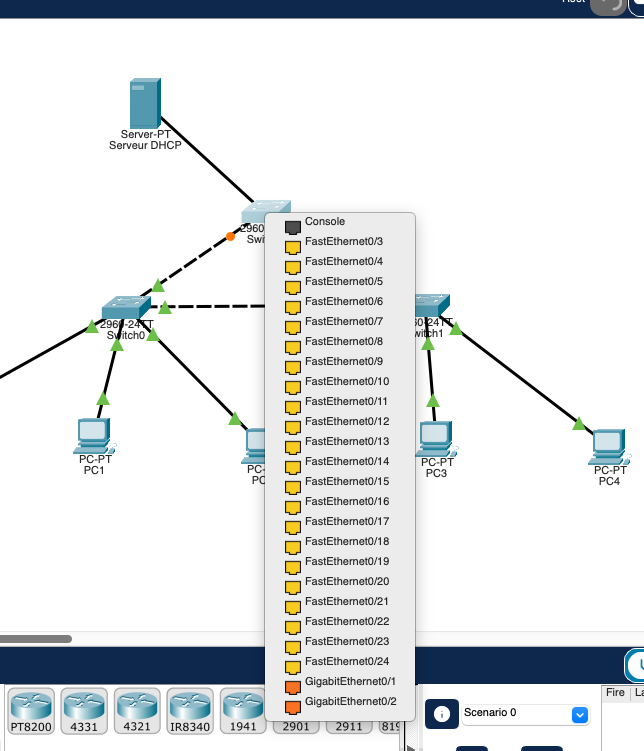
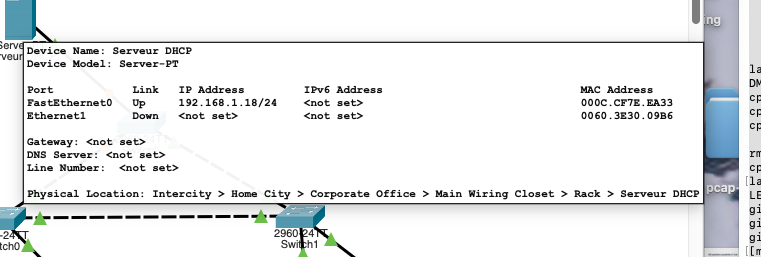
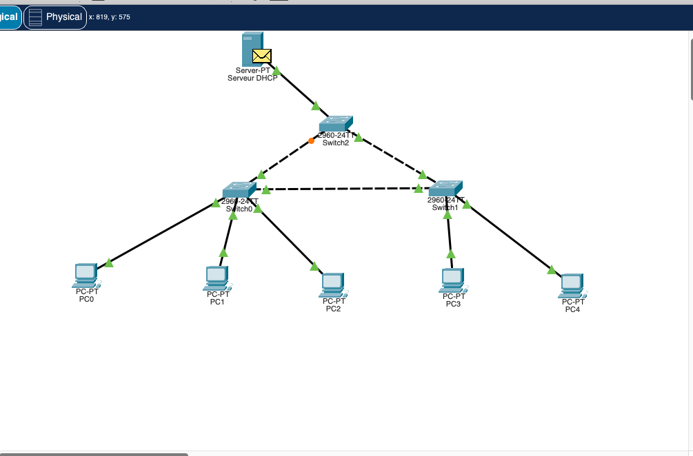
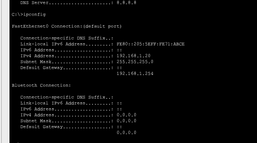
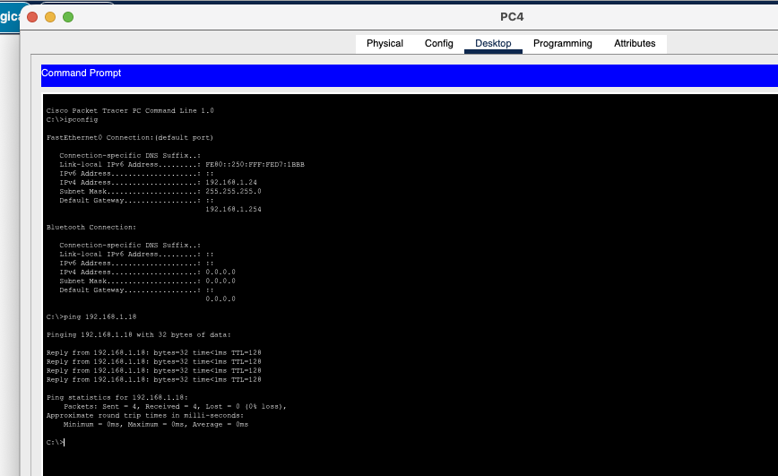

# Lab 04 - DHCP Server Interface Troubleshooting

## Objective

Troubleshoot a Cisco Packet Tracer LAN where DHCP clients cannot obtain valid IPv4 addresses.

The topology contains:

- 1 DHCP server
- 3 Cisco 2960 switches
- 5 client PCs
- A redundant Layer 2 triangle between the switches
- All active switch ports in VLAN 1
- No router in the lab topology

## Initial Symptoms

PC0 was configured for DHCP but received an APIPA address instead of a valid lease:

```text
IPv4 Address: 169.254.171.206
Subnet Mask:  255.255.0.0
Default Gateway: 0.0.0.0
```



This confirmed that DHCP negotiation was failing.

## Investigation

### 1. DHCP service and pool

The DHCP service was already enabled and a `LAN` pool existed.

The final scope used was:

```text
Pool Name:        LAN
Default Gateway:  192.168.1.254
DNS Server:       8.8.8.8
Start IP:         192.168.1.20
Subnet Mask:      255.255.255.0
Maximum Users:    235
```

The scope capacity was cleaned up from 236 to 235 addresses so the pool stops at `192.168.1.254` instead of including the broadcast address `192.168.1.255`.



### 2. Layer 2 connectivity test

PC0 was temporarily configured with:

```text
IP Address:  192.168.1.10
Subnet Mask: 255.255.255.0
```

A ping to the DHCP server address `192.168.1.18` initially failed.

This proved that the problem was not only the DHCP pool. Basic connectivity to the server was also broken.

### 3. Server interface mismatch

The server contained two network interfaces:

- `FastEthernet0`
- `Ethernet1`

The IPv4 address `192.168.1.18/24` and the DHCP service were configured on `FastEthernet0`, but the physical network connection was using the other NIC.



The server was reconnected through `FastEthernet0` to the available port on Switch2.



After the correction, the server showed:

```text
FastEthernet0  Up    192.168.1.18/24
Ethernet1      Down  <not set>
```



The static connectivity test then succeeded with 0% packet loss.

## DHCP Verification in Simulation Mode

Packet Tracer Simulation Mode was filtered to DHCP only and used to follow the full DHCP DORA exchange:

1. DHCP Discover
2. DHCP Offer
3. DHCP Request
4. DHCP ACK

The DHCP request successfully reached the server:



The server returned an ACK and PC0 successfully accepted the lease.

## Final DHCP Leases

All five PCs obtained valid leases:

| Client | IPv4 Address | Subnet Mask | Default Gateway | Ping to 192.168.1.18 |
|---|---|---|---|---|
| PC0 | 192.168.1.20 | 255.255.255.0 | 192.168.1.254 | Pass |
| PC1 | 192.168.1.21 | 255.255.255.0 | 192.168.1.254 | Pass |
| PC2 | 192.168.1.22 | 255.255.255.0 | 192.168.1.254 | Pass |
| PC3 | 192.168.1.23 | 255.255.255.0 | 192.168.1.254 | Pass |
| PC4 | 192.168.1.24 | 255.255.255.0 | 192.168.1.254 | Pass |

PC0 successfully obtained its DHCP lease:



PC4 confirmed the final end-to-end validation:



## Root Cause

The primary fault was a **DHCP server NIC mismatch**.

The server's IP address and DHCP service were configured on `FastEthernet0`, while the physical cable was connected to the other interface.

As a result:

- Clients could not reach the configured server interface.
- A static ping to `192.168.1.18` initially failed.
- DHCP negotiation failed.
- Clients fell back to APIPA addresses.

Reconnecting the server through `FastEthernet0` restored connectivity.

## Additional Configuration Cleanup

The DHCP pool originally allowed 236 users starting at `192.168.1.20`.

For a `/24` network, the usable range from `.20` through `.254` contains 235 addresses. The pool was therefore corrected to:

```text
Maximum Number of Users: 235
```

This was a configuration cleanup and was **not the primary root cause**.

## Key Lessons

- APIPA (`169.254.0.0/16`) is a strong indicator that DHCP negotiation failed.
- Test basic IP connectivity with a temporary static address before assuming the DHCP pool is the only problem.
- On a multi-NIC server, the configured IP address, DHCP service, and physical link must use the same interface.
- Packet Tracer Simulation Mode is useful for verifying DHCP DORA packet by packet.
- A blocked STP port in a redundant Layer 2 topology can be normal and should not be changed without evidence.
- DHCP scope boundaries should never include the subnet broadcast address.

## Result

**Lab 04 completed successfully.**

All five clients receive valid DHCP leases and can reach the DHCP server with 0% packet loss.
