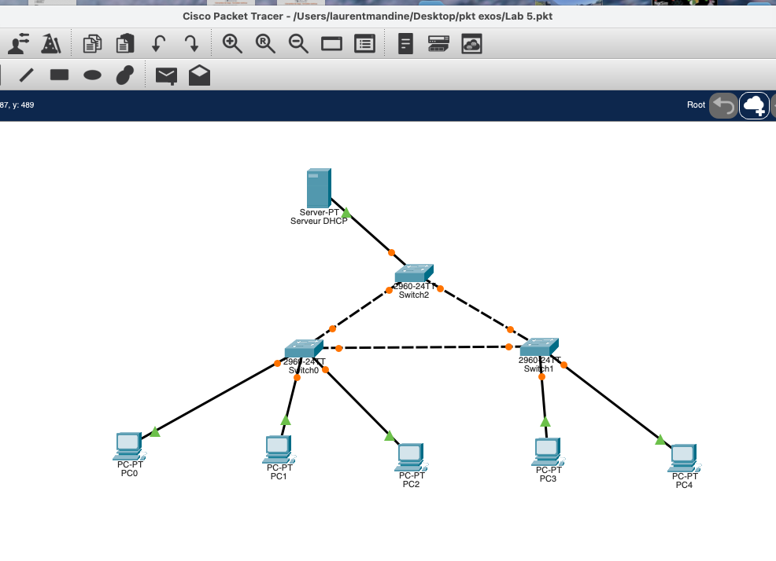
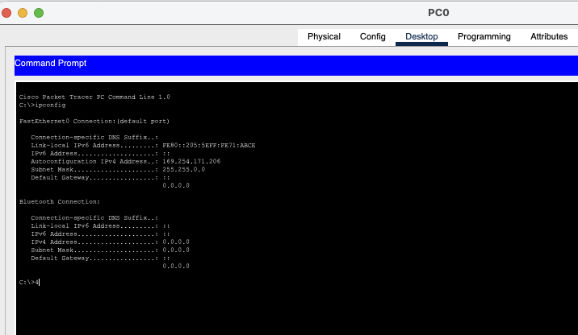
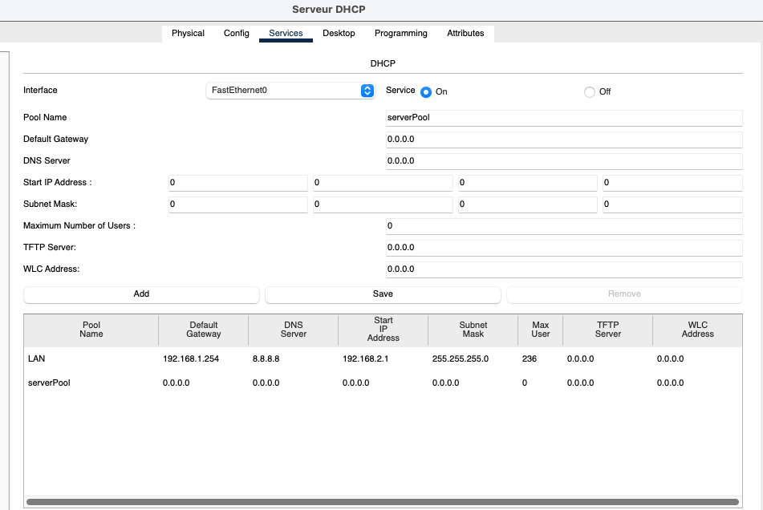
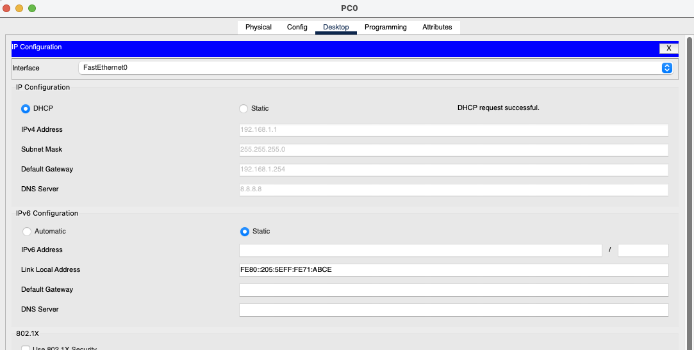
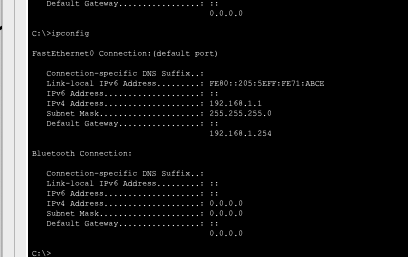
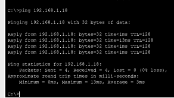
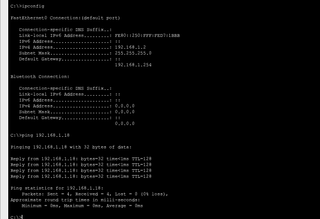
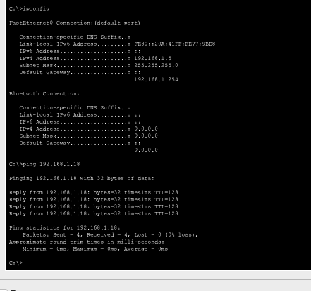

# Lab 05 - DHCP Wrong Subnet Troubleshooting

## Objective
Troubleshoot a Cisco Packet Tracer LAN where DHCP clients fail to receive valid IPv4 addresses.

The topology contains one DHCP server, three Cisco 2960 switches, five PCs, VLAN 1, and redundant Layer 2 links.



## Initial Symptom
PC0 was configured for DHCP but received an APIPA address:

```text
IPv4 Address: 169.254.171.206
Subnet Mask:  255.255.0.0
Default Gateway: 0.0.0.0
```



An address in `169.254.0.0/16` means the host did not successfully obtain a DHCP lease and used APIPA as a fallback.

## Root Cause
The DHCP server itself used `192.168.1.18/24`, but the DHCP pool started at `192.168.2.1/24`.

```text
Actual LAN: 192.168.1.0/24
DHCP pool:  192.168.2.0/24   <-- wrong subnet
```



## Fix
The pool start address was corrected from `192.168.2.1` to `192.168.1.1`.

Final pool:

```text
Pool Name:        LAN
Default Gateway:  192.168.1.254
DNS Server:       8.8.8.8
Start IP Address: 192.168.1.1
Subnet Mask:      255.255.255.0
Maximum Users:    236
```

After renewing DHCP, Packet Tracer reported `DHCP request successful`.



PC0 then received a valid lease:

```text
IPv4 Address:    192.168.1.1
Subnet Mask:     255.255.255.0
Default Gateway: 192.168.1.254
DNS Server:      8.8.8.8
```



## DHCP and APIPA - How They Work Together
DHCP normally follows DORA:

```text
1. DISCOVER - client broadcasts for a DHCP server
2. OFFER    - server offers an address
3. REQUEST  - client asks to use that address
4. ACK      - server confirms the lease
```

```text
Client                                  DHCP Server
  |------ DHCP DISCOVER (broadcast) -------->|
  |<--------- DHCP OFFER --------------------|
  |------ DHCP REQUEST --------------------->|
  |<---------- DHCP ACK ---------------------|
  |        Valid IPv4 lease installed        |
```

If DORA cannot complete, many clients fall back to APIPA:

```text
DHCP succeeds -> valid address from DHCP pool
                 example: 192.168.1.1/24

DHCP fails    -> APIPA fallback
                 example: 169.254.171.206/16
```

APIPA is generated locally by the client. It is not an address assigned by the DHCP server.

In this lab:

```text
Wrong DHCP pool subnet
        |
        v
DHCP lease fails
        |
        v
APIPA 169.254.x.x
        |
        v
Fix scope to 192.168.1.0/24
        |
        v
Renew DHCP
        |
        v
DORA succeeds
        |
        v
Client gets 192.168.1.x/24
```

## Validation
PC0 successfully reached the DHCP server:

```text
ping 192.168.1.18
Sent = 4
Received = 4
Lost = 0
```



Final leases:

| Client | IPv4 Address | Mask | Default Gateway | Ping to Server |
|---|---|---|---|---|
| PC0 | 192.168.1.1 | 255.255.255.0 | 192.168.1.254 | Pass |
| PC4 | 192.168.1.2 | 255.255.255.0 | 192.168.1.254 | Pass |
| PC1 | 192.168.1.3 | 255.255.255.0 | 192.168.1.254 | Pass |
| PC2 | 192.168.1.4 | 255.255.255.0 | 192.168.1.254 | Pass |
| PC3 | 192.168.1.5 | 255.255.255.0 | 192.168.1.254 | Pass |

The order reflects when each client renewed DHCP; it does not have to match PC numbering.





## Key Lessons
- `169.254.x.x` strongly suggests DHCP failure and APIPA fallback.
- Compare the DHCP scope subnet with the real LAN subnet.
- A DHCP server can be up while the scope itself is wrong.
- DHCP uses DORA: Discover, Offer, Request, ACK.
- After correcting a scope, renew the client lease.
- Validate with `ipconfig` and a ping to the server.

## Result
**Lab 05 completed successfully.** The DHCP pool used `192.168.2.0/24` instead of the actual `192.168.1.0/24` LAN.
