# Lab 07 - Router-on-a-Stick, VLAN Trunking and DHCP Relay Troubleshooting

## Objective

Troubleshoot a multi-VLAN Cisco Packet Tracer network using **Router-on-a-Stick** and a centralized DHCP server.

This lab combines several concepts:

- VLAN 10 and VLAN 20
- 802.1Q trunks
- Router subinterfaces
- Inter-VLAN routing
- DHCP relay with `ip helper-address`
- DHCP server return routing
- APIPA troubleshooting
- STP in a redundant switched topology

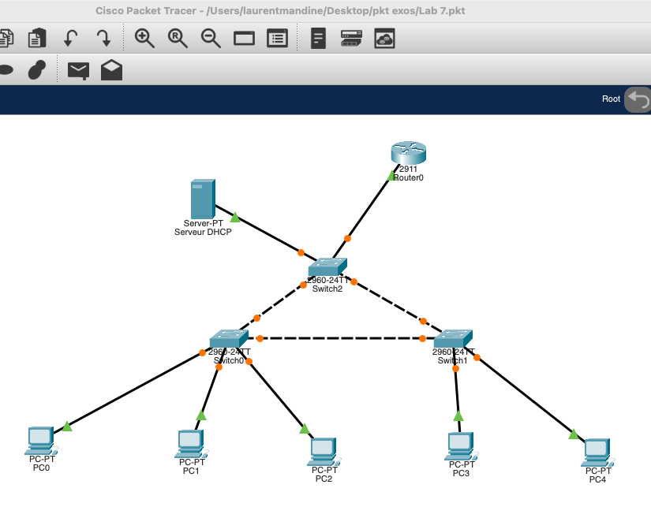

---

## Network Design

### VLAN 10

```text
Network: 192.168.1.0/24
Gateway: 192.168.1.254
Clients: PC0, PC1, PC2
DHCP Server: 192.168.1.18
```

### VLAN 20

```text
Network: 192.168.2.0/24
Gateway: 192.168.2.254
Clients: PC3, PC4
```

### Router-on-a-Stick

Router0 uses one physical interface with two 802.1Q subinterfaces:

```text
GigabitEthernet0/0.10
 encapsulation dot1Q 10
 ip address 192.168.1.254 255.255.255.0

GigabitEthernet0/0.20
 encapsulation dot1Q 20
 ip address 192.168.2.254 255.255.255.0
 ip helper-address 192.168.1.18
```

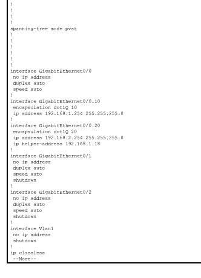

The `ip helper-address` on VLAN 20 is required because DHCP Discover is a broadcast and routers do not normally forward Layer 3 broadcasts between subnets.

---

## DHCP Server Pools

The DHCP server already had two valid pools:

```text
LAN
Gateway: 192.168.1.254
Start IP: 192.168.1.1
Mask: 255.255.255.0

LAN2
Gateway: 192.168.2.254
Start IP: 192.168.2.1
Mask: 255.255.255.0
```

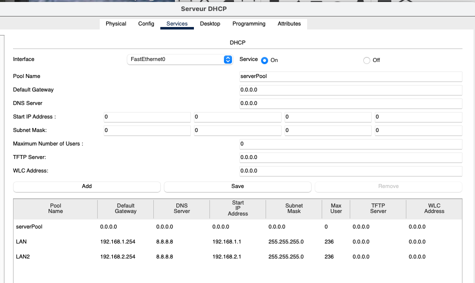

Therefore, the VLAN 20 failure was **not caused by a missing DHCP pool**.

---

# Initial Symptoms

## VLAN 10

PC0 successfully obtained a DHCP lease in `192.168.1.0/24`, but it could not initially reach its gateway `192.168.1.254`.

This was an important clue:

```text
PC0 -> DHCP Server 192.168.1.18   OK
PC0 -> Gateway 192.168.1.254      FAIL
```

The local VLAN worked, but traffic could not reach the router.

## VLAN 20

PC3 received APIPA:

```text
169.254.155.216/16
Gateway: 0.0.0.0
```

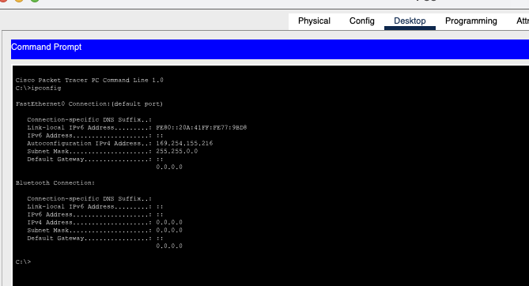

APIPA indicated that PC3 was configured for DHCP but could not complete the DHCP process.

---

# Fault 1 - Router-Facing Switch Port Was Not Trunking

The router subinterfaces were `up/up`, but Router0 could not ping either PC0 or the DHCP server.

The switch MAC address table revealed the router MAC address on **GigabitEthernet0/2**:

```text
0004.9A43.6501 -> Gig0/2
```

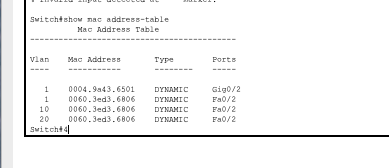

This was the key troubleshooting step: rather than guessing which switch interface connected to Router0, the MAC address table identified the real physical uplink.

The router-facing interface was then configured as an 802.1Q trunk:

```text
interface GigabitEthernet0/2
 switchport mode trunk
 no shutdown
```

Verification showed:

```text
Administrative Mode: trunk
Operational Mode: trunk
Operational Trunking Encapsulation: dot1q
Trunking VLANs Enabled: All
```

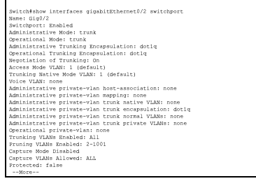

After the trunk correction, PC0 immediately reached its VLAN 10 gateway:

```text
ping 192.168.1.254
Sent = 4
Received = 4
Lost = 0
```

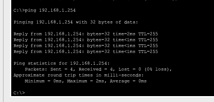

### Why this mattered

Router-on-a-Stick depends on VLAN tags.

```text
Switch VLAN 10 traffic --tag 10--> Router G0/0.10
Switch VLAN 20 traffic --tag 20--> Router G0/0.20
```

If the switch port toward the router is an access port instead of a trunk, the tagged VLAN traffic cannot reach the corresponding router subinterfaces correctly.

---

# Fault 2 - DHCP Server Had No Default Gateway

After fixing the trunk, the DHCP server could reach its local gateway:

```text
Server 192.168.1.18 -> 192.168.1.254   OK
```

but it still could not reach VLAN 20:

```text
Server 192.168.1.18 -> 192.168.2.254   FAIL
```

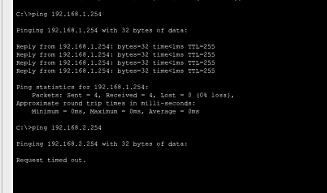

This isolated the second problem.

The DHCP server belonged to:

```text
192.168.1.0/24
```

It can communicate directly with devices in that subnet without a router. However, `192.168.2.0/24` is a remote network. To reach it, the server needs a default gateway.

The server was configured with:

```text
IP Address:      192.168.1.18
Subnet Mask:     255.255.255.0
Default Gateway: 192.168.1.254
```

After adding the default gateway:

```text
Server -> 192.168.2.254
4/4 replies
0% loss
```

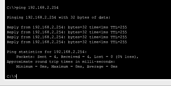

---

# How DHCP Relay Works in This Lab

PC3 is in VLAN 20, while the DHCP server is in VLAN 10.

A DHCP client initially has no IPv4 address, so it sends a broadcast DHCP Discover.

```text
PC3
 | DHCP DISCOVER broadcast
 v
VLAN 20
 |
 v
Router0 G0/0.20
```

Routers do not forward that broadcast normally. The following command converts the DHCP broadcast into a relayed request toward the DHCP server:

```text
ip helper-address 192.168.1.18
```

The flow becomes:

```text
PC3 / VLAN20
     |
     | DHCP DISCOVER
     v
Router0 G0/0.20
     |
     | DHCP relay
     v
DHCP Server 192.168.1.18
     |
     | response via default gateway
     v
Router0 192.168.1.254
     |
     v
PC3 / VLAN20
```

The helper address was already correct. The server's missing default gateway prevented the return path to the remote VLAN.

---

# DHCP and APIPA

Normal DHCP uses **DORA**:

```text
1. DISCOVER
2. OFFER
3. REQUEST
4. ACK
```

If the process succeeds:

```text
PC3 -> valid DHCP address such as 192.168.2.x/24
```

If DHCP fails and no valid lease is obtained, the client may fall back to APIPA:

```text
169.254.x.x/16
```

In this lab:

```text
Router trunk failure
        +
DHCP server missing return route
        |
        v
DHCP cannot complete for VLAN20
        |
        v
PC3 -> 169.254.x.x APIPA
```

After both faults were corrected, PC3 received:

```text
IPv4 Address:    192.168.2.21
Subnet Mask:     255.255.255.0
Default Gateway: 192.168.2.254
```

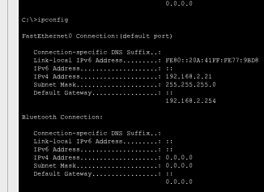

---

# Final Validation

PC3 successfully reached both its local gateway and the DHCP server in the other VLAN:

```text
ping 192.168.2.254   -> 0% loss
ping 192.168.1.18    -> 0% loss
```

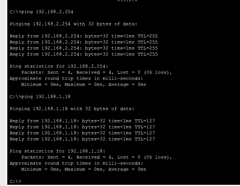

Inter-VLAN routing was then validated by reaching PC0 in VLAN 10:

```text
PC3/PC4 -> 192.168.1.1
4/4 replies
0% loss
```

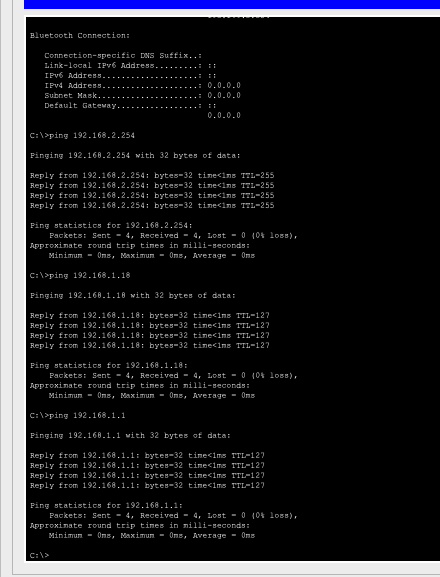

---

# Root Causes

Two independent problems were present:

1. **The actual router-facing switch interface `Gi0/2` was not operating as an 802.1Q trunk.**
2. **The DHCP server had no default gateway, so it could not return traffic to the remote VLAN 20 network.**

The DHCP pools and Router0 `ip helper-address` configuration were already correct.

---

# Troubleshooting Logic to Remember

A useful diagnostic pattern from this lab:

```text
Can reach devices in same subnet,
but cannot reach gateway
        -> inspect VLAN / trunk / router-facing port
```

```text
Server can reach same subnet,
but cannot reach another subnet
        -> inspect routing / default gateway
```

```text
DHCP client gets 169.254.x.x
        -> DHCP did not complete
        -> verify DORA path, VLANs, relay, scope and return routing
```

Also, do not guess physical switch ports when the topology is unclear. Use:

```text
show mac address-table
```

to identify where a known device MAC is actually learned.

---

## Result

**Lab 07 completed successfully.**

- VLAN 10 operational
- VLAN 20 operational
- Router-on-a-Stick operational
- 802.1Q trunk operational
- Inter-VLAN routing operational
- DHCP relay operational
- DHCP server return routing operational
- APIPA condition resolved
