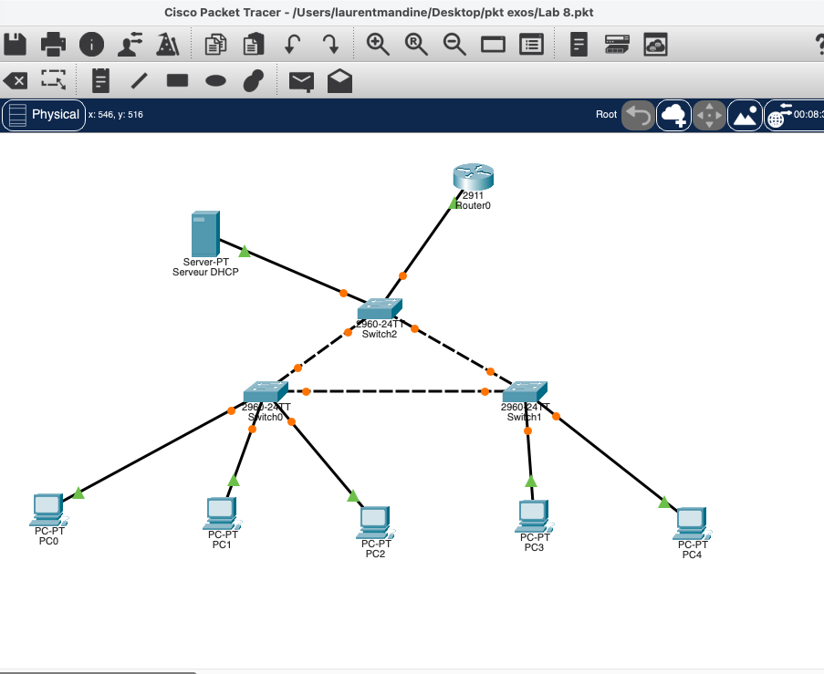
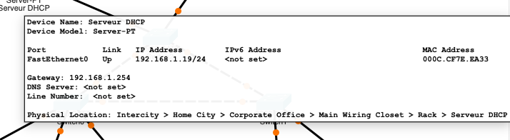
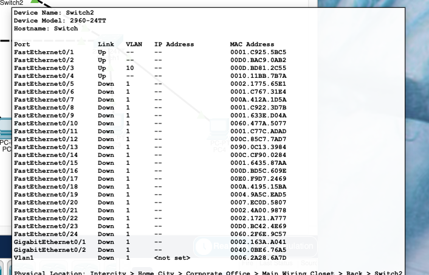
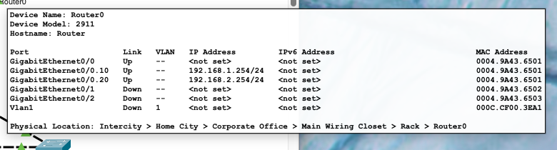
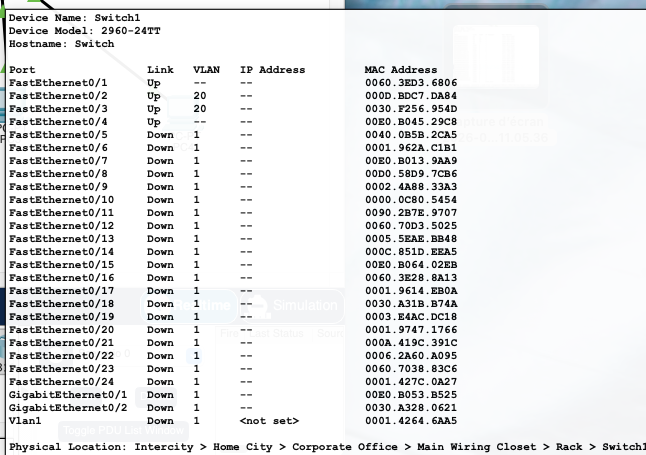
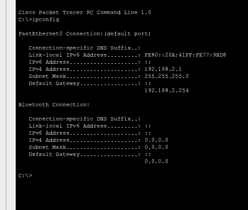
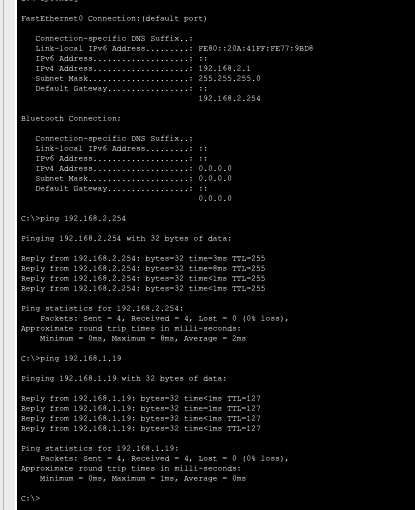

# Lab 08 - DHCP Relay Troubleshooting with `ip helper-address`

## Objective

Troubleshoot DHCP for a multi-VLAN Cisco Packet Tracer network using:

- VLAN 10: `192.168.1.0/24`
- VLAN 20: `192.168.2.0/24`
- Router-on-a-Stick
- One centralized DHCP server
- DHCP relay with `ip helper-address`



## Topology

The DHCP server is located in VLAN 10:

```text
DHCP Server: 192.168.1.19/24
Default Gateway: 192.168.1.254
```



Router0 provides the Layer 3 gateways:

```text
G0/0.10 -> 192.168.1.254/24
G0/0.20 -> 192.168.2.254/24
```



VLAN 10 clients are connected on the left side:



VLAN 20 clients are connected on the right side:



## The Problem

VLAN 20 clients could not obtain a DHCP lease.

The router configuration contained:

```text
interface GigabitEthernet0/0.20
 encapsulation dot1Q 20
 ip address 192.168.2.254 255.255.255.0
 ip helper-address 192.168.1.18
```

But the DHCP server was actually:

```text
192.168.1.19
```

The router was relaying DHCP traffic to the wrong server address.

## What Does `ip helper-address` Do?

DHCP clients initially do not have an IPv4 address, so they begin with a broadcast DHCP Discover:

```text
Source:      0.0.0.0
Destination: 255.255.255.255
```

Routers separate broadcast domains and do not forward that broadcast between VLANs by default.

Therefore, a DHCP server in VLAN 10 cannot directly hear a DHCP broadcast generated by a PC in VLAN 20.

Cisco uses a DHCP relay on the router:

```text
ip helper-address <DHCP-SERVER-IP>
```

In this lab:

```text
interface GigabitEthernet0/0.20
 ip helper-address 192.168.1.19
```

The router receives the DHCP broadcast on VLAN 20 and relays it toward the DHCP server.

### DHCP Relay Flow

```text
PC3 - VLAN 20
192.168.2.0/24
      |
      | DHCP DISCOVER broadcast
      v
Router0 G0/0.20
192.168.2.254
      |
      | ip helper-address 192.168.1.19
      v
DHCP Server
192.168.1.19
      |
      | DHCP response
      v
Router0
      |
      v
PC3 receives 192.168.2.x
```

## DHCP DORA with a Relay

The normal DHCP exchange remains:

```text
DISCOVER
OFFER
REQUEST
ACK
```

The router simply relays the DHCP messages between the remote subnet and the DHCP server.

```text
PC3                Router0                 DHCP Server
 |                    |                         |
 |--- DISCOVER ------>|                         |
 |                    |------ relay ---------->|
 |                    |<------ OFFER -----------|
 |<------ OFFER ------|                         |
 |--- REQUEST ------->|                         |
 |                    |------ relay ---------->|
 |                    |<------- ACK ------------|
 |<------- ACK -------|                         |
```

## Root Cause

Incorrect DHCP relay destination:

```text
Wrong:
ip helper-address 192.168.1.18

Correct:
ip helper-address 192.168.1.19
```

The helper address still pointed to the DHCP server address used in a previous lab.

## Fix

On Router0:

```text
enable
configure terminal
interface GigabitEthernet0/0.20
no ip helper-address 192.168.1.18
ip helper-address 192.168.1.19
end
show running-config
```

Final configuration:

```text
interface GigabitEthernet0/0.20
 encapsulation dot1Q 20
 ip address 192.168.2.254 255.255.255.0
 ip helper-address 192.168.1.19
```

## Validation

After renewing DHCP on PC3:

```text
IPv4 Address:    192.168.2.1
Subnet Mask:     255.255.255.0
Default Gateway: 192.168.2.254
```



PC3 successfully reached both its gateway and the DHCP server in VLAN 10:

```text
ping 192.168.2.254
Sent = 4, Received = 4, Lost = 0

ping 192.168.1.19
Sent = 4, Received = 4, Lost = 0
```



This validates:

- VLAN 20 DHCP
- Router-on-a-Stick
- 802.1Q tagging
- DHCP relay
- Inter-VLAN routing
- Correct DHCP server reachability

## APIPA Reminder

If DHCP fails, a client may self-assign an APIPA address:

```text
169.254.x.x/16
```

Quick troubleshooting rule:

```text
192.168.x.x from expected pool -> DHCP succeeded
169.254.x.x                  -> DHCP failed; APIPA fallback
0.0.0.0                      -> no usable IPv4 configuration yet
```

## Key Lessons

- DHCP broadcasts do not cross routers by default.
- `ip helper-address` lets a router relay DHCP requests to a server in another subnet.
- The helper address must point to the current DHCP server IP.
- A correct VLAN and gateway configuration is not enough if the relay target is wrong.
- Always verify the actual DHCP server IP instead of reusing values from a previous topology.
- Use `show running-config`, `ipconfig`, and ping tests to isolate the problem.

## Result

**Lab 08 completed successfully.**

The root cause was an outdated DHCP relay destination on `G0/0.20`.
