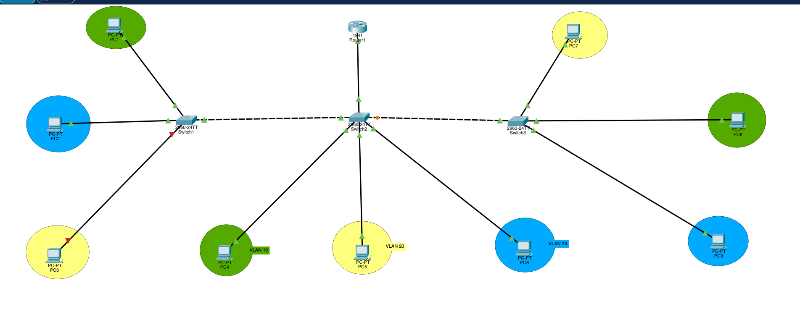
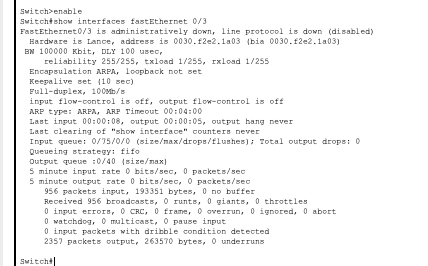
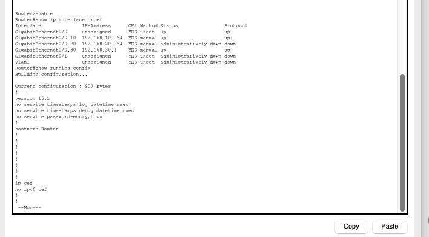
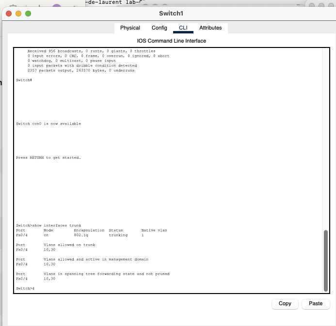
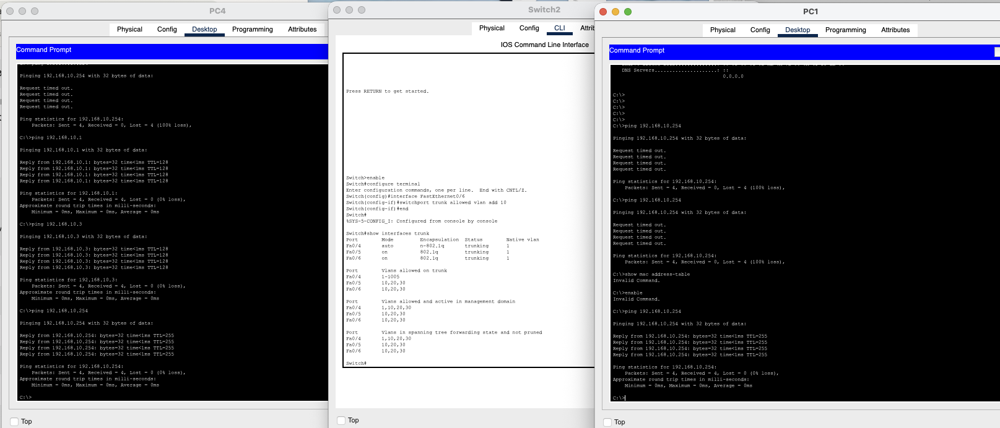
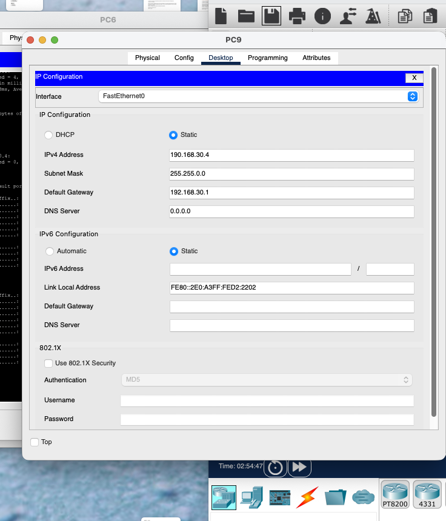
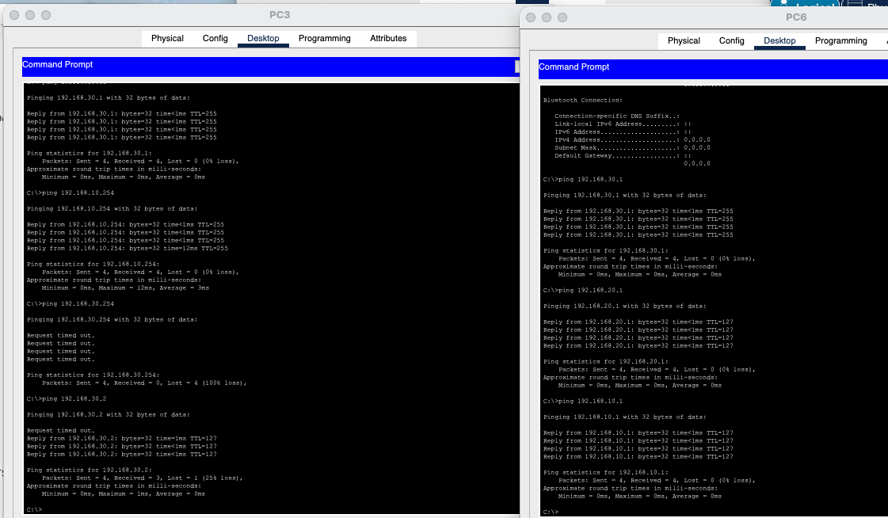

# General VLAN Troubleshooting Lab

## Overview

This Cisco Packet Tracer lab involved troubleshooting a multi-switch, multi-VLAN network with **Router-on-a-Stick** inter-VLAN routing.

The topology uses three VLANs:

| VLAN | Network | Gateway |
|---|---|---|
| VLAN 10 | `192.168.10.0/24` | `192.168.10.254` |
| VLAN 20 | `192.168.20.0/24` | `192.168.20.254` |
| VLAN 30 | `192.168.30.0/24` | `192.168.30.1` |



This lab contained several independent faults across Layer 2 and Layer 3. The objective was to diagnose each problem systematically instead of changing configurations at random.

---

## Troubleshooting Strategy

The investigation followed this path:

```text
Host configuration
       ↓
Access port state
       ↓
VLAN existence and membership
       ↓
Trunk allowed VLANs
       ↓
Router subinterfaces
       ↓
MAC address tables
       ↓
Gateway tests
       ↓
Inter-VLAN verification
```

---

## Fault 1 - Switch1 Fa0/3 Administratively Down

PC3 belonged to VLAN 20 but could not reach its gateway.

`show interfaces FastEthernet0/3` revealed:

```text
FastEthernet0/3 is administratively down,
line protocol is down (disabled)
```



### Fix

```bash
configure terminal
interface FastEthernet0/3
 no shutdown
end
```

---

## Fault 2 - Router VLAN 20 Subinterface Administratively Down

After restoring the access port, VLAN 20 still could not reach its gateway.

The router showed:

```text
GigabitEthernet0/0.20  192.168.20.254
administratively down  down
```



The Router-on-a-Stick configuration was correct:

```text
interface GigabitEthernet0/0.20
 encapsulation dot1Q 20
 ip address 192.168.20.254 255.255.255.0
```

but the subinterface had been shut down.

### Fix

```bash
configure terminal
interface GigabitEthernet0/0.20
 no shutdown
end
```

---

## Fault 3 - VLAN 20 Missing From the Switch1 Trunk

The trunk between Switch1 and the central switch was operational, but it only allowed:

```text
10,30
```

VLAN 20 was missing.



### Fix

```bash
configure terminal
interface FastEthernet0/4
 switchport trunk allowed vlan add 20
end
```

Final allowed VLANs:

```text
10,20,30
```

---

## Fault 4 - VLAN 20 Did Not Exist Locally on Switch1

Even after the trunk fix, `show interfaces FastEthernet0/3 switchport` showed:

```text
Access Mode VLAN: 20 (Inactive)
```

The access port referenced VLAN 20, but VLAN 20 did not exist in the local VLAN database.

### Fix

```bash
configure terminal
vlan 20
 name VLAN20
exit

interface FastEthernet0/3
 switchport mode access
 switchport access vlan 20
 no shutdown
end
```

The final membership became:

```text
VLAN 10 -> Fa0/1
VLAN 20 -> Fa0/3
VLAN 30 -> Fa0/2
```

---

## Fault 5 - Central Switch Port Toward the Router Was Not a Proper Trunk

The central switch contained three network-facing links. The port toward the router had initially been left as an access port.

Router-on-a-Stick requires an 802.1Q trunk between the switch and the router.

### Fix

```bash
configure terminal
interface FastEthernet0/5
 switchport mode trunk
 switchport trunk allowed vlan 10,20,30
end
```

---

## Fault 6 - VLAN 10 Missing From the Router Trunk

Further testing showed that hosts in VLAN 10 could communicate with each other but could not reach `192.168.10.254`.

MAC-address-table analysis identified the real router uplink as `FastEthernet0/6`.

That trunk allowed only:

```text
20,30
```

VLAN 10 was missing.

### Fix

```bash
configure terminal
interface FastEthernet0/6
 switchport trunk allowed vlan add 10
end
```

Final trunk state:

```text
10,20,30
```



---

## Fault 7 - Incorrect Host Configuration on PC3

PC3 originally used:

```text
IP Address:      192.168.20.1
Subnet Mask:     255.255.252.0
Default Gateway: 192.168.20.254
```

The subnet mask was incorrect.

### Fix

```text
IP Address:      192.168.20.1
Subnet Mask:     255.255.255.0
Default Gateway: 192.168.20.254
```

---

## Fault 8 - PC4 Had No IPv4 Configuration

PC4 was connected to VLAN 10 but had:

```text
IPv4 Address:    0.0.0.0
Subnet Mask:     0.0.0.0
Default Gateway: 0.0.0.0
```

The addressing pattern showed that PC4 should use:

```text
IP Address:      192.168.10.2
Subnet Mask:     255.255.255.0
Default Gateway: 192.168.10.254
```

After configuration, PC4 could communicate with VLAN 10 peers.

---

## Fault 9 - Incorrect PC9 IPv4 Address and Subnet Mask

PC9 initially had:

```text
IP Address:      190.168.30.4
Subnet Mask:     255.255.0.0
Default Gateway: 192.168.30.1
```

Two values were incorrect:
- `190.168.30.4` should have been `192.168.30.4`
- `255.255.0.0` should have been `255.255.255.0`



### Fix

```text
IP Address:      192.168.30.4
Subnet Mask:     255.255.255.0
Default Gateway: 192.168.30.1
```

After correction, PC9 successfully reached:
- `192.168.30.2`
- `192.168.30.1`
- `192.168.20.1`
- `192.168.10.1`

All tests completed with **0% packet loss**.

---

## Fault 10 - PC7 Connected to a Trunk Instead of a VLAN 20 Access Port

Switch3 initially showed:

```text
Fa0/1 -> trunk
Fa0/2 -> VLAN 10
Fa0/3 -> VLAN 30
Fa0/4 -> trunk
```

PC7 was a VLAN 20 endpoint, so `Fa0/1` should not have been a trunk.

### Fix

```bash
configure terminal
interface FastEthernet0/1
 switchport mode access
 switchport access vlan 20
 no shutdown
end
```

Final Switch3 access VLANs:

```text
VLAN 10 -> Fa0/2
VLAN 20 -> Fa0/1
VLAN 30 -> Fa0/3
```

PC7 then successfully reached:
- `192.168.20.254`
- `192.168.10.1`
- `192.168.30.2`

All tests completed with **0% packet loss**.

---

## Final Verification

Inter-VLAN communication was validated from multiple endpoints.

Example tests included:

```bash
ping 192.168.10.1
ping 192.168.20.1
ping 192.168.30.2
ping 192.168.10.254
ping 192.168.20.254
ping 192.168.30.1
```



The repaired network successfully provided:
- VLAN 10 connectivity
- VLAN 20 connectivity
- VLAN 30 connectivity
- Router-on-a-Stick routing
- inter-VLAN communication
- correct trunk propagation
- correct host addressing

---

## Commands Used

```bash
show ip interface brief
show running-config
show vlan brief
show interfaces trunk
show interfaces FastEthernet0/x
show interfaces FastEthernet0/x switchport
show mac address-table
show arp
show spanning-tree vlan 10
show port-security interface FastEthernet0/1
```

Corrective commands included:

```bash
no shutdown
switchport mode access
switchport access vlan <ID>
switchport mode trunk
switchport trunk allowed vlan add <ID>
vlan <ID>
```

---

## Skills Practiced

- VLAN troubleshooting
- Access-port troubleshooting
- 802.1Q trunk configuration
- Router-on-a-Stick
- Inter-VLAN routing
- VLAN database troubleshooting
- MAC address-table analysis
- ARP analysis
- Spanning Tree verification
- Host IPv4 troubleshooting
- Default gateway validation
- Subnet-mask troubleshooting
- Cisco IOS interface states
- Evidence-based fault isolation

---

## Key Takeaway

This lab demonstrated that network outages are often caused by **multiple simultaneous faults**.

A working troubleshooting process should avoid assuming that the first discovered problem is the only problem.

The most effective approach was:

```text
Observe
  ↓
Verify
  ↓
Change one item
  ↓
Test
  ↓
Continue only if necessary
```

The combination of interface state, VLAN membership, trunk configuration, MAC tables, ARP tables and endpoint tests made it possible to isolate each fault systematically.
