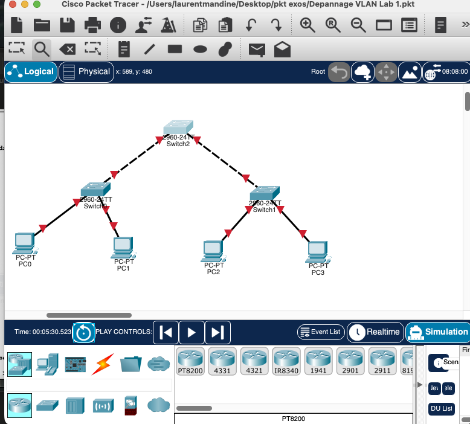

# Lab 01 – VLAN Troubleshooting: `Depannage VLAN Lab 1`



## Objective

Troubleshoot a simple switched network where PCs connected to different access switches must communicate through a central switch using VLAN `999`.

The goal of the lab was to identify why VLAN traffic was not passing correctly between the left switch, the right switch, and the central switch.

## Topology

The Packet Tracer topology contains:

| Device | Role | Connected devices |
|---|---|---|
| Switch0 | Access switch | PC0 and PC1 |
| Switch1 | Access switch | PC2 and PC3 |
| Switch2 | Core/transit switch | Switch0 and Switch1 |
| PC0, PC1, PC2, PC3 | End devices | Connected to access ports |

Expected design:

```text
PC0 ─┐
     ├── Switch0 ── trunk ── Switch2 ── trunk ── Switch1 ──┬── PC2
PC1 ─┘                                                     └── PC3
```

## What we found during troubleshooting

### 1. Switch0 was mostly correct

On Switch0, the output showed that VLAN `999` existed and that the PC-facing ports were assigned to it:

```text
999  vlan-group  active  Fa0/2, Fa0/3
```

The uplink to Switch2 was also trunking:

```text
Fa0/1  on  802.1q  trunking  native vlan 1
```

### 2. Switch1 was mostly correct

Switch1 had the same type of configuration:

```text
999  vlan-group  active  Fa0/2, Fa0/3
```

Its uplink was also trunking:

```text
Fa0/1  on  802.1q  trunking  native vlan 1
```

### 3. Switch2 was the problem

Switch2 had two trunk links, `Fa0/1` and `Fa0/2`, but VLAN `999` did not exist on the switch at first.

The important clue was this output:

```text
Vlans allowed and active in management domain
Fa0/1       1
Fa0/2       1
```

Even though the trunks allowed VLANs `1-1005`, only VLAN `1` was active. Because VLAN `999` did not exist on Switch2, Switch2 could not forward VLAN `999` traffic between Switch0 and Switch1.

## Root cause

The root cause was:

> VLAN `999` was missing on Switch2, the central transit switch.

A trunk can allow a VLAN, but the VLAN must also exist and be active on the switch. Otherwise, the switch will not forward that VLAN.

## Fix applied on Switch2

We created VLAN `999` on Switch2 and forced both uplinks to operate as trunk ports.

```cisco
Switch> enable
Switch# configure terminal
Switch(config)# vlan 999
Switch(config-vlan)# name vlan-group
Switch(config-vlan)# exit
Switch(config)# interface range fa0/1 - 2
Switch(config-if-range)# switchport mode trunk
Switch(config-if-range)# end
Switch# copy running-config startup-config
```

## Final verification

After the fix, Switch2 showed the expected result:

```text
Port        Vlans allowed and active in management domain
Fa0/1       1,999
Fa0/2       1,999

Port        Vlans in spanning tree forwarding state and not pruned
Fa0/1       1,999
Fa0/2       1,999
```

This confirmed that VLAN `999` was now active and forwarding on both trunk links.

## What is a trunk port?

A **trunk port** is a switch port that carries traffic for multiple VLANs over a single physical link.

In this lab, the links between switches had to be trunk ports because VLAN `999` traffic needed to travel from Switch0 to Switch1 through Switch2.

### Access port vs trunk port

| Port type | Carries | Usually connected to | Example in this lab |
|---|---|---|---|
| Access port | One VLAN | PC, printer, endpoint | PC ports in VLAN `999` |
| Trunk port | Multiple VLANs | Switch, router, firewall, access point | Switch-to-switch links |

### How trunking works

Cisco switches use **802.1Q tagging** on trunk links. This means the switch adds a small VLAN tag to Ethernet frames so the receiving switch knows which VLAN the traffic belongs to.

Example:

```text
PC0 sends traffic in VLAN 999
      ↓
Switch0 forwards it over the trunk to Switch2 with VLAN tag 999
      ↓
Switch2 keeps the VLAN tag and forwards it to Switch1
      ↓
Switch1 removes the tag and sends the frame to the correct access port
```

The native VLAN, VLAN `1` by default in this lab, is the VLAN that is sent untagged on an 802.1Q trunk.

## Useful verification commands

```cisco
show vlan brief
show interfaces trunk
show spanning-tree
show interfaces fa0/1 switchport
show interfaces fa0/2 switchport
show ip interface brief
```

Some commands were not supported in this Packet Tracer IOS image:

```cisco
show interfaces status
show running-config | section vlan
```

When that happens, use the simpler verification commands above.

## Screenshots

| Screenshot | Description |
|---|---|
| [`00-topology-before-fix.png`](assets/00-topology-before-fix.png) | Initial topology in Packet Tracer |
| [`02-full-troubleshooting-overview.png`](assets/02-full-troubleshooting-overview.png) | Overview of topology, PC IPs, and switch checks |
| [`03-switch2-before-vlan999.png`](assets/03-switch2-before-vlan999.png) | Switch2 before VLAN `999` was created |
| [`04-switch2-ports-before-fix.png`](assets/04-switch2-ports-before-fix.png) | Switch2 port information during troubleshooting |

## Lessons learned

- VLANs must exist on every switch that needs to forward that VLAN.
- A trunk link can allow a VLAN, but the VLAN must also be active in the VLAN database.
- Access ports are used for end devices.
- Trunk ports are used between switches when VLAN traffic must cross multiple switches.
- `show interfaces trunk` is one of the most useful commands for VLAN troubleshooting.

## Final status

VLAN `999` is now present on Switch2 and forwarding over both trunk links. The switching/VLAN issue is resolved. If pings still fail after this, the next things to check are the PCs' IP addresses, subnet masks, and access-port assignments.
