# Lab 02 - VLAN Troubleshooting in Cisco Packet Tracer

## Objective

The goal of this lab was to troubleshoot a VLAN connectivity issue between three PCs connected through three Cisco 2960 switches.

At the end of the lab, all PCs were able to communicate using `ping` because they were placed in the same VLAN and the switch-to-switch links were configured correctly as trunk links.

## Final Topology

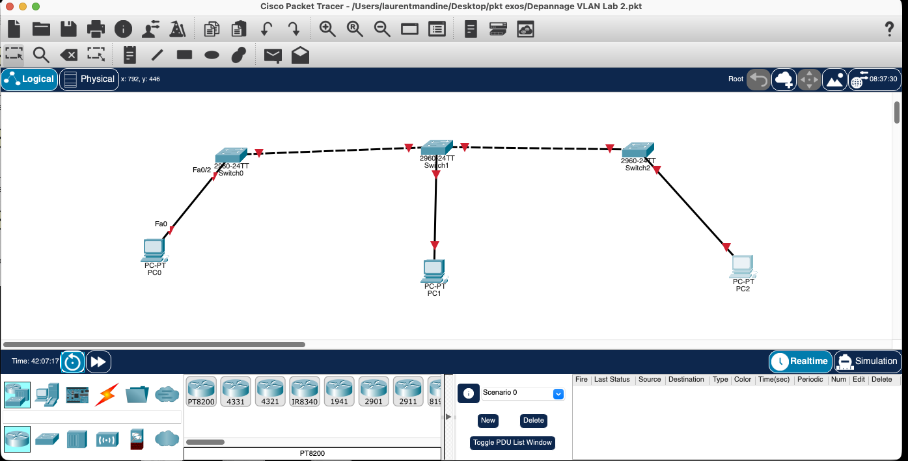

## IP Addressing Plan

| Device | Interface | IP address | Subnet mask | VLAN |
|---|---|---:|---:|---:|
| PC0 | FastEthernet0 | 192.168.1.1 | 255.255.255.0 | 100 |
| PC1 | FastEthernet0 | 192.168.1.2 | 255.255.255.0 | 100 |
| PC2 | FastEthernet0 | 192.168.1.3 | 255.255.255.0 | 100 |

No default gateway was required in this lab because all PCs were in the same subnet and the same VLAN.

## Simple Explanation

Imagine the network is a school.

- The PCs are students.
- The VLAN is a classroom.
- The switches are school buildings.
- Access ports are normal classroom doors.
- Trunk ports are big hallways between buildings.

For the PCs to talk to each other, they all needed to be in the same classroom: **VLAN 100**.

The switch-to-switch links needed to be trunk ports, like big hallways, so VLAN 100 could travel between the switches.

## What Is a Trunk Port?

A **trunk port** is a switch port used to connect one switch to another switch.

A normal access port belongs to only one VLAN. It is usually used for end devices like PCs, printers, or IP phones.

A trunk port can carry VLAN traffic between switches. In this lab, the trunk links carried VLAN 100 across all three switches.

Example:

```text
PC0 --- Switch0 === Switch1 === Switch2 --- PC2
             trunk      trunk
```

The `===` links are trunk links. They allow the VLAN to continue from one switch to another.

### Access Port vs Trunk Port

| Port type | Used for | Carries VLANs | Example in this lab |
|---|---|---|---|
| Access port | PC to switch | One VLAN only | PC0 on Switch0 Fa0/2 in VLAN 100 |
| Trunk port | Switch to switch | VLAN traffic between switches | Switch0 Fa0/1 to Switch1 |

## Initial Problem

The PCs were configured in the same IP subnet:

- PC0: `192.168.1.1/24`
- PC1: `192.168.1.2/24`
- PC2: `192.168.1.3/24`

But they could not communicate correctly because some switch ports were not configured with the correct VLAN mode.

The main issue was on **Switch1**:

- `Fa0/2` was connected to another switch but was configured like an access port in VLAN 100.
- `Fa0/3` was connected to PC1 but was configured like a trunk port.

Those two ports were inverted.

Because of this, Cisco Packet Tracer showed messages like:

```text
%CDP-4-NATIVE_VLAN_MISMATCH: Native VLAN mismatch discovered
```

This warning means the two sides of a link did not agree on how VLAN traffic should be handled.

## Initial Screenshots

### Initial topology

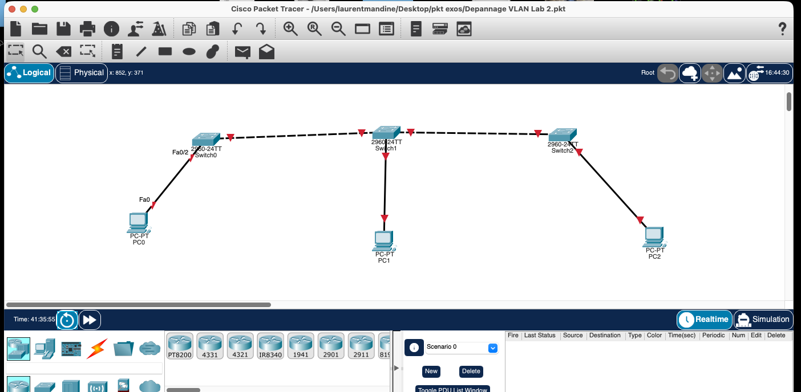

### Initial switch status

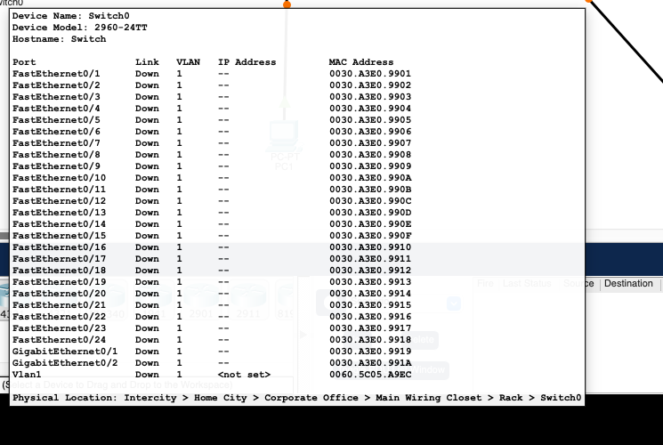

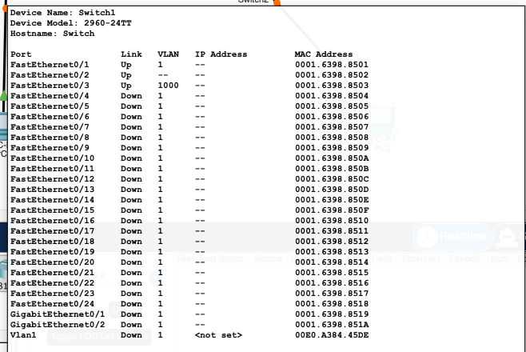

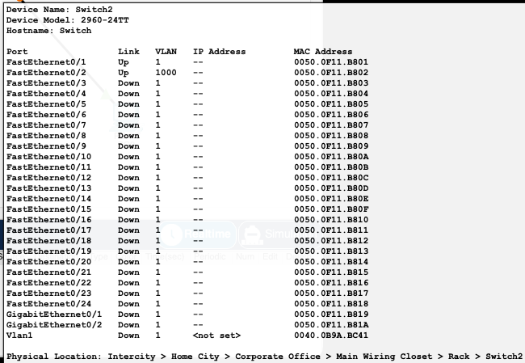

### PC IP configuration

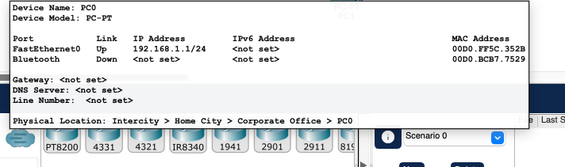

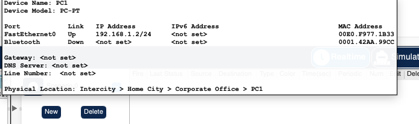

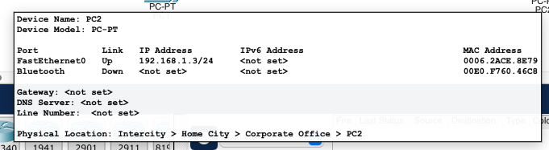

## Final Port Mapping

| Device | Port | Connected to | Final mode | VLAN |
|---|---|---|---|---:|
| Switch0 | Fa0/1 | Switch1 | Trunk | 100 allowed |
| Switch0 | Fa0/2 | PC0 | Access | 100 |
| Switch1 | Fa0/1 | Switch0 | Trunk | 100 allowed |
| Switch1 | Fa0/2 | Switch2 | Trunk | 100 allowed |
| Switch1 | Fa0/3 | PC1 | Access | 100 |
| Switch2 | Fa0/1 | Switch1 | Trunk | 100 allowed |
| Switch2 | Fa0/2 | PC2 | Access | 100 |

## Configuration Applied

### Switch0

```cisco
conf t
vlan 100
 name USERS

interface fa0/2
 switchport mode access
 switchport access vlan 100
 no shutdown

interface fa0/1
 switchport mode trunk
 switchport trunk allowed vlan 100
 no shutdown
end
wr
```

### Switch1

The important correction was on Switch1: `Fa0/2` had to be a trunk port, and `Fa0/3` had to be an access port.

```cisco
conf t
vlan 100
 name USERS

interface fa0/2
 switchport mode trunk
 switchport trunk allowed vlan 100
 no shutdown

interface fa0/3
 switchport mode access
 switchport access vlan 100
 no shutdown
end
wr
```

### Switch2

```cisco
conf t
vlan 100
 name USERS

interface fa0/2
 switchport mode access
 switchport access vlan 100
 no shutdown

interface fa0/1
 switchport mode trunk
 switchport trunk allowed vlan 100
 no shutdown
end
wr
```

## Verification Commands

These commands were used to validate the configuration:

```cisco
show vlan brief
show interfaces trunk
show interfaces status
show cdp neighbors
```

The most important checks were:

- PC ports must appear as access ports in VLAN 100.
- Switch-to-switch ports must appear as trunk ports.
- VLAN 100 must be allowed and active on the trunk links.

## Final Verification Screenshots

### Switch0 final state

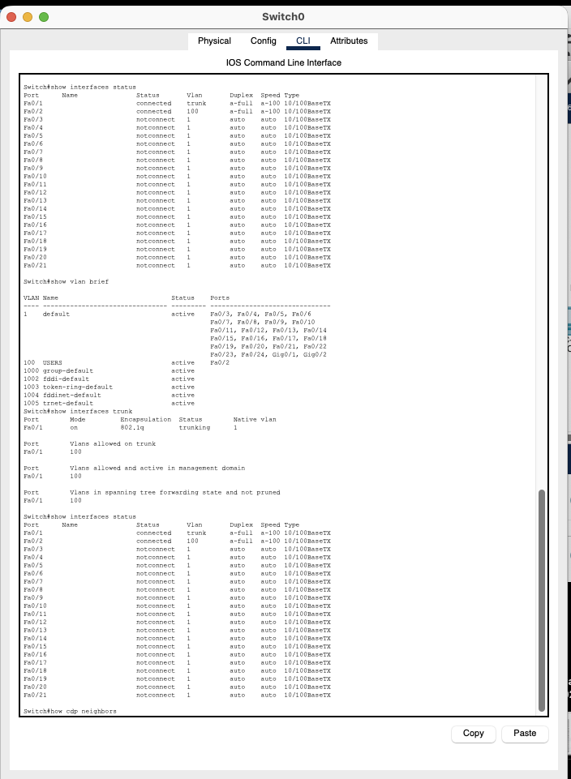

Switch0 final state:

- `Fa0/1` is a trunk port.
- `Fa0/2` is an access port in VLAN 100.

### Switch1 final state

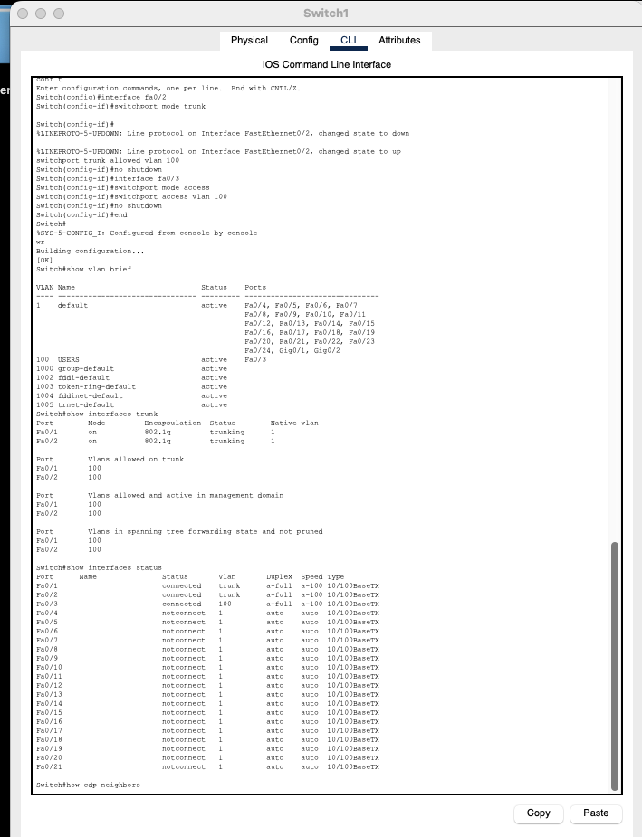

Switch1 final state:

- `Fa0/1` is a trunk port to Switch0.
- `Fa0/2` is a trunk port to Switch2.
- `Fa0/3` is an access port in VLAN 100 for PC1.

### Switch2 final state

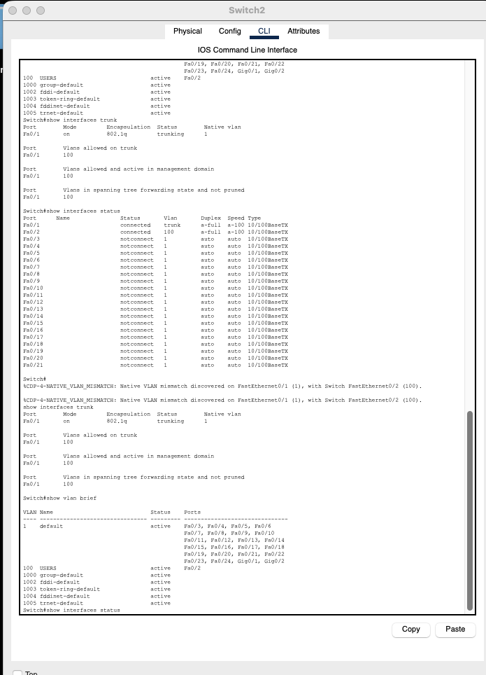

Switch2 final state:

- `Fa0/1` is a trunk port.
- `Fa0/2` is an access port in VLAN 100.

## Connectivity Test

After the correction, the PCs were able to ping each other:

```text
PC0 > ping 192.168.1.2
PC0 > ping 192.168.1.3

PC1 > ping 192.168.1.1
PC1 > ping 192.168.1.3

PC2 > ping 192.168.1.1
PC2 > ping 192.168.1.2
```

Note: the first ping can sometimes fail because ARP needs to learn the MAC address first. Running the ping a second time usually confirms the result.

## Troubleshooting Methodology

1. Checked the IP addresses on PC0, PC1, and PC2.
2. Confirmed all PCs were in the same subnet: `192.168.1.0/24`.
3. Checked switch port states with `show interfaces status`.
4. Checked VLAN membership with `show vlan brief`.
5. Checked trunk links with `show interfaces trunk`.
6. Identified an access/trunk mistake on Switch1.
7. Corrected Switch1 port roles.
8. Confirmed VLAN 100 was allowed across all trunks.
9. Tested connectivity with ping.

## Lessons Learned

- Devices in the same subnet still need to be in the same VLAN to communicate through switches.
- A PC port should normally be an access port.
- A switch-to-switch port should normally be a trunk port.
- A native VLAN mismatch warning usually means the two sides of a link do not agree on VLAN handling.
- `show vlan brief`, `show interfaces trunk`, and `show interfaces status` are essential commands for VLAN troubleshooting.

## Final Summary

The issue was caused by incorrect port roles on Switch1. One port connected to a switch was configured as access, and one port connected to a PC was configured as trunk.

After correcting the port modes and allowing VLAN 100 on the trunk links, all PCs were placed in VLAN 100 and connectivity worked successfully.
