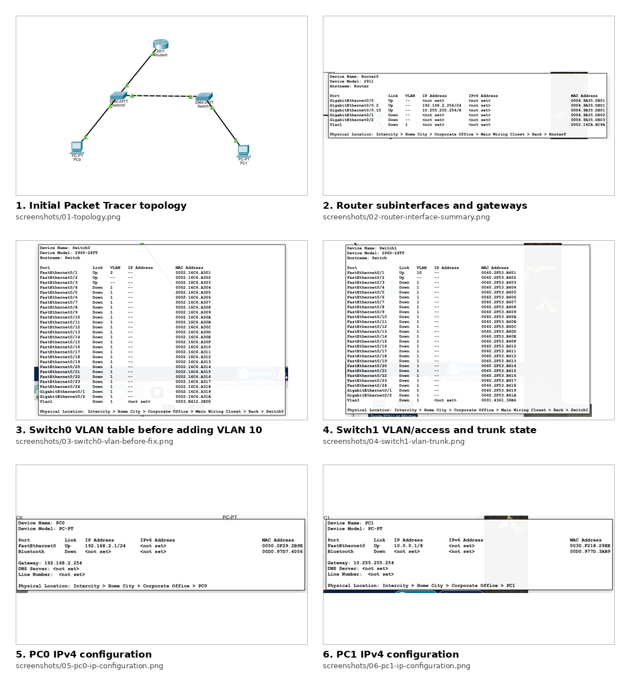
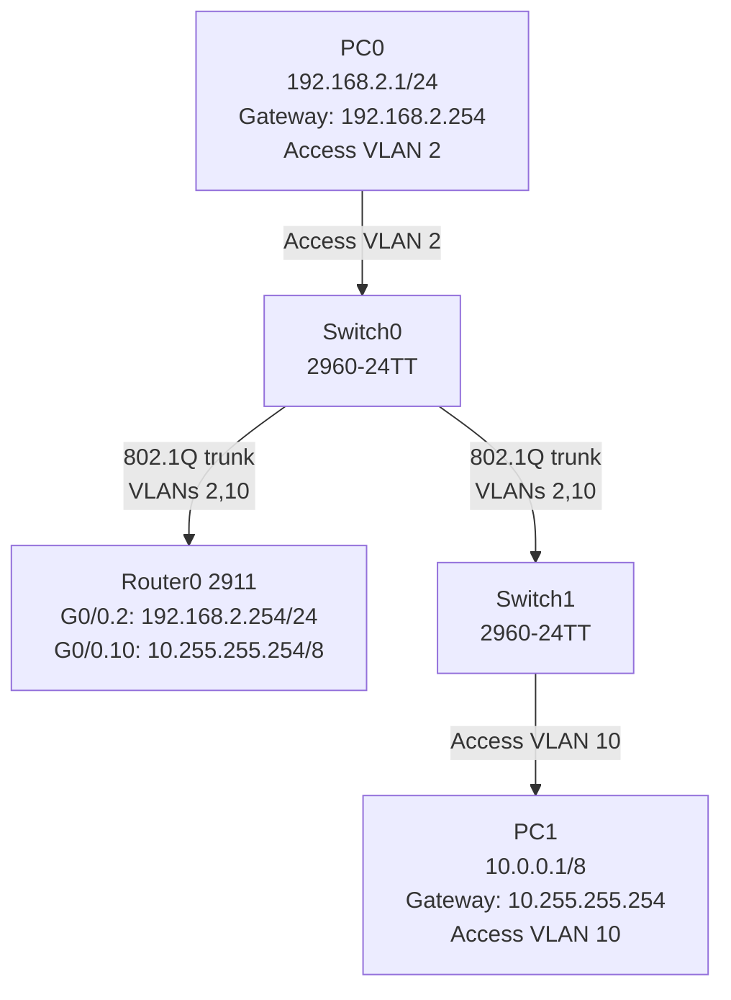
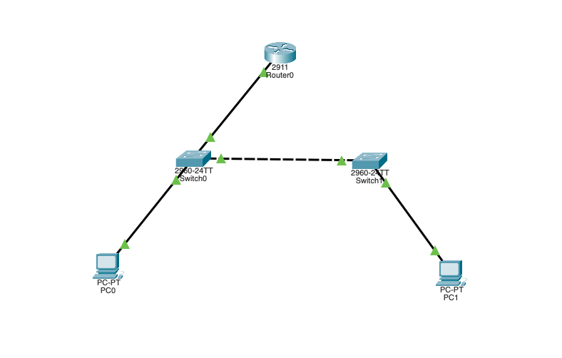
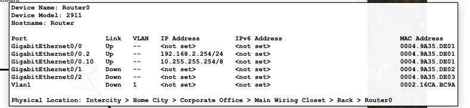
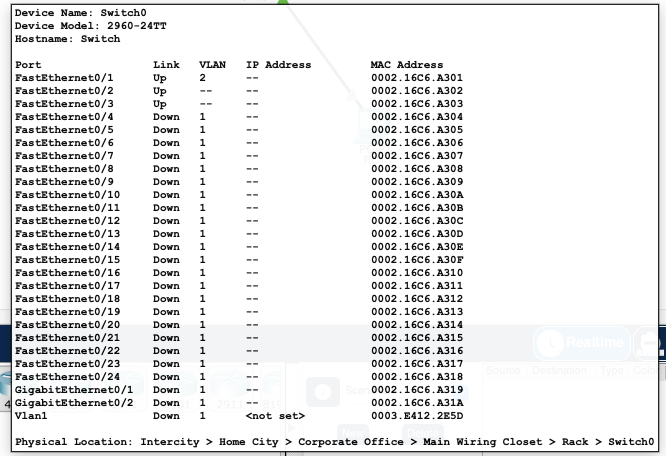
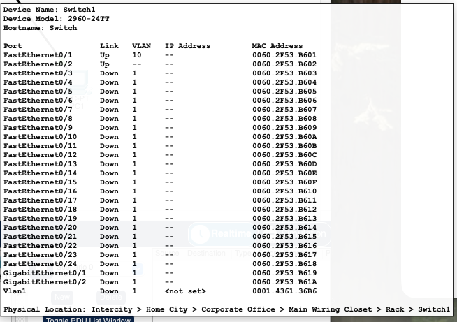
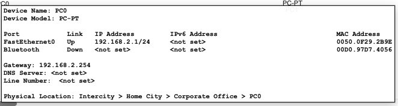
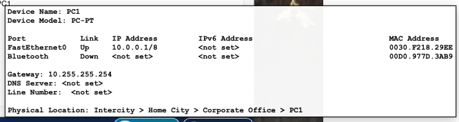

# Lab 03 – VLAN Troubleshooting: Router-on-a-Stick

## Objective

Troubleshoot a Packet Tracer topology using two VLANs, two switches, one router, and two PCs. The goal is to restore connectivity between hosts in different VLANs using router-on-a-stick.



## Topology



## Addressing table

| Device | Interface / Port | VLAN | IP address | Subnet mask | Default gateway |
|---|---|---:|---:|---:|---:|
| Router0 | G0/0 | Trunk parent | Unassigned | — | — |
| Router0 | G0/0.2 | 2 | 192.168.2.254 | 255.255.255.0 | — |
| Router0 | G0/0.10 | 10 | 10.255.255.254 | 255.0.0.0 | — |
| Switch0 | Fa0/1 | 2 | — | — | — |
| Switch0 | Fa0/2 | Trunk | — | — | — |
| Switch0 | Fa0/3 | Trunk | — | — | — |
| Switch1 | Fa0/1 | 10 | — | — | — |
| Switch1 | Fa0/2 | Trunk | — | — | — |
| PC0 | FastEthernet0 | 2 | 192.168.2.1 | 255.255.255.0 | 192.168.2.254 |
| PC1 | FastEthernet0 | 10 | 10.0.0.1 | 255.0.0.0 | 10.255.255.254 |

## What was wrong

The router subinterfaces were already correct and up/up:

```text
GigabitEthernet0/0     unassigned      up    up
GigabitEthernet0/0.2   192.168.2.254   up    up
GigabitEthernet0/0.10  10.255.255.254  up    up
```

The PC addressing was also correct:

- PC0 was in VLAN 2 with gateway `192.168.2.254`.
- PC1 was in VLAN 10 with gateway `10.255.255.254`.

The real issue was on **Switch0**: VLAN 10 did not exist at first. Switch0 only had VLAN 2 configured for PC0. Because VLAN 10 traffic from Switch1 must cross Switch0 to reach the router, Switch0 also needed VLAN 10 in its VLAN database.

## Why this matters

VLANs are separate Layer 2 broadcast domains. A host in VLAN 2 cannot directly communicate with a host in VLAN 10 at Layer 2.

To allow communication between VLANs, the router performs Layer 3 routing. This design is called **router-on-a-stick** because one physical router interface, `G0/0`, carries several VLANs using 802.1Q tagging:

- `G0/0.2` handles VLAN 2 traffic.
- `G0/0.10` handles VLAN 10 traffic.

For this to work, the switch ports between router and switches must be trunks, and the required VLANs must be active on the switches. If a trunk allows VLAN 10 but Switch0 does not have VLAN 10 created, VLAN 10 is not active on that switch and traffic cannot be forwarded correctly across it.

## Troubleshooting methodology used

### 1. Verified the router first

Command:

```bash
show ip interface brief
```

Result:

- Parent interface `G0/0` was up/up and had no IP address.
- Subinterface `G0/0.2` had `192.168.2.254/24`.
- Subinterface `G0/0.10` had `10.255.255.254/8`.

This confirmed the router-on-a-stick side was correctly prepared.

### 2. Verified Switch0 VLANs

Command:

```bash
show vlan brief
```

Initial finding:

```text
VLAN 2 active, Fa0/1
VLAN 10 missing
```

Fix applied on Switch0:

```bash
configure terminal
vlan 10
name VLAN0010
end
```

After the fix, Switch0 had both VLANs:

```text
2    VLAN0002    active    Fa0/1
10   VLAN0010    active
```

### 3. Verified Switch0 trunking

Command:

```bash
show interfaces trunk
```

Expected / observed state after the fix:

```text
Fa0/2 trunking, VLANs 1,2,10 forwarding
Fa0/3 trunking, VLANs 1,2,10 forwarding
```

Meaning:

- `Fa0/2` carried traffic between Switch0 and Router0.
- `Fa0/3` carried traffic between Switch0 and Switch1.
- VLANs 2 and 10 were allowed, active, and forwarding.

### 4. Verified Switch1 VLAN and trunk

Commands:

```bash
show vlan brief
show interfaces trunk
```

Findings:

```text
VLAN 10 active on Fa0/1
Fa0/2 trunking with VLAN 10 forwarding
```

This confirmed PC1 was correctly connected to VLAN 10 and could reach the trunk path back to Switch0.

### 5. Verified PC addressing

PC0:

```text
IPv4 Address:     192.168.2.1
Subnet Mask:      255.255.255.0
Default Gateway:  192.168.2.254
```

PC1:

```text
IPv4 Address:     10.0.0.1
Subnet Mask:      255.0.0.0
Default Gateway:  10.255.255.254
```

### 6. Performed gateway ping tests

From PC0:

```bash
ping 192.168.2.254
```

Result:

```text
Sent = 4, Received = 4, Lost = 0 (0% loss)
```

From PC1:

```bash
ping 10.255.255.254
```

Result:

```text
Sent = 4, Received = 4, Lost = 0 (0% loss)
```

These tests proved that each PC could reach its default gateway.

### 7. Final validation to run

From PC0:

```bash
ping 10.0.0.1
```

From PC1:

```bash
ping 192.168.2.1
```

Expected result: both should succeed once VLAN 10 exists on Switch0 and both trunk links are forwarding VLANs 2 and 10.

## Important Cisco CLI lesson learned

Cisco IOS has different command modes:

| Prompt | Mode | What you can do |
|---|---|---|
| `Router>` | User EXEC | Basic commands only |
| `Router#` | Privileged EXEC | Show commands, ping, copy, debug |
| `Router(config)#` | Global configuration | Configure router/switch settings |
| `Router(config-if)#` | Interface configuration | Configure a specific interface |

Examples:

```bash
enable
show ip interface brief
```

To configure:

```bash
configure terminal
interface GigabitEthernet0/0
```

To ping while still inside configuration mode:

```bash
do ping 192.168.2.1
```

Or leave configuration mode first:

```bash
end
ping 192.168.2.1
```

## Commands used

### Router0 verification

```bash
enable
show ip interface brief
```

Expected router-on-a-stick configuration:

```bash
configure terminal
interface GigabitEthernet0/0
 no ip address
 no shutdown
exit

interface GigabitEthernet0/0.2
 encapsulation dot1Q 2
 ip address 192.168.2.254 255.255.255.0
exit

interface GigabitEthernet0/0.10
 encapsulation dot1Q 10
 ip address 10.255.255.254 255.0.0.0
exit
end
```

### Switch0 correction

```bash
enable
show vlan brief
configure terminal
vlan 10
 name VLAN0010
end
show vlan
show interfaces trunk
```

### Switch1 verification

```bash
enable
show vlan brief
show interfaces trunk
```

### PC tests

```bash
ipconfig
ping 192.168.2.254
ping 10.255.255.254
ping 10.0.0.1
ping 192.168.2.1
```

## Screenshots

| Screenshot | Description |
|---|---|
|  | Initial Packet Tracer topology |
|  | Router subinterfaces for VLAN 2 and VLAN 10 |
|  | Switch0 initially had VLAN 2 but VLAN 10 was missing |
|  | Switch1 had VLAN 10 on PC1 and a trunk to Switch0 |
|  | PC0 configured in the 192.168.2.0/24 network |
|  | PC1 configured in the 10.0.0.0/8 network |

## Lessons learned

- Always troubleshoot from Layer 1 upward: links, interfaces, VLANs, trunks, IP addresses, then pings.
- A trunk can allow a VLAN, but that VLAN must also exist and be active on the switch.
- Router-on-a-stick requires router subinterfaces with the correct `encapsulation dot1Q` VLAN IDs.
- Each PC must use the router subinterface in its own VLAN as its default gateway.
- Use `show vlan brief`, `show interfaces trunk`, and `show ip interface brief` to quickly isolate VLAN and routing problems.
