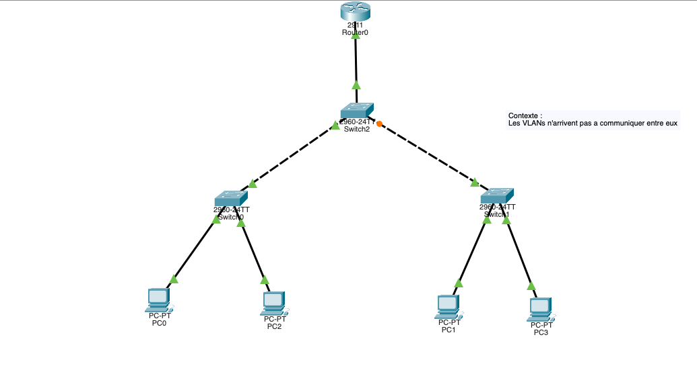
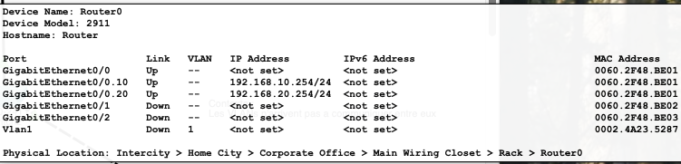
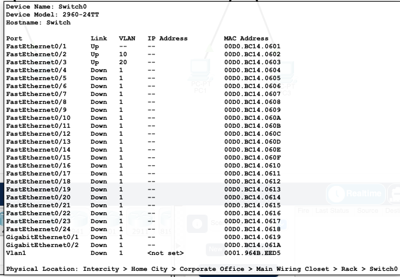
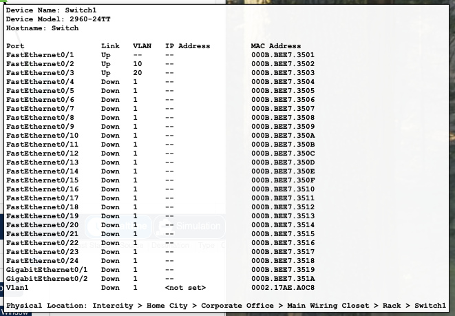
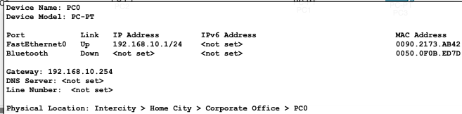
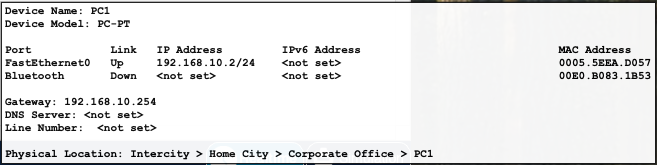
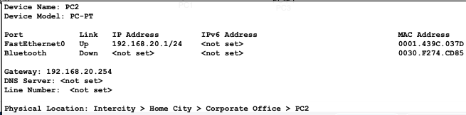
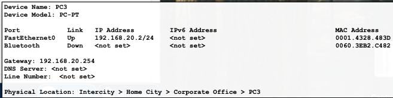
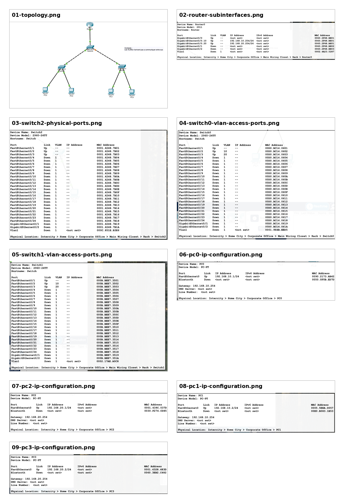

# Lab 04 — Dépannage VLAN: Trunk allowed VLAN mismatch

## Objective

Troubleshoot a Cisco Packet Tracer topology where hosts in different VLANs could not communicate correctly. The lab focuses on **inter-VLAN routing**, **802.1Q trunks**, and the effect of an incorrect `switchport trunk allowed vlan` configuration.

## Topology



The topology contains:

| Device | Role |
|---|---|
| Router0 | Router-on-a-stick gateway for VLAN 10 and VLAN 20 |
| Switch2 | Central/distribution switch connected to Router0, Switch0, and Switch1 |
| Switch0 | Access switch for PC0 and PC2 |
| Switch1 | Access switch for PC1 and PC3 |
| PC0 / PC1 | VLAN 10 hosts |
| PC2 / PC3 | VLAN 20 hosts |

## IP addressing plan

| Host / Interface | VLAN | IP address | Subnet mask | Default gateway |
|---|---:|---:|---:|---:|
| Router0 G0/0.10 | 10 | `192.168.10.254` | `255.255.255.0` | N/A |
| Router0 G0/0.20 | 20 | `192.168.20.254` | `255.255.255.0` | N/A |
| PC0 | 10 | `192.168.10.1` | `255.255.255.0` | `192.168.10.254` |
| PC1 | 10 | `192.168.10.2` | `255.255.255.0` | `192.168.10.254` |
| PC2 | 20 | `192.168.20.1` | `255.255.255.0` | `192.168.20.254` |
| PC3 | 20 | `192.168.20.2` | `255.255.255.0` | `192.168.20.254` |

## Initial symptoms

The lab context was:

> Les VLANs n'arrivent pas à communiquer entre eux.

The physical links were up, and the router subinterfaces were up, but communication between VLANs was not fully working.

## What we checked

### 1. Router-on-a-stick



Router0 showed the expected subinterfaces:

```text
GigabitEthernet0/0      unassigned        up
GigabitEthernet0/0.10   192.168.10.254    up
GigabitEthernet0/0.20   192.168.20.254    up
```

This confirmed that the router had one subinterface for each VLAN:

```text
VLAN 10 → 192.168.10.254/24
VLAN 20 → 192.168.20.254/24
```

### 2. Access VLANs on Switch0 and Switch1

Switch0 had one access port in VLAN 10 and one access port in VLAN 20:



Switch1 also had one access port in VLAN 10 and one access port in VLAN 20:



The access layer was therefore correct:

```text
PC0 → VLAN 10
PC1 → VLAN 10
PC2 → VLAN 20
PC3 → VLAN 20
```

### 3. PC addressing

PC0 and PC1 were correctly configured in VLAN 10:





PC2 and PC3 were correctly configured in VLAN 20:





### 4. Switch2 trunk status

Switch2 had VLAN 10 and VLAN 20 in its VLAN database, but one trunk was filtering VLAN 20.

Problematic output:

```text
Port        Vlans allowed on trunk
Fa0/1       1-1005
Fa0/2       1-1005
Fa0/3       10
```

The key problem was this line:

```text
Fa0/3       10
```

`Fa0/3` was operating as a trunk, but it only allowed VLAN 10. VLAN 20 was not allowed on that trunk, so VLAN 20 traffic could not cross that link.

## Root cause

The root cause was an incorrect allowed VLAN list on **Switch2 Fa0/3**.

Before the fix:

```text
Switch2 Fa0/3 allowed only VLAN 10
```

Expected:

```text
Switch2 Fa0/3 should allow VLAN 10 and VLAN 20
```

A trunk link can carry multiple VLANs, but only the VLANs in the allowed list can traverse the link. Because VLAN 20 was missing from the allowed list, VLAN 20 frames were blocked on that trunk.

## Fix applied

On Switch2:

```bash
enable
configure terminal
interface fa0/3
switchport trunk allowed vlan 10,20
end
```

## Verification after the fix

After correction, `show interfaces trunk` showed:

```text
Port        Vlans allowed on trunk
Fa0/1       1-1005
Fa0/2       1-1005
Fa0/3       10,20

Port        Vlans allowed and active in management domain
Fa0/1       1,10,20
Fa0/2       1,10,20
Fa0/3       10,20

Port        Vlans in spanning tree forwarding state and not pruned
Fa0/1       1,10,20
Fa0/2       1,10,20
Fa0/3       10,20
```

This confirms that VLAN 20 is now allowed, active, and forwarding on `Fa0/3`.

## Ping validation

From PC0:

```bash
ping 192.168.10.254
ping 192.168.20.1
ping 192.168.20.2
```

Observed results:

```text
PC0 → 192.168.10.254 = success, 0% loss
PC0 → 192.168.20.1   = success after first ARP timeout
PC0 → 192.168.20.2   = success after first ARP timeout
```

The first timeout on the inter-VLAN pings is normal in Packet Tracer because ARP needs to learn MAC address mappings before ICMP replies succeed.

## Final status

| Test | Result |
|---|---|
| PC0 → VLAN 10 gateway | OK |
| PC0 → PC2 in VLAN 20 | OK |
| PC0 → PC3 in VLAN 20 | OK |
| Switch2 Fa0/3 allows VLAN 10 and VLAN 20 | OK |
| Inter-VLAN routing | OK |

## Key lesson

For inter-VLAN routing to work, it is not enough to configure the router subinterfaces and access VLANs. Every trunk in the traffic path must allow the required VLANs.

In this lab, the router was ready and the hosts were correctly addressed. The failure came from a trunk filtering problem:

```text
VLAN 20 existed, but it was not allowed on Switch2 Fa0/3.
```

The fix was to allow both VLANs on the trunk:

```bash
switchport trunk allowed vlan 10,20
```

## Screenshots overview


