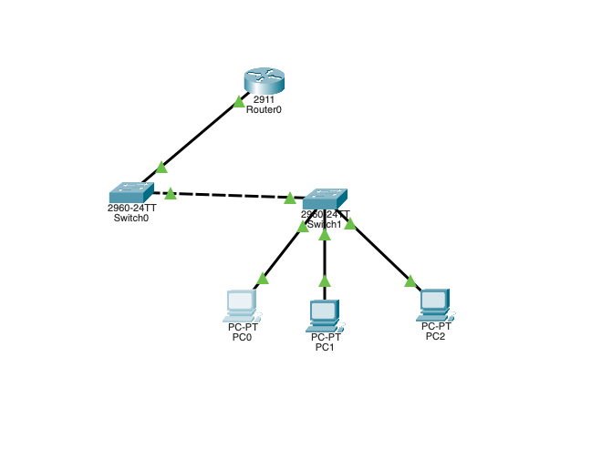
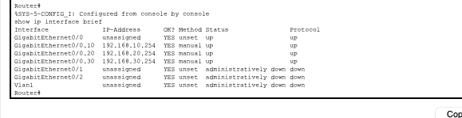
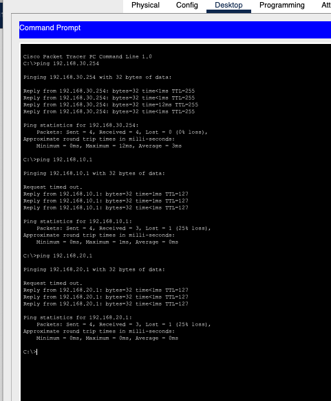

# VLAN Troubleshooting Lab 06

## Overview

This Cisco Packet Tracer lab focuses on troubleshooting inter-VLAN connectivity in a Router-on-a-Stick environment.



| VLAN | Network | Default Gateway |
|---|---|---|
| VLAN 10 | 192.168.10.0/24 | 192.168.10.254 |
| VLAN 20 | 192.168.20.0/24 | 192.168.20.254 |
| VLAN 30 | 192.168.30.0/24 | 192.168.30.254 |

The issue affected the host in VLAN 30, which could not communicate correctly with devices located in the other VLANs.

---

## Troubleshooting Approach

I followed a structured Layer 2 to Layer 3 troubleshooting process:

1. Checked host IP configuration
2. Verified VLAN membership
3. Verified 802.1Q trunk links
4. Checked router subinterfaces
5. Identified the Layer 3 issue
6. Corrected the host default gateway
7. Verified gateway connectivity
8. Verified inter-VLAN connectivity

---

## Layer 2 Verification

The access ports on the switch were correctly assigned:

```text
Fa0/2 -> VLAN 10
Fa0/3 -> VLAN 20
Fa0/4 -> VLAN 30
```

The trunk links were operational and carrying VLANs 10, 20 and 30.

Verification commands:

```bash
show vlan brief
show interfaces trunk
```

This confirmed that the Layer 2 VLAN configuration was working correctly.

---

## Problem Identified

The router configuration showed subinterfaces for VLAN 10 and VLAN 20:

```text
GigabitEthernet0/0.10   192.168.10.254   up/up
GigabitEthernet0/0.20   192.168.20.254   up/up
```

However, there was no subinterface for VLAN 30.

The issue was identified using:

```bash
show ip interface brief
```

VLAN 30 therefore existed at Layer 2 but did not have a Layer 3 gateway configured on the router.

A second issue was found on PC2.

Initial configuration:

```text
IP Address:      192.168.30.1
Subnet Mask:     255.255.255.0
Default Gateway: 192.168.30.253
```

The default gateway was incorrect.

---

## Root Cause

Two configuration errors prevented VLAN 30 from communicating with the other VLANs:

1. The router subinterface for VLAN 30 was missing.
2. PC2 had an incorrect default gateway.

---

## Resolution

### Create the VLAN 30 Router Subinterface

The following configuration was added to Router0:

```bash
enable
configure terminal

interface GigabitEthernet0/0.30
 encapsulation dot1Q 30
 ip address 192.168.30.254 255.255.255.0
 no shutdown

end
```

The configuration was then verified:

```bash
show ip interface brief
```

Final result:

```text
GigabitEthernet0/0.10   192.168.10.254   up/up
GigabitEthernet0/0.20   192.168.20.254   up/up
GigabitEthernet0/0.30   192.168.30.254   up/up
```



### Correct PC2 Default Gateway

The gateway was changed from:

```text
192.168.30.253
```

to:

```text
192.168.30.254
```

Final PC2 configuration:

```text
IP Address:      192.168.30.1
Subnet Mask:     255.255.255.0
Default Gateway: 192.168.30.254
```

---

## Verification

PC2 was first tested against its local gateway:

```bash
ping 192.168.30.254
```

The gateway responded successfully.

Inter-VLAN connectivity was then tested:

```bash
ping 192.168.10.1
ping 192.168.20.1
```

Both tests were successful.



The first ICMP packet may occasionally time out in Packet Tracer while ARP information is being resolved. Subsequent packets were successfully delivered.

---

## Commands Used

```bash
show vlan brief
show interfaces trunk
show ip interface brief
```

Router configuration:

```bash
configure terminal
interface GigabitEthernet0/0.30
encapsulation dot1Q 30
ip address 192.168.30.254 255.255.255.0
no shutdown
end
```

Connectivity tests:

```bash
ping 192.168.30.254
ping 192.168.10.1
ping 192.168.20.1
```

---

## Skills Practiced

- VLAN troubleshooting
- 802.1Q trunk verification
- Router-on-a-Stick
- Inter-VLAN routing
- Cisco router subinterfaces
- Default gateway troubleshooting
- Layer 2 vs Layer 3 fault isolation
- Cisco IOS verification commands
- ICMP connectivity testing
- Structured network troubleshooting

---

## Key Takeaway

A VLAN can be correctly configured and transported across the Layer 2 infrastructure while still being unable to communicate with other networks.

In this lab, Layer 2 was operational, but VLAN 30 lacked its required Layer 3 router subinterface and PC2 used an incorrect default gateway.

```text
Host -> VLAN -> Trunk -> Gateway -> Routing -> Connectivity Test
```
