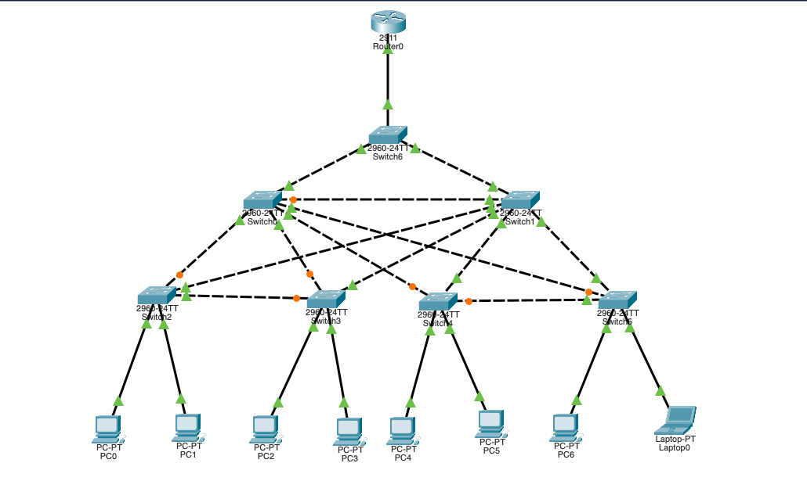
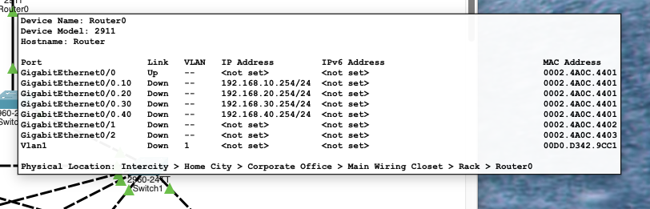
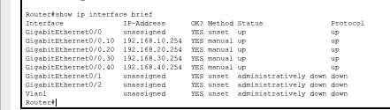
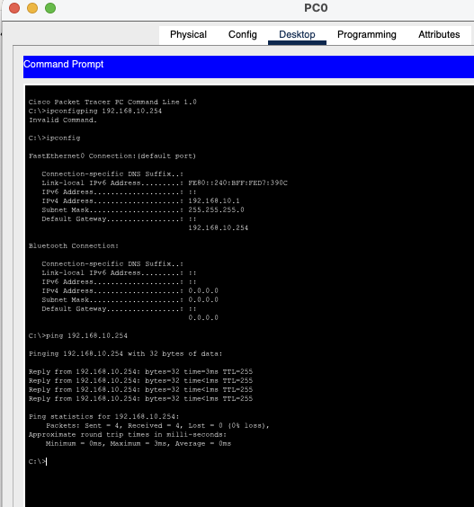
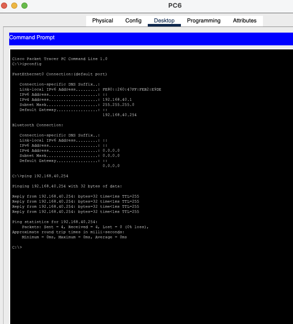

# VLAN Troubleshooting Lab 07

## Overview

This Cisco Packet Tracer lab focuses on troubleshooting a multi-switch VLAN environment using **Router-on-a-Stick** for inter-VLAN routing.

The network contains four user VLANs and several redundant Layer 2 paths between switches.



| VLAN | Network | Default Gateway | Example Hosts |
|---|---|---|---|
| VLAN 10 | `192.168.10.0/24` | `192.168.10.254` | PC0, PC1 |
| VLAN 20 | `192.168.20.0/24` | `192.168.20.254` | PC2, PC3 |
| VLAN 30 | `192.168.30.0/24` | `192.168.30.254` | PC4, PC5 |
| VLAN 40 | `192.168.40.0/24` | `192.168.40.254` | PC6, Laptop0 |

---

## Initial Observation

The topology contains many redundant switch-to-switch links. Some links appeared orange in Packet Tracer.

Because redundant Layer 2 paths can create switching loops, **Spanning Tree Protocol (STP)** blocks selected ports. The orange links were therefore not treated as failures without further evidence.

The investigation focused on the Layer 3 path and the Router-on-a-Stick configuration.

---

## Troubleshooting Methodology

The troubleshooting process was:

1. Inspect the topology and VLAN layout.
2. Verify host VLAN placement.
3. Verify the router physical interface.
4. Inspect Router-on-a-Stick subinterfaces.
5. Verify IEEE 802.1Q VLAN tagging.
6. Identify the administrative interface state.
7. Enable the affected subinterfaces.
8. Test each VLAN gateway.
9. Verify inter-VLAN communication.

```text
Topology
   ↓
VLAN membership
   ↓
Trunks / STP
   ↓
Router physical interface
   ↓
Router subinterfaces
   ↓
Default gateways
   ↓
Inter-VLAN connectivity
```

---

## Problem Identified

The router's physical interface was operational:

```text
GigabitEthernet0/0     unassigned      up    up
```

However, every Router-on-a-Stick subinterface was **administratively down**:

```text
GigabitEthernet0/0.10  192.168.10.254  administratively down  down
GigabitEthernet0/0.20  192.168.20.254  administratively down  down
GigabitEthernet0/0.30  192.168.30.254  administratively down  down
GigabitEthernet0/0.40  192.168.40.254  administratively down  down
```



The running configuration confirmed that the IP addresses and VLAN tags were correct, but each subinterface contained `shutdown`:

```text
interface GigabitEthernet0/0.10
 encapsulation dot1Q 10
 ip address 192.168.10.254 255.255.255.0
 shutdown

interface GigabitEthernet0/0.20
 encapsulation dot1Q 20
 ip address 192.168.20.254 255.255.255.0
 shutdown

interface GigabitEthernet0/0.30
 encapsulation dot1Q 30
 ip address 192.168.30.254 255.255.255.0
 shutdown

interface GigabitEthernet0/0.40
 encapsulation dot1Q 40
 ip address 192.168.40.254 255.255.255.0
 shutdown
```

---

## Why `dot1Q` Matters

`encapsulation dot1Q <VLAN-ID>` associates a router subinterface with a specific IEEE 802.1Q VLAN tag.

In this lab:

```text
G0/0.10 -> VLAN 10
G0/0.20 -> VLAN 20
G0/0.30 -> VLAN 30
G0/0.40 -> VLAN 40
```

The 802.1Q configuration was correct. The fault was the administrative shutdown state.

---

## Root Cause

> **All four Router-on-a-Stick subinterfaces were correctly configured but administratively shut down.**

This disabled the Layer 3 default gateways for VLANs 10, 20, 30 and 40 and prevented inter-VLAN routing.

---

## Resolution

Each router subinterface was enabled:

```bash
configure terminal

interface GigabitEthernet0/0.10
 no shutdown

interface GigabitEthernet0/0.20
 no shutdown

interface GigabitEthernet0/0.30
 no shutdown

interface GigabitEthernet0/0.40
 no shutdown

end
```

After the fix:

```text
GigabitEthernet0/0.10  192.168.10.254  up  up
GigabitEthernet0/0.20  192.168.20.254  up  up
GigabitEthernet0/0.30  192.168.30.254  up  up
GigabitEthernet0/0.40  192.168.40.254  up  up
```



---

## Gateway Verification

Each VLAN was tested against its default gateway.

### VLAN 10

PC0 configuration:

```text
IP address:      192.168.10.1
Default gateway: 192.168.10.254
```

Test:

```bash
ping 192.168.10.254
```

Result: **4/4 replies, 0% packet loss.**



The same gateway validation succeeded for VLANs 20, 30 and 40.

A representative VLAN 40 test is shown below:



---

## Inter-VLAN Verification

Final tests were performed from PC0 in VLAN 10:

```bash
ping 192.168.20.1
ping 192.168.30.1
ping 192.168.40.1
```

Results:

```text
192.168.20.1 -> 4/4 replies, 0% loss
192.168.30.1 -> 4/4 replies, 0% loss
192.168.40.1 -> 4/4 replies, 0% loss
```

This confirmed that Router-on-a-Stick inter-VLAN routing was fully restored.

---

## Commands Used

### Verification

```bash
show ip interface brief
show running-config
```

### Recovery

```bash
configure terminal

interface GigabitEthernet0/0.10
no shutdown

interface GigabitEthernet0/0.20
no shutdown

interface GigabitEthernet0/0.30
no shutdown

interface GigabitEthernet0/0.40
no shutdown

end
```

### Connectivity tests

```bash
ping 192.168.10.254
ping 192.168.20.254
ping 192.168.30.254
ping 192.168.40.254

ping 192.168.20.1
ping 192.168.30.1
ping 192.168.40.1
```

---

## Skills Practiced

- VLAN troubleshooting
- Router-on-a-Stick
- IEEE 802.1Q tagging
- Inter-VLAN routing
- Cisco IOS subinterface troubleshooting
- Administrative interface states
- Default gateway validation
- ICMP connectivity testing
- Layer 2 vs Layer 3 fault isolation
- Spanning Tree awareness in redundant topologies
- Structured network troubleshooting

---

## Key Takeaway

The presence of correct VLAN IDs and IP addresses does not guarantee that an interface is operational.

The critical clue in this lab was:

```text
administratively down
```

That status points directly toward an explicit `shutdown` configuration rather than a cabling, VLAN-tagging, or routing-table problem.

The topology also reinforces an important troubleshooting principle: redundant Layer 2 links blocked by STP should not automatically be treated as faults.
