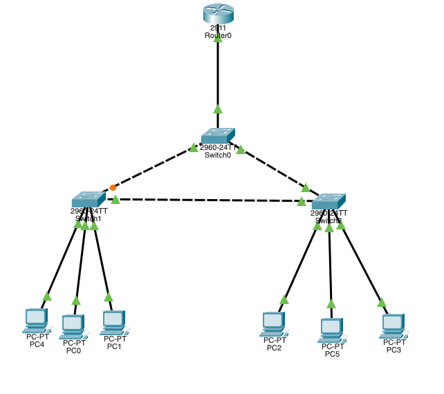
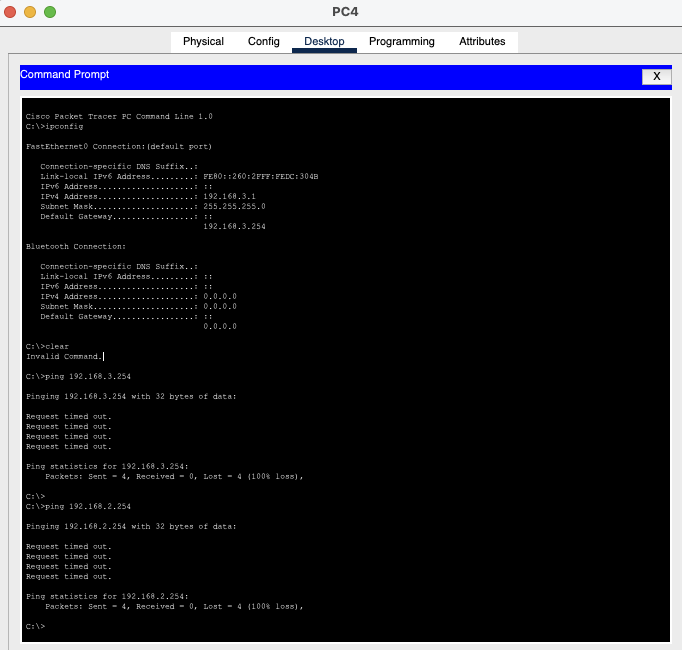
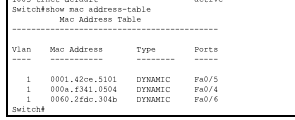
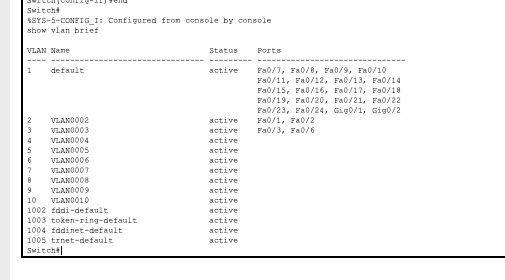
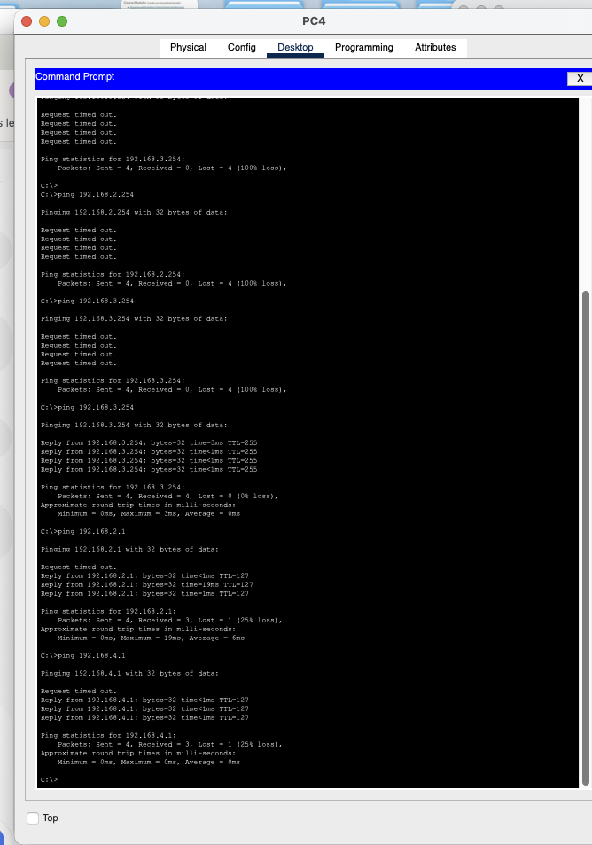

# VLAN Troubleshooting Lab 08

## Overview

This Cisco Packet Tracer lab focuses on troubleshooting an access-port VLAN mismatch in a redundant switched network using **Router-on-a-Stick** for inter-VLAN routing.



| VLAN | Network | Default Gateway |
|---|---|---|
| VLAN 2 | `192.168.2.0/24` | `192.168.2.254` |
| VLAN 3 | `192.168.3.0/24` | `192.168.3.254` |
| VLAN 4 | `192.168.4.0/24` | `192.168.4.254` |

---

## Initial Investigation

The router subinterfaces were already operational:

```text
GigabitEthernet0/0.2   192.168.2.254   up   up
GigabitEthernet0/0.3   192.168.3.254   up   up
GigabitEthernet0/0.4   192.168.4.254   up   up
```

The central trunk links were also operational and carrying the required VLANs.

This ruled out the Router-on-a-Stick configuration and the main trunk path as the primary cause.

---

## Symptom

PC4 had a valid VLAN 3 configuration:

```text
IP Address:      192.168.3.1
Subnet Mask:     255.255.255.0
Default Gateway: 192.168.3.254
```

However, PC4 could not reach its gateway or other networks.



The host addressing looked correct, so the investigation moved back to Layer 2.

---

## MAC Address Table Investigation

To identify the real physical switch port used by PC4, Switch1 was checked with:

```bash
show mac address-table
```

After PC4 generated traffic, its MAC address appeared on:

```text
VLAN 1   0060.2fcd.304b   DYNAMIC   Fa0/6
```



This provided the decisive evidence:

```text
PC4 -> Switch1 Fa0/6
PC4 IP network -> VLAN 3
Fa0/6 -> VLAN 1
```

---

## Root Cause

> **PC4 was connected to Switch1 FastEthernet0/6, but Fa0/6 was left in the default VLAN 1 instead of VLAN 3.**

This created a Layer 2 / Layer 3 mismatch.

PC4 had the correct IP address and gateway for VLAN 3, but its switch access port belonged to VLAN 1. As a result, PC4 could not reach the VLAN 3 gateway.

---

## Resolution

FastEthernet0/6 was configured as an access port in VLAN 3:

```bash
enable
configure terminal

interface FastEthernet0/6
 switchport mode access
 switchport access vlan 3

end
```

During troubleshooting, Fa0/1 had temporarily been tested as a possible PC4 port. Once the MAC address table identified the real physical port, Fa0/1 was restored to VLAN 2:

```bash
configure terminal

interface FastEthernet0/1
 switchport mode access
 switchport access vlan 2

end
```

Final Switch1 VLAN membership:

```text
VLAN 2 -> Fa0/1, Fa0/2
VLAN 3 -> Fa0/3, Fa0/6
```



---

## Verification

After correcting Fa0/6, PC4 successfully reached its gateway:

```bash
ping 192.168.3.254
```

Result:

```text
4/4 replies
0% packet loss
```

PC4 then successfully reached hosts in other VLANs:

```bash
ping 192.168.2.1
ping 192.168.4.1
```

The first packet was lost during initial ARP resolution, while the following packets succeeded.



This confirmed that local VLAN connectivity and inter-VLAN routing were fully restored.

---

## Troubleshooting Methodology

```text
Router subinterfaces
        ↓
Trunk verification
        ↓
Access VLAN membership
        ↓
Host IP configuration
        ↓
Gateway test
        ↓
MAC address table
        ↓
Physical port identification
        ↓
Access VLAN correction
        ↓
Connectivity verification
```

A key lesson from this lab is that the visual topology should not be used to guess the exact physical switch port.

The MAC address table provided definitive evidence and removed guesswork.

---

## Commands Used

### Router verification

```bash
show ip interface brief
```

### Switch verification

```bash
show vlan brief
show interfaces trunk
show mac address-table
```

### Corrective configuration

```bash
configure terminal

interface FastEthernet0/6
switchport mode access
switchport access vlan 3

interface FastEthernet0/1
switchport mode access
switchport access vlan 2

end
```

### Connectivity verification

```bash
ping 192.168.3.254
ping 192.168.2.1
ping 192.168.4.1
```

---

## Skills Practiced

- VLAN troubleshooting
- Access-port configuration
- Router-on-a-Stick verification
- 802.1Q trunk verification
- MAC address table analysis
- Layer 2 vs Layer 3 fault isolation
- Physical port identification
- Default gateway troubleshooting
- Inter-VLAN routing validation
- ICMP connectivity testing
- Evidence-based troubleshooting

---

## Key Takeaway

A host can have a completely correct IP address, subnet mask and default gateway and still fail to communicate if its switch access port belongs to the wrong VLAN.

The decisive command in this lab was:

```bash
show mac address-table
```

It mapped PC4 to the actual physical switch port and prevented further guesswork.

**Final root cause: FastEthernet0/6 was in VLAN 1 instead of VLAN 3.**
