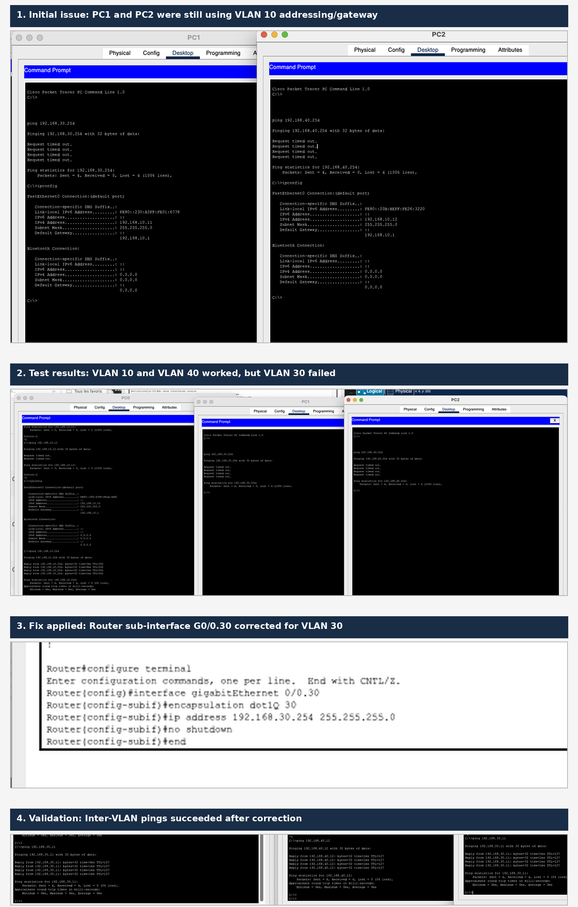

# Lab 05 - IP Troubleshooting: VLANs and Inter-VLAN Routing

## Objective

The objective of this Packet Tracer lab was to troubleshoot connectivity between several PCs connected to the same switch but placed in different VLANs. The final goal was to make all VLANs communicate through a router-on-a-stick configuration.

## Topology

The lab uses one router, one switch, and three PCs.

| Device | VLAN | IP address | Subnet mask | Default gateway |
|---|---:|---:|---:|---:|
| PC0 | 10 | `192.168.10.10` | `255.255.255.0` | `192.168.10.254` |
| PC1 | 30 | `192.168.30.11` | `255.255.255.0` | `192.168.30.254` |
| PC2 | 40 | `192.168.40.12` | `255.255.255.0` | `192.168.40.254` |

The router provides one gateway per VLAN using sub-interfaces:

| Router sub-interface | VLAN | Gateway IP |
|---|---:|---:|
| `GigabitEthernet0/0.10` | 10 | `192.168.10.254` |
| `GigabitEthernet0/0.30` | 30 | `192.168.30.254` |
| `GigabitEthernet0/0.40` | 40 | `192.168.40.254` |

## Evidence



## Initial symptoms

At the beginning, the physical links were green, so the problem was not a cable or physical interface issue. However, pings between the PCs failed.

The first issue was that some PCs had incorrect IP settings for their VLAN. For example, PC1 and PC2 were still using the `192.168.10.0/24` network and the wrong gateway, even though their switch ports were assigned to VLAN 30 and VLAN 40.

A second issue appeared after correcting the PC addressing: PC0 and PC2 could communicate, but PC1 could not even ping its own gateway `192.168.30.254`. This isolated the problem to VLAN 30.

## Troubleshooting process

### 1. Checked physical connectivity

The links were green in Packet Tracer, which confirmed that the physical layer was working.

### 2. Checked the router interfaces

The router was configured with sub-interfaces for VLAN 10, VLAN 30, and VLAN 40.

```bash
show ip interface brief
```

Expected router gateways:

```text
GigabitEthernet0/0.10  192.168.10.254  up  up
GigabitEthernet0/0.30  192.168.30.254  up  up
GigabitEthernet0/0.40  192.168.40.254  up  up
```

### 3. Checked switch port assignments

The switch ports were assigned as access ports for the PCs, and the router-facing port was configured as a trunk.

```bash
show interfaces status
```

Expected result:

```text
Fa0/1  connected  10
Fa0/2  connected  30
Fa0/3  connected  40
Fa0/4  connected  trunk
```

The trunk was verified with:

```bash
show interfaces trunk
```

Expected result:

```text
Fa0/4  trunking  802.1q
Vlans allowed on trunk: 10,30,40
```

## Configuration applied

### Switch configuration

```bash
enable
configure terminal

vlan 10
name VLAN10
exit

vlan 30
name VLAN30
exit

vlan 40
name VLAN40
exit

interface fastEthernet 0/1
switchport mode access
switchport access vlan 10
exit

interface fastEthernet 0/2
switchport mode access
switchport access vlan 30
exit

interface fastEthernet 0/3
switchport mode access
switchport access vlan 40
exit

interface fastEthernet 0/4
switchport mode trunk
switchport trunk allowed vlan 10,30,40
exit
end
```

### Router configuration

The router uses sub-interfaces because the link between the router and the switch carries multiple VLANs through one physical cable.

```bash
enable
configure terminal

interface gigabitEthernet 0/0
no shutdown
exit

interface gigabitEthernet 0/0.10
encapsulation dot1Q 10
ip address 192.168.10.254 255.255.255.0
no shutdown
exit

interface gigabitEthernet 0/0.30
encapsulation dot1Q 30
ip address 192.168.30.254 255.255.255.0
no shutdown
exit

interface gigabitEthernet 0/0.40
encapsulation dot1Q 40
ip address 192.168.40.254 255.255.255.0
no shutdown
exit
end
```

The final blocking issue was fixed by reapplying the correct VLAN 30 sub-interface configuration:

```bash
configure terminal
interface gigabitEthernet 0/0.30
encapsulation dot1Q 30
ip address 192.168.30.254 255.255.255.0
no shutdown
end
```

## Validation tests

Each PC was first tested against its own default gateway.

| Test | Result |
|---|---:|
| PC0 → `192.168.10.254` | Success |
| PC1 → `192.168.30.254` | Success |
| PC2 → `192.168.40.254` | Success |

Then inter-VLAN routing was tested.

| Test | Result |
|---|---:|
| PC0 → PC1 | Success |
| PC0 → PC2 | Success |
| PC1 → PC2 | Success |
| PC2 → PC1 | Success |

## Root cause

The main problems were:

1. Some PCs had IP settings that did not match their VLAN.
2. PC0 initially used the wrong default gateway.
3. VLAN 30 required correction on the router sub-interface `GigabitEthernet0/0.30`.

## What I learned

This lab helped me practice a structured troubleshooting approach:

1. Check the physical layer first.
2. Verify IP addressing and subnet masks.
3. Confirm that each PC uses the correct default gateway.
4. Check VLAN membership on switch access ports.
5. Verify that the router-facing switch port is configured as a trunk.
6. Verify router sub-interfaces and `dot1Q` encapsulation.
7. Test connectivity in stages: PC to gateway first, then PC to PC across VLANs.

## Key takeaway

A green link in Packet Tracer only confirms physical connectivity. It does not guarantee that VLANs, gateways, trunking, or routing are correctly configured.
