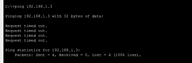
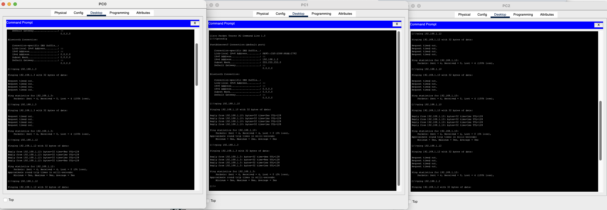

# Lab 10 - IP Troubleshooting

## Overview

This lab focuses on IP troubleshooting in Cisco Packet Tracer.

In this exercise, we worked as a group to identify and resolve connectivity issues in the network.  
This repository documents the issue, the troubleshooting process, the corrections applied, and the final verification.

## Objectives

- Identify the source of the IP connectivity issue
- Verify the IP configuration on hosts and network devices
- Correct the addressing problem
- Validate connectivity after the fix

## Lab File

- [Packet Tracer file](./files/lab-10-depannage-ip.pkt)

## Topology

## Initial Problem

At the beginning of the lab, the network was not functioning correctly.  
The issue affected communication between devices.

### Symptoms observed
- Ping failed between hosts
- End devices could not reach the destination
- Connectivity tests showed errors

## Troubleshooting Process

We followed a step-by-step troubleshooting methodology:

1. Checked IP addressing on hosts
2. Verified subnet masks
3. Verified default gateways
4. Checked device interfaces
5. Tested connectivity with ping
6. Identified the misconfiguration

## Root Cause

The issue was caused by an incorrect IP-related configuration.

> Replace this section with the real cause:
- wrong IP address
- wrong subnet mask
- wrong default gateway
- interface shutdown
- device in wrong network
- other misconfiguration

## Fix Applied

We corrected the configuration and re-tested the network.

### Actions taken
- Corrected the IP configuration
- Updated the subnet mask/default gateway if needed
- Verified interface settings
- Saved the working configuration

## Validation

After the correction, the network was tested again.

### Results
- Ping successful
- Connectivity restored
- Devices communicated correctly

## What I Learned

This lab helped me practice:

- IP troubleshooting methodology
- Identifying addressing errors
- Verifying end-device network settings
- Testing and validating connectivity in Packet Tracer

## Teamwork Note

This lab was solved as a group.  
I am documenting the troubleshooting process here to show my understanding of the issue, the steps we followed, and the final resolution.

## Author

Laurent Mandine

