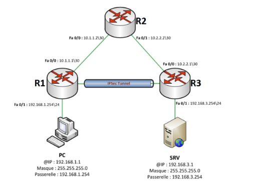
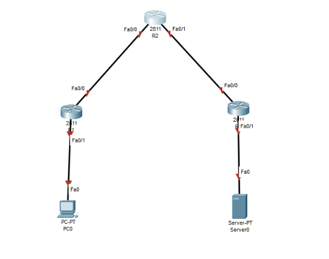

# Cisco IPsec Site-to-Site VPN Lab

## Overview

This lab demonstrates the configuration of a **site-to-site IPsec VPN** between two Cisco routers using Cisco Packet Tracer.

The network contains three routers:

- **R1** — Site A VPN endpoint
- **R2** — Transit router
- **R3** — Site B VPN endpoint

The encrypted IPsec tunnel is established between **R1 and R3**.

R2 only provides Layer 3 connectivity between the two VPN peers.

---

## Network Topology

### Packet Tracer Topology



### Logical IPsec Topology



---

## IP Addressing

| Device | Interface | IP Address | Subnet |
|---|---|---|---|
| R1 | Fa0/1 | 192.168.1.254 | /24 |
| R1 | Fa0/0 | 10.1.1.1 | /30 |
| R2 | Fa0/0 | 10.1.1.2 | /30 |
| R2 | Fa0/1 | 10.2.2.2 | /30 |
| R3 | Fa0/0 | 10.2.2.1 | /30 |
| R3 | Fa0/1 | 192.168.3.254 | /24 |
| PC | NIC | 192.168.1.1 | /24 |
| Server | NIC | 192.168.3.1 | /24 |

---

## Objectives

- Configure router interfaces
- Configure RIPv2 routing
- Verify end-to-end connectivity
- Configure IKE/ISAKMP Phase 1
- Configure a pre-shared key
- Configure an IPsec transform set
- Define interesting traffic with an ACL
- Configure a crypto map
- Apply the crypto map to the WAN interfaces
- Verify IKE and IPsec Security Associations

---

# 1. Base Network Configuration

## R1

```cisco
interface FastEthernet0/1
 ip address 192.168.1.254 255.255.255.0
 no shutdown

interface FastEthernet0/0
 ip address 10.1.1.1 255.255.255.252
 no shutdown
```

### RIPv2

```cisco
router rip
 version 2
 no auto-summary
 network 192.168.1.0
 network 10.1.1.0
```

---

## R2

```cisco
interface FastEthernet0/0
 ip address 10.1.1.2 255.255.255.252
 no shutdown

interface FastEthernet0/1
 ip address 10.2.2.2 255.255.255.252
 no shutdown
```

### RIPv2

```cisco
router rip
 version 2
 no auto-summary
 network 10.1.1.0
 network 10.2.2.0
```

R2 does not participate in the VPN configuration. It only routes traffic between R1 and R3.

---

## R3

```cisco
interface FastEthernet0/1
 ip address 192.168.3.254 255.255.255.0
 no shutdown

interface FastEthernet0/0
 ip address 10.2.2.1 255.255.255.252
 no shutdown
```

### RIPv2

```cisco
router rip
 version 2
 no auto-summary
 network 10.2.2.0
 network 192.168.3.0
```

---

# 2. Verify Connectivity

Before configuring IPsec, verify that routing works correctly.

From the Site A PC:

```text
ping 192.168.3.1
```

A successful response confirms that Layer 3 connectivity is operational.

---

# 3. IKE / ISAKMP Phase 1

IKE Phase 1 establishes a secure and authenticated channel between R1 and R3.

Parameters used in this lab:

| Parameter | Value |
|---|---|
| Authentication | Pre-Shared Key |
| Encryption | AES-256 |
| Hash | SHA |
| Diffie-Hellman | Group 5 |
| Lifetime | 3600 seconds |

## R1

```cisco
crypto isakmp policy 10
 authentication pre-share
 encryption aes 256
 hash sha
 group 5
 lifetime 3600
```

Configure the remote peer pre-shared key:

```cisco
crypto isakmp key <PRE_SHARED_KEY> address 10.2.2.1
```

## R3

```cisco
crypto isakmp policy 10
 authentication pre-share
 encryption aes 256
 hash sha
 group 5
 lifetime 3600
```

```cisco
crypto isakmp key <PRE_SHARED_KEY> address 10.1.1.1
```

---

# 4. IPsec Phase 2

Create the IPsec transform set on both VPN endpoints:

```cisco
crypto ipsec transform-set 50 esp-aes 256 esp-sha-hmac
```

The transform set uses:

- ESP — Encapsulating Security Payload
- AES-256 — Encryption
- SHA-HMAC — Integrity

Global Security Association lifetime:

```cisco
crypto ipsec security-association lifetime seconds 1800
```

---

# 5. Define Interesting Traffic

The VPN ACL identifies which traffic must be protected by IPsec.

## R1

```cisco
access-list 101 permit ip 192.168.1.0 0.0.0.255 192.168.3.0 0.0.0.255
```

## R3

```cisco
access-list 101 permit ip 192.168.3.0 0.0.0.255 192.168.1.0 0.0.0.255
```

The ACLs are mirrored because the source and destination networks are reversed on each VPN endpoint.

---

# 6. Crypto Map

The crypto map associates:

- The remote VPN peer
- The IPsec transform set
- The interesting traffic ACL
- The Security Association lifetime

## R1

```cisco
crypto map nom_de_map 10 ipsec-isakmp
 set peer 10.2.2.1
 set transform-set 50
 set security-association lifetime seconds 900
 match address 101
```

Apply the crypto map:

```cisco
interface FastEthernet0/0
 crypto map nom_de_map
```

## R3

```cisco
crypto map nom_de_map 10 ipsec-isakmp
 set peer 10.1.1.1
 set transform-set 50
 set security-association lifetime seconds 900
 match address 101
```

Apply the crypto map:

```cisco
interface FastEthernet0/0
 crypto map nom_de_map
```

---

# 7. VPN Verification

Generate interesting traffic:

```text
ping 192.168.3.1
```

Then verify the VPN.

## Verify the Transform Set

```cisco
show crypto ipsec transform-set
```

## Verify the Crypto Map

```cisco
show crypto map
```

## Verify IPsec Security Associations

```cisco
show crypto ipsec sa
```

Important counters include:

```text
#pkts encaps
#pkts encrypt
#pkts decaps
#pkts decrypt
```

Increasing counters confirm that packets are being encrypted and decrypted by IPsec.

## Verify IKE / ISAKMP

```cisco
show crypto isakmp sa
```

A successful tunnel should show a state such as:

```text
QM_IDLE
ACTIVE
```

`QM_IDLE` indicates that IKE negotiation has successfully completed and the IPsec Security Associations are established.

---

# 8. VPN Configuration Logic

```text
Routing
   |
   v
IKE Phase 1
   |
   +-- Authentication
   +-- AES-256
   +-- SHA
   +-- DH Group 5
   |
   v
Pre-Shared Key
   |
   v
IPsec Transform Set
   |
   +-- ESP
   +-- AES-256
   +-- SHA-HMAC
   |
   v
ACL 101
Interesting Traffic
   |
   v
Crypto Map
   |
   +-- Peer
   +-- Transform Set
   +-- ACL
   |
   v
FastEthernet0/0
   |
   v
Encrypted IPsec Tunnel
```

---

# 9. Useful Commands

```cisco
show ip interface brief
show ip route
show crypto ipsec transform-set
show crypto map
show crypto ipsec sa
show crypto isakmp sa
```

---

## Security Note

This Packet Tracer exercise uses **IKEv1/ISAKMP, SHA-1 and Diffie-Hellman Group 5**.

These parameters are considered legacy for modern production networks.

Modern deployments should generally prefer:

- IKEv2
- SHA-256 or stronger
- Stronger Diffie-Hellman groups
- Current organizational cryptographic standards

---

## Repository Files

```text
lab-01-site-to-site-vpn/
├── README.md
├── configs/
│   ├── R1.cfg
│   ├── R2.cfg
│   └── R3.cfg
├── packet-tracer/
│   └── VPN.pkt
└── screenshots/
    ├── 01-packet-tracer-topology.png
    └── 02-logical-ipsec-topology.png
```

---

## Key Takeaways

- R1 and R3 are the VPN endpoints.
- R2 is only a transit router.
- IKE Phase 1 negotiates authentication and cryptographic parameters.
- IPsec Phase 2 protects the actual network traffic.
- ACL 101 identifies interesting traffic.
- The crypto map connects the peer, transform set and ACL.
- `show crypto isakmp sa` verifies IKE.
- `show crypto ipsec sa` verifies encrypted traffic.
